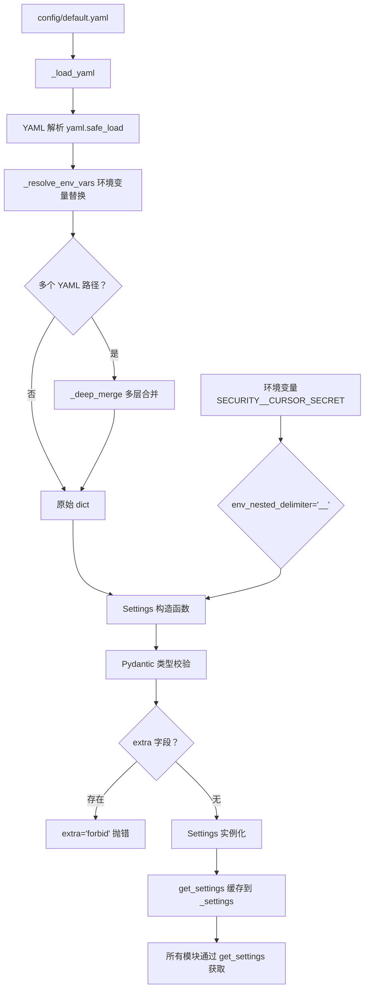
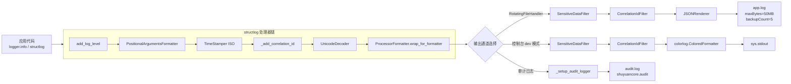
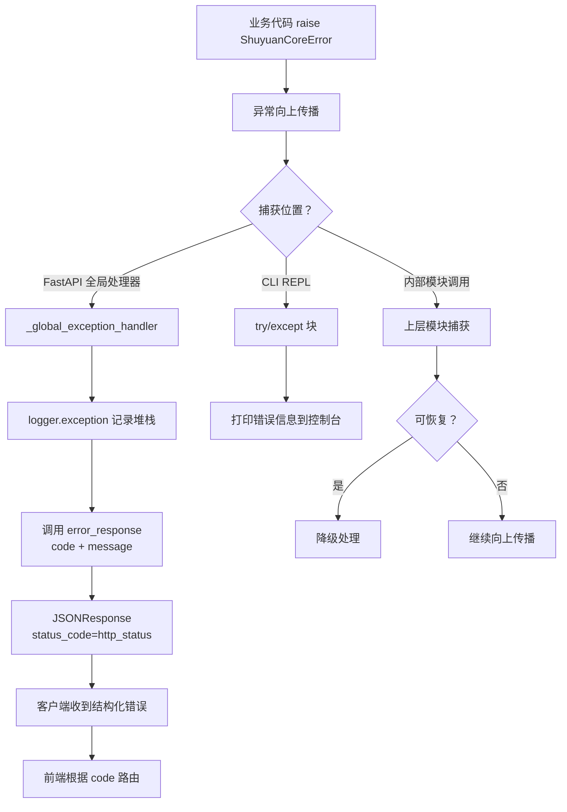

# ShuyuanCore 基础设施设计方案

> **最后更新**：2026-05-27  
> **对应阶段**：Phase 1  
> **版本**：v1.0.0

---

## 1. 设计目标

ShuyuanCore 的基础设施层旨在为整个智能体系统提供**可配置、可观测、健壮运行**的底层支撑。三个核心目标互相支撑，共同构成系统的基石：

- **可配置（Configurable）**：通过 YAML 文件加环境变量的双层配置体系，支持全部模块的运行时参数调整，降低部署和运维成本。配置结构采用 Pydantic Settings 嵌套模型，在编译期即可捕获类型错误与非法参数。
- **可观测（Observable）**：基于 structlog 构建的结构化日志管道，统一采集应用日志与审计日志，支持关联 ID 追踪请求链路、敏感信息自动过滤、JSON 序列化输出，便于日志聚合系统（如 ELK、Loki）消费。
- **健壮运行（Robust）**：建立完整的异常体系，以 `ShuyuanCoreError` 为基类，按功能领域分层，配合错误码映射机制，确保异常在 API 层、CLI 层和内部模块间一致表达。同时通过配置锁定（`field_validator` 锁定关键参数）防止无意篡改。

---

## 2. 核心概念

### 2.1 配置管理（Settings）

配置管理是整个基础设施的入口。采用 **Pydantic Settings v2** 作为配置模型框架，定义了 13 个顶层配置域（Section），每个域对应一个独立的 `BaseModel` 子类，嵌套在全局 `Settings` 类中。

**设计约束**：

- `extra="forbid"`：禁止传入未在模型中定义的字段，防止拼写错误或未预期的配置项被静默忽略。
- `field_validator` 锁定参数：对关键业务参数使用 `field_validator` 进行值校验，若值不匹配预期则抛出 `ValueError`。例如 `drift_threshold` 必须为 0.25，`anchors_dimensions` 必须为 128，`max_active_modules` 必须为 5。
- 环境变量覆盖：通过 `env_nested_delimiter="__"` 支持环境变量覆盖嵌套配置，例如 `SECURITY__CURSOR_SECRET` 可在不修改 YAML 文件的前提下注入安全配置。

### 2.2 日志系统（Logging）

日志系统围绕 **structlog** 构建，采用"处理器链（Processor Chain）"模式：

- **标准处理器链**：`add_log_level` → `PositionalArgumentsFormatter` → `TimeStamper` → `add_correlation_id` → `UnicodeDecoder`
- **双 Filter**：`CorrelationIdFilter` 从 `ContextVar` 注入关联 ID；`SensitiveDataFilter` 通过正则匹配擦除敏感信息
- **双输出通道**：`RotatingFileHandler` 输出 JSON 格式到文件（默认 50MB 轮转、5 个备份）；`colorlog` 输出彩色格式化日志到控制台（仅 dev 模式）
- **审计日志分离**：专有 `shuyuancore.audit` Logger，独立写入 `audit.log`

### 2.3 异常体系（Exceptions）

异常体系是健壮性的核心保障。以 `ShuyuanCoreError` 为基类，每个异常实例包含三个核心属性：

- `code`：整数错误码，用于 API 响应和前端路由
- `http_status`：对应的 HTTP 状态码，便于网关层直接映射
- `default_message`：中英双语默认错误消息

`to_dict()` 方法将异常序列化为 `{code, message, http_status, detail}` 结构，与 API 层的 `error_response()` 函数无缝集成。

### 2.4 依赖注入容器

当前 Phase 1 实现**未引入**第三方依赖注入容器（如 `dependency_injector`、`lagom` 等）。模块间的依赖通过以下方式管理：

- **全局单例模式**：`get_settings()` 返回缓存的 `Settings` 实例；`get_logger()` / `get_audit_logger()` 返回已配置的 Logger
- **模块级工厂函数**：各模块自行实例化内部组件，通过构造函数接收配置（如 `AuditLogger(db_path=...)`）
- **网关层手动组装**：`create_app()` 接收 `Agent` 和 `BeliefStore` 实例，而非通过 DI 容器自动注入

这种轻量方式在 Phase 1 中足够使用，若后续模块间依赖复杂度显著上升（例如需要自动生命周期管理、作用域隔离），可考虑引入 `dependency_injector` 或 `fastapi.Depends`。

---

## 3. 数据流（Mermaid 流程图）

### 3.1 配置加载流程

配置加载采用"YAML 文件 → 环境变量解析 → Pydantic Settings → 全局单例"的流水线设计：



**关键设计点**：

- `_deep_merge` 支持递归合并字典，当多个 YAML 路径存在时，后面的配置覆盖前面的配置
- `_resolve_env_vars` 使用正则 `\$\{(\w+)\}` 匹配 `${VAR_NAME}` 语法，替换为 `os.environ` 中的值
- `extra="forbid"` 在 Pydantic 模型层面拒绝未定义字段，将运行时错误提前到启动阶段

### 3.2 日志管道



### 3.3 异常处理流程



---

## 4. 关键参数

从 [config.py](file:///workspace/src/config.py) 中提取的核心可配置参数：

| 参数路径 | 类型 | 默认值 | 说明 |
|---|---|---|---|
| `deploy.host` | `str` | `"0.0.0.0"` | HTTP 服务监听地址 |
| `deploy.port` | `int` | `8005` | HTTP 服务监听端口 |
| `deploy.workers` | `int` | `1` | 工作进程数 |
| `deploy.log_level` | `str` | `"info"` | 日志级别（DEBUG/INFO/WARNING/ERROR） |
| `deploy.log_rotation.max_size` | `str` | `"50MB"` | 日志文件轮转大小阈值 |
| `deploy.log_rotation.backup_count` | `int` | `5` | 保留的旧日志文件数 |
| `deploy.health_check.enabled` | `bool` | `True` | 是否启用健康检查端点 |
| `security.cursor_secret` | `str` | `""` | 游标签名密钥（为空则自动生成随机值） |
| `security.require_approval` | `bool` | `True` | 是否要求危险操作审批 |
| `security.rate_limit_per_minute` | `int` | `60` | API 每分钟速率限制 |
| `security.sandbox` | `str` | `"docker"` | 沙箱类型 |
| `memory.decay_rates` | `dict` | 6 层衰减率 | 记忆衰减速率配置 |
| `memory.confidence_floor` | `float` | `0.1` | 记忆置信度下限 |
| `memory.core_memory_limit` | `int` | `2200` | 核心记忆容量上限 |
| `memory.user_model_limit` | `int` | `1375` | 用户模型容量上限 |
| `models.routing.code` | `str` | `"deepseek/deepseek-chat"` | 代码模型路由 |
| `models.routing.chat` | `str` | `"dashscope/qwen-max"` | 对话模型路由 |
| `skills.matching_timeout_ms` | `int` | `200` | 技能匹配超时（毫秒） |
| `skills.value_score_threshold` | `float` | `0.7` | 技能价值分数阈值 |
| `persona.style.drift_threshold` | `float` | `0.25` | 人格漂移阈值（锁定参数） |
| `persona.compiler.min_input_chars` | `int` | `100` | 人格编译器最小输入字符数（锁定参数） |
| `evolution.max_active_modules` | `int` | `5` | 最大活跃演化模块数（锁定参数） |
| `tools.default_timeout` | `int` | `60` | 工具默认超时（秒） |
| `tools.code_exec_timeout` | `int` | `30` | 代码执行超时（秒） |
| `gateway.platforms.api.port` | `int` | `8000` | API 网关端口 |
| `cron.check_interval` | `int` | `60` | 定时任务检查间隔（秒） |

**锁定参数**：上表中标注"锁定参数"的字段通过 `field_validator` 强制执行固定值，不可通过 YAML 或环境变量修改。这是一种安全设计，防止因误操作导致系统行为异常。

---

## 5. 配置管理（详细设计）

### 5.1 Settings 类的嵌套结构

`Settings` 类定义在 [config.py](file:///workspace/src/config.py#L426-L444)，包含 13 个顶层配置域。每个域对应一个独立的 `BaseModel`：

```
Settings
├── agent: AgentConfig              # 智能体基础配置（name, mode）
├── models: ModelsConfig            # 模型路由与提供者配置
│   ├── routing: ModelRoutingConfig # 按场景的模型路由（code/chat/math/...）
│   └── providers: dict[str, ModelProviderConfig]  # 多提供者配置
├── memory: MemoryConfig            # 记忆系统配置
│   ├── working: WorkingMemoryConfig
│   ├── chroma: ChromaConfig
│   │   └── collections: ChromaCollectionsConfig
│   │       ├── long_term_memory: ChromaCollectionConfig
│   │       └── conversations: ChromaCollectionConfig
│   └── embedding: EmbeddingConfig
├── skills: SkillsConfig            # 技能系统配置（提取、策展、匹配）
├── persona: PersonaConfig          # 人格系统配置
│   ├── feature_flags: PersonaFeatureFlagsConfig
│   ├── style: PersonaStyleConfig
│   ├── hard_fact: PersonaHardFactConfig
│   ├── compiler: PersonaCompilerConfig
│   ├── autonomous: PersonaAutonomousConfig
│   ├── protection_levels: ProtectionLevelsConfig
│   └── identity: PersonaIdentityConfig
├── evolution: EvolutionConfig      # 演化系统配置
├── prediction: PredictionConfig    # 预测系统配置
├── security: SecurityConfig        # 安全配置（审批/沙箱/限流/加密）
├── tools: ToolsConfig              # 工具系统配置
├── agents: AgentsConfig            # 多智能体协作配置
├── gateway: GatewayConfig          # 网关配置
│   ├── platforms: GatewayPlatformsConfig
│   │   ├── cli: GatewayPlatformConfig
│   │   ├── api: GatewayPlatformConfig
│   │   ├── telegram: GatewayPlatformConfig
│   │   ├── wechat: GatewayPlatformConfig
│   │   └── ...
│   └── history: HistoryConfig
├── cron: CronConfig                # 定时任务配置
└── deploy: DeployConfig            # 部署配置
    ├── log_rotation: LogRotationConfig
    └── health_check: HealthCheckConfig
```

### 5.2 双阶段加载机制

配置加载分为两个阶段：

**第一阶段：YAML 加载（`_load_yaml`）**

[`_load_yaml`](file:///workspace/src/config.py#L28-L34) 函数负责读取 YAML 文件并返回原始的 `dict`：

```python
def _load_yaml(file_path: str) -> dict[str, Any]:
    path = Path(file_path)
    if not path.exists():
        return {}  # 文件不存在时返回空字典，而非报错
    with open(path, "r", encoding="utf-8") as f:
        raw: dict[str, Any] = yaml.safe_load(f) or {}
    return _resolve_env_vars(raw)  # 立即执行环境变量解析
```

**第二阶段：环境变量解析（`_resolve_env_vars`）**

[`_resolve_env_vars`](file:///workspace/src/config.py#L15-L25) 递归遍历整个字典，将字符串中的 `${VAR_NAME}` 模式替换为环境变量值：

```python
def _resolve_env_vars(value: Any) -> Any:
    if isinstance(value, str):
        def _replacer(m: re.Match[str]) -> str:
            return os.environ.get(m.group(1), "")  # 环境变量不存在时替换为空字符串
        return _ENV_VAR_PATTERN.sub(_replacer, value)
    if isinstance(value, dict):
        return {k: _resolve_env_vars(v) for k, v in value.items()}
    if isinstance(value, list):
        return [_resolve_env_vars(item) for item in value]
    return value
```

这种设计的优势是：YAML 中可以嵌入 `${API_KEY}` 等占位符，避免将敏感凭据提交到版本控制系统。

### 5.3 extra="forbid" 防止未定义配置注入

在 `Settings` 的元数据配置中显式声明：

```python
class Settings(BaseSettings):
    model_config = SettingsConfigDict(
        env_nested_delimiter="__",
        extra="forbid",  # 拒绝未定义字段
    )
```

如果用户错误地在 `config.yaml` 中写入了 `unknown_field: value`，Pydantic 会在启动时抛出 `ValueError`，明确告知哪些字段是不被允许的。这一机制对大型配置文件的维护至关重要——它能立即暴露拼写错误或多余配置，而不是让这些配置静默失效。

### 5.4 get_settings() 全局单例模式

[`get_settings`](file:///workspace/src/config.py#L451-L463) 函数采用经典的惰性初始化单例模式：

```python
_settings: Settings | None = None
_CONFIG_YAML_PATHS: tuple[str, ...] = ("config/default.yaml",)

def get_settings(yaml_paths: tuple[str, ...] | None = None) -> Settings:
    global _settings
    if _settings is not None:
        return _settings  # 缓存命中，直接返回

    paths = yaml_paths or _CONFIG_YAML_PATHS
    merged: dict[str, Any] = {}
    for file_path in paths:
        data = _load_yaml(file_path)
        _deep_merge(merged, data)

    _settings = Settings(**merged)  # 使用合并后的字典构造 Settings
    return _settings
```

所有模块统一调用 `get_settings()` 获取配置。这种设计避免了配置实例的重复创建，也保证了不同模块看到的配置始终一致。

### 5.5 _deep_merge 多层合并

[`_deep_merge`](file:///workspace/src/config.py#L466-L471) 函数支持递归合并两个嵌套字典：

```python
def _deep_merge(base: dict[str, Any], override: dict[str, Any]) -> None:
    for key, value in override.items():
        if key in base and isinstance(base[key], dict) and isinstance(value, dict):
            _deep_merge(base[key], value)  # 递归合并嵌套的 dict
        else:
            base[key] = value  # 非 dict 或类型不匹配时直接覆盖
```

支持多个 YAML 配置文件的叠加。例如 `get_settings(yaml_paths=("config/default.yaml", "config/production.yaml"))` 时会先加载默认配置，再用生产配置覆盖，仅对顶层和嵌套的 dict 类型键做递归合并，其余情况直接覆盖。

### 5.6 reload_settings() 运行时重载

[`reload_settings`](file:///workspace/src/config.py#L474-L477) 函数实现了运行时配置热重载：

```python
def reload_settings(yaml_paths: tuple[str, ...] | None = None) -> Settings:
    global _settings
    _settings = None       # 清除缓存
    return get_settings(yaml_paths)  # 重新加载
```

调用 `reload_settings()` 后，下一次任何模块调用 `get_settings()` 都会重新读取配置文件并构造新的实例。这为后续实现配置热更新 API 提供了基础。

---

## 6. 日志系统（详细设计）

### 6.1 structlog 配置

日志系统在 [logging.py](file:///workspace/src/logging.py) 中通过 `setup_logging()` 函数一次性完成初始化，核心配置如下：

```python
shared_processors = [
    structlog.stdlib.add_log_level,              # 注入日志级别
    structlog.stdlib.PositionalArgumentsFormatter(),  # 格式化位置参数
    _timestamper_processor,                      # 注入 ISO 8601 时间戳
    _add_correlation_id,                         # 注入关联 ID
    structlog.processors.UnicodeDecoder(),        # 确保 Unicode 正确解码
]

structlog.configure(
    processors=shared_processors + [
        structlog.stdlib.ProcessorFormatter.wrap_for_formatter,
    ],
    wrapper_class=structlog.stdlib.BoundLogger,
    context_class=dict,
    logger_factory=structlog.stdlib.LoggerFactory(),
    cache_logger_on_first_use=True,
)
```

**处理器说明**：

| 处理器 | 作用 |
|---|---|
| `add_log_level` | 在事件字典中注入 `level` 字段（如 `"info"`、`"error"`） |
| `PositionalArgumentsFormatter` | 处理位置参数绑定，将 `%(name)s` 格式替换为实际值 |
| `TimeStamper(fmt="iso")` | 注入 `timestamp: "2026-05-27T10:30:00.123456Z"` 字段 |
| `_add_correlation_id` | 从 `ContextVar` 读取关联 ID，注入到事件字典 |
| `UnicodeDecoder` | 确保所有字符串字段为 Unicode |
| `JSONRenderer` | 将整个事件字典序列化为 JSON 字符串输出 |

### 6.2 CorrelationIdFilter + SensitiveDataFilter 双 Filter

**CorrelationIdFilter**：

```python
class CorrelationIdFilter(logging.Filter):
    def filter(self, record: logging.LogRecord) -> bool:
        cid = _correlation_id_ctx.get()
        record.correlation_id = cid or "-"  # 无关联 ID 时使用 "-"
        return True
```

[`_correlation_id_ctx`](file:///workspace/src/logging.py#L25) 是一个 `ContextVar`，在请求入口处通过 `set_correlation_id()` 设置，系统会自动将该 ID 传播到所有异步任务中。当与 OpenTelemetry 等链路追踪系统集成时，关联 ID 可替代 `trace_id` / `span_id`，实现请求级别的日志关联。

**SensitiveDataFilter**：

```python
_SENSITIVE_PATTERNS = [
    (re.compile(r"sk-[a-zA-Z0-9]{32,}"), "sk-***REDACTED***"),        # OpenAI API Key
    (re.compile(r"Bearer [a-zA-Z0-9._\-]{20,}"), "Bearer ***REDACTED***"),  # Bearer Token
    (re.compile(r"api_key[=:]\s*\S+", re.IGNORECASE), "api_key=***REDACTED***"),
    (re.compile(r"password[=:]\s*\S+", re.IGNORECASE), "password=***REDACTED***"),
    (re.compile(r"token[=:]\s*\S+", re.IGNORECASE), "token=***REDACTED***"),
    (re.compile(r"DASHSCOPE_API_KEY[=:]\s*\S+"), "DASHSCOPE_API_KEY=***REDACTED***"),
    (re.compile(r"DEEPSEEK_API_KEY[=:]\s*\S+"), "DEEPSEEK_API_KEY=***REDACTED***"),
    (re.compile(r"OPENAI_API_KEY[=:]\s*\S+"), "OPENAI_API_KEY=***REDACTED***"),
]
```

[`SensitiveDataFilter`](file:///workspace/src/logging.py#L61-L69) 在日志写出前对整条消息进行正则扫描和替换。这确保了即使业务代码意外地将凭据写入日志，也会在落盘前被擦除。

### 6.3 RotatingFileHandler 日志轮转

```python
file_handler = logging.handlers.RotatingFileHandler(
    filename=str(log_dir_path / "app.log"),
    maxBytes=_parse_size("50MB"),   # 默认 50MB
    backupCount=5,                   # 保留 5 个备份
    encoding="utf-8",
)
file_handler.setLevel(logging.DEBUG)
file_handler.setFormatter(json_formatter)
file_handler.addFilter(CorrelationIdFilter())
file_handler.addFilter(SensitiveDataFilter())
```

`_parse_size` 函数[`_parse_size`](file:///workspace/src/logging.py#L41-L50) 支持 `GB` / `MB` / `KB` / `B` 格式的字符串解析。

### 6.4 colorlog 控制台输出（dev 模式）

在 `env == "dev"` 且安装了 `colorlog` 包的情况下，日志系统会自动添加彩色控制台输出：

```python
console_formatter = colorlog.ColoredFormatter(
    "%(asctime)s %(log_color)s[%(levelname)-7s]%(reset)s "
    "%(name)-25s [%(correlation_id)s] "
    "%(log_color)s%(message)s%(reset)s",
    datefmt="%H:%M:%S",
    log_colors={
        "DEBUG": "cyan",
        "INFO": "green",
        "WARNING": "yellow",
        "ERROR": "red",
        "CRITICAL": "red,bg_white",
    },
)
```

---

## 7. 异常体系（详细设计）

### 7.1 ShuyuanCoreError 基类

[`ShuyuanCoreError`](file:///workspace/src/exceptions.py#L6-L24) 是所有业务异常的基类：

```python
class ShuyuanCoreError(Exception):
    code: int = 0              # 业务错误码
    http_status: int = 500     # HTTP 状态码
    default_message: str = "内部错误 / Internal error"

    def __init__(self, message: str | None = None, detail: Any = None) -> None:
        self.message = message or self.default_message
        self.detail = detail
        super().__init__(self.message)

    def to_dict(self) -> dict[str, Any]:
        result = {
            "code": self.code,
            "message": self.message,
            "http_status": self.http_status,
        }
        if self.detail is not None:
            result["detail"] = self.detail
        return result
```

**三个核心属性**：
- `code`：唯一整数错误码，用于客户端路由和错误处理
- `http_status`：HTTP 状态映射，保证网关层可以直接用 `status_code=http_status` 返回响应
- `default_message`：中英双语消息，兼顾中文用户和国际化需求

### 7.2 领域分层异常类

异常体系按功能领域垂直分层，共 13 个领域，约 40 个异常类：

| 领域 | 基类 | 错误码范围 | 说明 |
|---|---|---|---|
| 通用校验 | `ValidationError` | 1000-1005 | 参数校验、缺少参数、格式错误、资源不存在、权限不足、冲突 |
| 模型 | `ModelError` | 2000-2002 | LLM API 调用失败、模型切换失败 |
| 记忆 | `MemoryOperationError` | 3001 | SQLite / ChromaDB 操作失败 |
| 技能 | `SkillError` | 4000-4003 | 技能不存在、市场连接失败、导入失败 |
| 人格 | `PersonaError` | 5000-5001 | 人格操作失败、编译失败 |
| 工具 | `ToolError` | 6000-6004 | 执行失败、审批超时、沙箱失败、操作被拒绝 |
| MCP | `MCPError` | 7000-7002 | MCP 连接失败、工具未注册 |
| 定时任务 | `CronError` | 8001 | 任务创建失败 |
| 审批 | `ApprovalError` | 9000-9003 | 审批不存在、审批超时、命令不存在 |
| 会话 | `SessionError` | 10000-10004 | 会话不存在、消息不存在、已归档、已删除 |
| 配置 | `ConfigurationError` | 11000-11002 | 配置缺失、更新失败、持久化失败 |
| 多智能体 | `AgentError` | 12000-12003 | 子代理超时、协调器超时、仲裁失败 |
| 扫描支付 | `ScanPayError` | 13000 | 扫码支付错误（预留给未来扩展） |

**错误码区间分配**：

```
1000-1999   通用校验（Validation）
2000-2999   模型（Model）
3000-3999   记忆（Memory）
4000-4999   技能（Skill）
5000-5999   人格（Persona）
6000-6999   工具（Tool）
7000-7999   MCP
8000-8999   定时任务（Cron）
9000-9999   审批（Approval）
10000-10999 会话（Session）
11000-11999 配置（Configuration）
12000-12999 多智能体（Agent）
13000-13999 扫码支付（ScanPay，预留）
```

### 7.3 to_dict() 与 API error_response() 集成

异常体系与 API 层的集成通过 `to_dict()` 和 `error_response()` 两条路径实现：

**异常侧 → API 侧**：`ShuyuanCoreError.to_dict()` 返回包含 `code`、`message`、`http_status`（可选 `detail`）的字典。

**API 侧**：[`error_response`](file:///workspace/src/gateway/utils.py#L82-L85) 函数生成标准的错误响应体：

```python
def error_response(code: int, message: str, detail: Any = None) -> dict[str, Any]:
    body = {"code": code, "message": message}
    if detail is not None:
        body["detail"] = detail
    return body
```

**FastAPI 全局异常处理器**：[`_global_exception_handler`](file:///workspace/src/gateway/api_server.py#L245-L251) 捕获所有未处理异常：

```python
@app.exception_handler(Exception)
async def _global_exception_handler(request: Request, exc: Exception) -> JSONResponse:
    req_id = getattr(request.state, "request_id", "unknown")
    logger.exception("Unhandled exception request_id=%s", req_id)
    return _build_error_response(500, 0, str(exc))
```

理想情况下，该处理器应优先检测 `ShuyuanCoreError` 类型，调用其 `to_dict()` 方法生成响应（可视为 Phase 2 的演进方向）：

```python
@app.exception_handler(Exception)
async def _global_exception_handler(request: Request, exc: Exception) -> JSONResponse:
    if isinstance(exc, ShuyuanCoreError):
        error_dict = exc.to_dict()
        return JSONResponse(
            status_code=error_dict["http_status"],
            content=error_response(error_dict["code"], error_dict["message"], error_dict.get("detail")),
        )
    # 兜底处理非 ShuyuanCoreError
    ...
```

---

## 8. 安全基础设施

### 8.1 参数脱敏（_sanitize_params）

审计日志模块 [`AuditLogger`](file:///workspace/src/security/audit.py) 在记录参数前对敏感字段进行脱敏处理：

```python
_SENSITIVE_KEYS = {
    "api_key", "token", "password", "secret", "cookie", "authorization"
}

def _sanitize_params(params: dict[str, Any]) -> dict[str, Any]:
    sanitized = {}
    for key, value in params.items():
        if any(s in key.lower() for s in _SENSITIVE_KEYS):
            sanitized[key] = "***REDACTED***"          # 敏感字段脱敏
        elif isinstance(value, dict):
            sanitized[key] = _sanitize_params(value)   # 递归处理嵌套字典
        elif isinstance(value, str) and len(value) > 500:
            sanitized[key] = value[:200] + "...[truncated]"  # 超长字符串截断
        else:
            sanitized[key] = value
    return sanitized
```

该函数在 `AuditLogger.log()` 和 `AuditLogger.log_async()` 中均被调用，确保数据入库前已完成脱敏。

### 8.2 日志敏感信息过滤（_SENSITIVE_PATTERNS）

日志系统的 [`SensitiveDataFilter`](file:///workspace/src/logging.py#L61-L69) 通过正则匹配擦除日志中的凭据信息。它涵盖的场景包括：

- OpenAI 风格的 API Key（`sk-` 前缀后跟 32+ 字母数字）
- Bearer Token（`Bearer` 开头后跟 20+ 字符）
- `api_key=xxx`、`password=xxx`、`token=xxx` 等键值对
- 特定平台的 API Key（`DASHSCOPE_API_KEY`、`DEEPSEEK_API_KEY`、`OPENAI_API_KEY`）

该 Filter 同时作用于文件日志和控制台日志，避免凭据在调试输出中泄露。

### 8.3 游标签名安全

[`cursor_secret`](file:///workspace/src/config.py#L319) 是分页游标签名的 HMAC 密钥。在 [gateway/utils.py](file:///workspace/src/gateway/utils.py#L17-L30) 中，如果未配置此密钥，系统会生成一个随机值并在日志中告警，确保即使未显式配置也能安全运行：

```python
def get_cursor_secret() -> str:
    global _CURSOR_SECRET
    if _CURSOR_SECRET is None:
        _CURSOR_SECRET = _secrets.token_urlsafe(32)
        logger.warning(
            "Cursor secret not configured, using random value for this session. "
            "Set CURSOR_SECRET env var or security.cursor_secret in config for persistence."
        )
    return _CURSOR_SECRET
```

---

## 9. 与各模块的关系

基础设施层为所有业务模块提供统一的服务，各模块的依赖关系如下：

```mermaid
flowchart TD
    subgraph 基础设施层
        Config[config.py<br/>Settings + get_settings]
        Logging[logging.py<br/>structlog + 日志轮转]
        Exceptions[exceptions.py<br/>ShuyuanCoreError 体系]
        Audit[security/audit.py<br/>AuditLogger + 参数脱敏]
    end

    subgraph 业务模块
        Agent[核心 Agent]
        Memory[记忆系统]
        Skills[技能系统]
        Persona[人格系统]
        Tools[工具系统]
        Gateway[API 网关]
        Cron[定时任务]
        Evolution[演化系统]
    end

    Config -->|get_settings()| Agent
    Config -->|get_settings()| Memory
    Config -->|get_settings()| Skills
    Config -->|get_settings()| Persona
    Config -->|get_settings()| Tools
    Config -->|get_settings()| Gateway
    Config -->|get_settings()| Cron
    Config -->|get_settings()| Evolution

    Logging -->|get_logger()| Agent
    Logging -->|get_logger()| Memory
    Logging -->|get_logger()| Skills
    Logging -->|get_logger()| Persona
    Logging -->|get_logger()| Tools
    Logging -->|get_logger()| Gateway
    Logging -->|get_logger()| Audit

    Exceptions -->|领域异常子类| Agent
    Exceptions -->|领域异常子类| Memory
    Exceptions -->|领域异常子类| Skills
    Exceptions -->|领域异常子类| Persona
    Exceptions -->|领域异常子类| Tools
    Exceptions -->|领域异常子类| Gateway
    Exceptions -->|领域异常子类| Cron
    
    Audit -->|审计日志| Gateway
    Audit -->|审计日志| Tools
```

**具体而言**：

- **配置管理**：所有模块通过 `from src.config import get_settings` 获取配置实例。模块内部无需关心配置的来源和生命周期。
- **日志系统**：模块通过 `from src.logging import get_logger` 获取已配置的 Logger 实例。`get_logger("shuyuancore.memory")` 即可获得带命名空间的 Logger。
- **异常体系**：各模块在 `exceptions.py` 中定义自己的领域异常子类，通过继承 `ShuyuanCoreError` 自动获得错误码、HTTP 状态映射和 `to_dict()` 序列化能力。
- **审计安全**：`Gateway` 和 `Tool` 模块调用 `AuditLogger.log()` 记录操作信息，`_sanitize_params` 自动脱敏敏感字段。

---

## 10. 已知限制

### 10.1 配置管理

- **单例不可变**：`get_settings()` 返回的 `Settings` 实例在创建后不可修改（Pydantic BaseModel 默认不可变）。运行时如需修改配置，必须调用 `reload_settings()` 重新构建，但这会导致所有引用旧实例的模块无法自动感知变更。
- **YAML 路径固定**：默认 YAML 路径 `("config/default.yaml",)` 是硬编码的元组常量，不支持自动扫描目录或通配符匹配。若需要多环境配置，调用方必须显式传递 `yaml_paths` 参数。
- **嵌套深度限制**：`_deep_merge` 仅对双方均为 `dict` 的键做递归合并。如果一方是 `dict` 而另一方是其他类型（如 `list`），会直接覆盖而非合并列表。

### 10.2 日志系统

- **同步阻塞**：`RotatingFileHandler` 是同步的日志写入方式。在高并发场景下，日志写入可能成为瓶颈。未来可考虑切换到 `ConcurrentRotatingFileHandler` 或异步日志处理器。
- **敏感过滤的性能开销**：`SensitiveDataFilter` 对每条日志消息执行 8 次正则匹配，在 DEBUG 级别日志量极大时可能引入显著的 CPU 开销。生产环境建议将日志级别保持在 INFO 以上。
- **关联 ID 传播边界**：`ContextVar` 的关联 ID 依赖 `asyncio` 上下文自动传播。如果在 `asyncio.create_task` 或线程池中启动新任务，可能需要显式调用 `set_correlation_id()`。

### 10.3 异常体系

- **全局处理器未针对 ShuyuanCoreError 优化**：当前 FastAPI 的 `_global_exception_handler` 对所有 `Exception` 类型使用统一的 500 错误响应，没有对 `ShuyuanCoreError` 进行类型检测并调用 `to_dict()`。这导致自定义的业务错误码和 HTTP 状态码无法被自动传递给客户端。
- **异常与 API 响应的映射耦合**：业务模块直接 `raise` 领域异常，但异常的 `http_status` 仅在网关层有意义。如果系统需要暴露非 HTTP 协议（如 gRPC、WebSocket），异常模型需要额外的适配层。
- **错误码管理**：当前错误码通过类属性静态定义，缺乏集中注册机制。随着系统发展，可能出现错误码冲突或遗忘注册的情况。

### 10.4 依赖注入

- **无 DI 容器**：系统未引入 DI 容器，模块之间的依赖关系通过全局单例和手动组装管理。当模块数量增长到 20+ 时，这种模式将导致启动代码臃肿且难以测试。
- **测试困难**：全局状态（`_settings`、`_active_streams`、`_rate_limit_buckets`）在单元测试中需要在每个测试前重置，若忘记清理可能导致测试互相污染。

### 10.5 安全基础设施

- **正则覆盖有限**：`_SENSITIVE_PATTERNS` 仅覆盖已知的几种凭据格式。如果新增一个 API 提供者使用不常见的前缀或格式，需要手动扩展正则列表。
- **审计日志内存缓存**：`AuditLogger` 在内存中缓存最近 10000 条审计条目（`_max_entries`），仅在调用 `flush_all()` 或条目数量触及上限时才写入数据库。如果进程在两次刷新之间崩溃，可能丢失最多 10000 条审计记录。

---

> 本文档覆盖了 ShuyuanCore Phase 1 基础设施层的核心设计，包括配置管理、日志系统、异常体系和安全基础设施。随着系统演进，基础设施层将持续优化以支撑更复杂的业务需求。