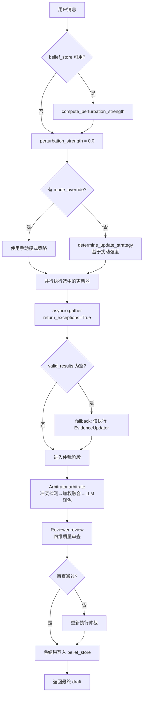
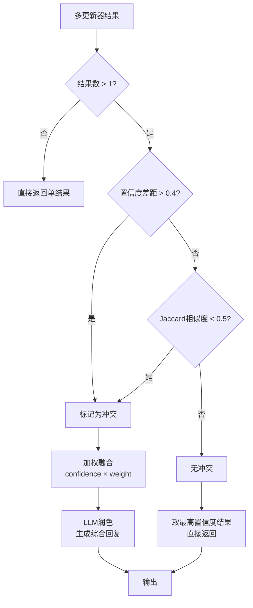
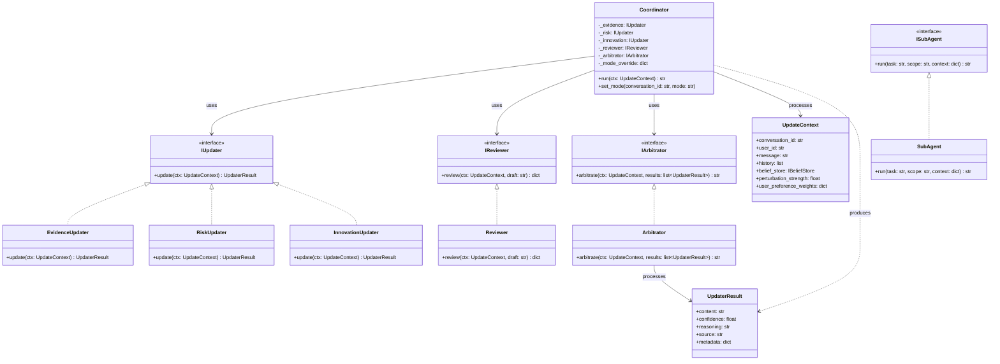

# ShuyuanCore 多智能体协作设计方案

> **最后更新**：2026-05-27  
> **对应阶段**：Phase 7（多智能体协作框架）— Phase 8（自适应调度与仲裁审查）

---

## 1. 设计目标

ShuyuanCore 多智能体协作体系的核心设计目标为 **信念场扰动强度自适应调度（Adaptive Scheduling Based on Belief Field Perturbation Strength）**。

具体而言，当用户输入一条消息进入系统时，该消息被视作对当前信念场（Belief Field）的一次**扰动（Perturbation）**。不同的扰动强度需要不同深度的推理来回应：

- **低扰动**：用户消息与现有信念高度一致，仅需证据更新器（EvidenceUpdater）做事实性确认即可；
- **中扰动**：消息引入一定的新信息或矛盾，需要同时激活证据更新器和风险更新器（RiskUpdater），兼顾事实与风险；
- **高扰动**：消息包含重大分歧、全新议题或决策诉求，需要三个更新器（证据、风险、创新）全部介入，进行全方位分析。

该设计借鉴了控制论中"扰动—响应"的思想，将信念场视为一个动态系统，LLM 的推理行为视为对该系统的自适应调节。通过量化扰动强度并动态调度子模块，在**计算成本、响应质量、推理深度**三者之间取得最优平衡。

除自适应调度外，该体系还实现了以下子目标：

| 子目标 | 说明 |
|--------|------|
| 多视角分析 | 证据、风险、创新三个正交视角，避免单一视角偏误 |
| 冲突检测与仲裁 | 自动检测多更新器输出之间的冲突，通过加权融合和 LLM 润色得出最终结论 |
| 质量审查 | 对仲裁结果执行完整性、准确性、一致性、安全性四维检查 |
| 子代理隔离执行 | 子代理在隔离环境中运行，共享信念读权限但限定写入 scope |
| 超时降级 | 任何子模块超时均不影响整体流程，具备完备的 fallback 机制 |
| 手动模式覆盖 | 支持通过 `/mode quick|balanced|deep` 命令手动指定调度策略 |

---

## 2. 核心概念

### 2.1 三大更新器（Updaters）

系统定义了三个正交分析视角的更新器，均实现 `IUpdater` 接口：

#### 2.1.1 EvidenceUpdater（证据更新器）

- **角色定位**：基于事实的决策者
- **职责**：根据已有信念和用户消息，提供最可靠的结论
- **行为特征**：强调数据和已有证据，不凭空猜测；证据不足时需明确说明不确定性
- **LLM 温度**：0.3（低温度，偏向确定性输出）
- **Prompt 核心指令**：`"你是一个基于事实的决策者（证据更新器）"`
- **降级策略**：LLM 调用失败时返回置信度 0.3 的 fallback 结论

```python
# EvidenceUpdater.update() 核心逻辑（简化）
async def update(self, ctx: UpdateContext) -> UpdaterResult:
    messages = [{"role": "system", "content": _EVIDENCE_SYSTEM_PROMPT}]
    if ctx.belief_store:
        recent = await ctx.belief_store.get(ctx.conversation_id, limit=20)
        # 将近期信念拼接为上下文注入 prompt
    messages.append({"role": "user", "content": ...})
    result = await self._model_provider.chat(..., temperature=0.3)
    return _parse_updater_json(result.content, "evidence")
```

#### 2.1.2 RiskUpdater（风险更新器）

- **角色定位**：风险分析师
- **职责**：识别潜在问题、失败模式、边界条件和隐患
- **行为特征**：不只否定，指出具体风险点和可能性；无明显风险时说明"未发现明显风险"
- **LLM 温度**：0.3
- **Prompt 核心指令**：`"你是一个风险分析师（风险更新器）"`
- **降级策略**：LLM 调用失败时返回置信度 0.3 的 fallback 分析，建议人工审查

#### 2.1.3 InnovationUpdater（创新更新器）

- **角色定位**：创新探索者
- **职责**：跳出框架，提供非显而易见的替代方案或新思路
- **行为特征**：不天马行空，需合理且有逻辑支撑；没有好思路时说明"常规方案已足够"
- **LLM 温度**：0.7（高温度，鼓励发散性输出）
- **Prompt 核心指令**：`"你是一个创新探索者（创新更新器）"`
- **降级策略**：LLM 调用失败时返回置信度 0.3 的 fallback，建议沿用常规方案

三个更新器共享同一个 JSON 解析函数 `_parse_updater_json()`，该函数从 LLM 返回的文本中提取第一个完整的 JSON 对象，解析出 `content`、`confidence`、`reasoning` 三个字段。

### 2.2 扰动强度计算（Perturbation Strength）

扰动强度是自适应调度的核心输入，由 [utils.py](file:///workspace/src/agents/utils.py) 中的 `compute_perturbation_strength()` 函数计算。该函数从四个维度量化用户消息对信念场的冲击程度：

#### 公式定义

```
perturbation_strength = Σ(weight_i × factor_i)
```

其中四个维度的因子通过加权求和后 clamp 到 [0.0, 1.0] 区间。

#### 维度详解

| 维度 | 权重配置项 | 默认值 | 计算方式 |
|------|-----------|--------|---------|
| **语义距离** | `perturbation_semantic_weight` | 0.4 | 在信念库中搜索与用户消息最相似的 5 条信念，取最大相似度 `max_sim`，语义距离 = `1.0 - max_sim` |
| **矛盾密度** | `perturbation_contradiction_weight` | 0.3 | 遍历近期 30 条全局信念，统计高置信度（>0.6）信念对中相互矛盾的对数，除以信念总数后 clamp 到 [0,1] |
| **消息密度** | `perturbation_density_weight` | 0.15 | 基于信念时间戳计算最近消息的密集程度：`density = count / timespan * 3600000`，`density_factor = min(density / 10.0, 1.0)` |
| **决策关键词** | `perturbation_decision_weight` | 0.15 | 检测用户消息中是否包含决策类关键词（如"要不要"、"应不应该"、"推荐"、"建议"、"选哪个"等），命中则加上该权重 |

#### 矛盾检测逻辑

`_are_contradicting()` 函数判断两条信念是否矛盾，基于以下条件：

1. **实体交集非空**：两条信念必须有共同的实体（entity）才可能矛盾
2. **情感对立**：一条信念情感值 > 0.8（积极）且另一条 < 0.2（消极）
3. **内容长度差异过大**：内容长度差异比 > 0.7

```python
def _are_contradicting(a: Belief, b: Belief) -> bool:
    if not a.entities or not b.entities:
        return False
    shared = set(a.entities) & set(b.entities)
    if not shared:
        return False
    content_diff = abs(len(a.content) - len(b.content)) / max(max(len(a.content), len(b.content)), 1)
    if a.emotion > 0.8 and b.emotion < 0.2:
        return True
    if a.emotion < 0.2 and b.emotion > 0.8:
        return True
    if content_diff > 0.7:
        return True
    return False
```

### 2.3 自适应调度策略（Update Strategy）

基于扰动强度计算结果，[utils.py](file:///workspace/src/agents/utils.py) 中的 `determine_update_strategy()` 函数决定激活哪些更新器：

```python
def determine_update_strategy(
    perturbation_strength: float,
    low_threshold: float = 0.3,
    high_threshold: float = 0.7,
    mode_override: str | None = None,
) -> list[str]:
```

#### 自动调度规则

| 扰动强度区间 | 激活更新器 | 场景示例 |
|-------------|-----------|---------|
| [0.0, 0.3) | 仅 Evidence | 用户确认信息、简单问候、常规追问 |
| [0.3, 0.7) | Evidence + Risk | 用户提出新需求、表达担忧、询问可能性 |
| [0.7, 1.0] | Evidence + Risk + Innovation | 用户要求决策、提出矛盾观点、探索创新方案 |

#### 手动模式覆盖

当设置了 mode_override 时，自动调度被完全取代：

| 模式 | 激活更新器 | 适用场景 |
|------|-----------|---------|
| `quick` | 仅 Evidence | 需要快速响应，忽略风险和创新的分析 |
| `balanced` | Evidence + Risk | 默认推荐，兼顾事实与风险分析 |
| `deep` | Evidence + Risk + Innovation | 需要全面深度分析的复杂场景 |

模式覆盖通过 `Coordinator.set_mode(conversation_id, mode)` 方法设置，存储在 `_mode_override` 字典中，可通过 `get_mode()` 查询。

### 2.4 仲裁器（Arbitrator）

仲裁器实现 `IArbitrator` 接口，位于 [arbitrator.py](file:///workspace/src/agents/arbitrator.py)，负责将多个更新器的输出融合为一条连贯的回复。

#### 工作流程

```
输入: list[UpdaterResult] → 冲突检测 → 无冲突 → 取最高置信度结果
                                     ↓ 有冲突
                             加权融合 → LLM 润色 → 输出
```

#### 2.4.1 冲突检测

`_detect_conflict()` 函数基于两个条件判断是否存在冲突：

1. **置信度差距**：如果最大置信度与最小置信度之差 > 0.4，视为冲突
2. **内容相似度**：使用 Jaccard 相似度计算任意两个结果的 content 字段，如果相似度 < 0.5，视为冲突

```python
def _detect_conflict(results: list[UpdaterResult], threshold: float = 0.5) -> bool:
    confidences = [r.confidence for r in results]
    if max(confidences) - min(confidences) > 0.4:
        return True
    for i in range(len(results)):
        for j in range(i + 1, len(results)):
            if _content_similarity(results[i].content, results[j].content) < threshold:
                return True
    return False
```

**Jaccard 相似度算法**（对中文做了专门处理）：

```python
def _content_similarity(a: str, b: str) -> float:
    def tokenize(text: str) -> set[str]:
        words = re.findall(r"[\u4e00-\u9fff]+|[a-zA-Z]+", text.lower())
        return set(words)
    tokens_a, tokens_b = tokenize(a), tokenize(b)
    intersection = tokens_a & tokens_b
    # 如果至少有一个交集词，给予 0.5 的 baseline 相似度
    if len(intersection) >= 1:
        return 0.5 + 0.5 * (len(intersection) / len(tokens_a | tokens_b))
    return len(intersection) / len(tokens_a | tokens_b)
```

#### 2.4.2 加权融合

`_weighted_fusion()` 函数根据用户偏好权重对每个结果的置信度做加权调整：

```python
def _weighted_fusion(results: list[UpdaterResult], weights: dict[str, float]) -> list[UpdaterResult]:
    fused = []
    for r in results:
        weight = weights.get(r.source, 1.0)
        fused.append(UpdaterResult(
            content=r.content,
            confidence=r.confidence * weight,
            reasoning=r.reasoning,
            source=r.source,
        ))
    return fused
```

加权后的置信度计算方式为：`weighted_confidence = confidence × user_preference_weights[source]`。默认所有 source 的权重均为 1.0，可在配置中按需调整。

#### 2.4.3 LLM 润色

当检测到冲突时，仲裁器将加权融合后的结构化数据送入 LLM 进行润色。润色 Prompt 要求：

1. 保留每个视角的核心结论和置信度
2. 冲突时优先采信置信度高的视角
3. 输出包含 [综合] 部分，给出最终建议
4. 使用中文

LLM 润色使用的模型为 `cfg.models.routing.tool`，temperature 为 0.3。如果 LLM 调用失败，降级直接返回结构化的加权数据文本。

#### 单结果场景

如果只有一个更新器结果，或者多个结果之间未检测到冲突，仲裁器直接返回最高置信度结果的格式化文本，跳过 LLM 润色以节省计算资源。

### 2.5 审查器（Reviewer）

审查器实现 `IReviewer` 接口，位于 [reviewer.py](file:///workspace/src/agents/reviewer.py)，对仲裁器输出的 draft 执行四维逻辑质量检查。

#### 四维检查

| 维度 | 英文标识 | 检查内容 |
|------|---------|---------|
| 完整性 | completeness | 文本是否回答了问题的所有方面 |
| 准确性 | accuracy | 文本中的事实声明是否合理且不矛盾 |
| 一致性 | consistency | 文本内部逻辑是否自洽 |
| 安全底线 | safety | 是否遵守基本安全准则（不违法、不有害） |

#### 审查流程

```python
review_result = await self._reviewer.review(ctx, draft)
if not review_result.get("pass", True):
    draft = await self._arbitrator.arbitrate(ctx, valid_results)  # 重试仲裁
```

如果审查不通过（`pass == false`），Coordinator 会重新执行一次仲裁（希望得到更优的结果），但不做无限重试。

#### 审查输出格式

审查器返回严格 JSON 格式：

```json
{
  "pass": true,
  "issues": [
    {"dimension": "completeness", "description": "问题描述"}
  ],
  "suggestions": ["修改建议1", "修改建议2"]
}
```

#### 与信念库的交叉验证

审查器还实现了 `_check_against_beliefs()` 方法，在 belief_store 可用时进行交叉验证：

1. 在信念库中搜索与 draft 语义相似的信念（top_k=5, min_confidence=0.6）
2. 如果某条信念置信度 > 0.9 且相似度 > 0.8
3. 但 draft 中未包含该信念的核心关键词，则标记为准确性 issue

#### 降级策略

如果 LLM 审查调用失败，审查器返回默认通过（`pass: True`），避免审查成为瓶颈。

### 2.6 子代理（SubAgent）

子代理实现 `ISubAgent` 接口，位于 [sub_agent.py](file:///workspace/src/agents/sub_agent.py)，是系统中可独立调用的推理单元。

#### 隔离执行原则

- **读权限**：子代理可以读取 `IBeliefStore` 中指定 conversation 的信念（通过 `get()` 方法）
- **写权限**：子代理只能向信念库中写入带 scope 前缀的信念（source 格式为 `"sub_agent:{scope}"`）
- **超时控制**：子代理执行受 `sub_agent_timeout_seconds` 控制（默认 30 秒），超时时返回空字符串

#### 执行流程

```
run(task, scope, context)
  ├── 从 belief_store 获取该会话的信念列表（limit=10）
  ├── 按置信度阈值（sub_agent_belief_threshold=0.5）过滤
  ├── 构造 LLM prompt（含 scope、task、信念上下文）
  ├── 调用 LLM（或使用 text fallback）
  ├── 将输出结果写入 belief_store（source="sub_agent:{scope}"）
  └── 返回 summary 文本
```

#### 子代理的信念写入

```python
belief = Belief(
    id=str(uuid.uuid4()),
    content=summary,
    source=f"sub_agent:{scope}",  # scope 前缀标识
    confidence=0.7,
    base_confidence=0.7,
    memory_type="fact",
    layer=3,
    metadata={"task": task, "scope": scope},
)
await self._belief_store.add(conversation_id, belief)
```

子代理写入的信念固定置信度为 0.7，layer 为 3，memory_type 为 "fact"，通过 metadata 记录任务和 scope 信息。

### 2.7 超时降级（Timeout Degradation）

系统实现了多层超时降级机制：

#### 协调器级别（Coordinator Timeout）

```python
async def run(self, ctx: UpdateContext) -> str:
    cfg = get_settings()
    timeout = cfg.agents.coordinator_timeout_seconds  # 默认 30 秒
    try:
        return await asyncio.wait_for(self._run_internal(ctx), timeout=timeout)
    except asyncio.TimeoutError:
        raise CoordinatorTimeoutError("协调器执行超时")
```

整个协调器执行流程受 `coordinator_timeout_seconds` 控制，超时时抛出 `CoordinatorTimeoutError`（代码 12002，HTTP 408）。

#### 更新器级别（Per-Updater Timeout）

在 `_run_internal()` 中，多个更新器通过 `asyncio.gather()` 并行执行，并使用 `_safe_update()` 方法包装：

```python
async def _safe_update(self, ctx: UpdateContext, updater: IUpdater, name: str) -> UpdaterResult:
    try:
        return await updater.update(ctx)
    except Exception:
        logger.exception("updater_error: name=%s", name)
        raise
```

由于 `gather(return_exceptions=True)` 的使用，单个更新器的失败或超时**不会影响其他更新器**的执行。

#### 全部失败回退

如果所有更新器都失败（`valid_results` 为空），系统自动回退到仅使用证据更新器：

```python
if not valid_results:
    evidence_fallback = await self._evidence.update(ctx)
    valid_results.append(evidence_fallback)
```

这保证了即使风险和创新更新器都不可用，系统仍能提供基于事实的基本回复。

### 2.8 手动模式覆盖（/mode Command）

Coordinator 支持通过 `set_mode()` 方法手动覆盖对话的调度策略：

```python
def set_mode(self, conversation_id: str, mode: str) -> None:
    if mode in ("quick", "balanced", "deep"):
        self._mode_override[conversation_id] = mode
```

模式覆盖是会话级别的，存储在 `_mode_override` 字典中。设置后，该会话后续的所有请求都将使用指定的模式，直到再次调用 `set_mode()` 更改或重启服务。

--- 

## 3. 数据流

### 3.1 Coordinator.run() 完整流程



### 3.2 扰动强度计算 → 自适应调度 → 并行更新器 → 仲裁 → 审查 → 信念写入

```mermaid
flowchart LR
    subgraph 扰动计算
        A1[语义距离<br>1 - max_similarity] --> D
        A2[矛盾密度<br>矛盾对/总数] --> D
        A3[消息密度<br>timestamps/span] --> D
        A4[决策关键词<br>关键词匹配] --> D
        D[加权求和<br>clamp to [0,1]] --> E
    end
    
    subgraph 自适应调度
        E{perturbation_strength} --> F1[< 0.3<br>仅 Evidence]
        E --> F2[0.3 ~ 0.7<br>Evidence + Risk]
        E --> F3[> 0.7<br>Evidence + Risk + Innovation]
    end
    
    subgraph 并行更新器
        F1 --> G1[EvidenceUpdater<br>temp=0.3]
        F2 --> G1
        F2 --> G2[RiskUpdater<br>temp=0.3]
        F3 --> G1
        F3 --> G2
        F3 --> G3[InnovationUpdater<br>temp=0.7]
        
        G1 --> H((UpdaterResult))
        G2 --> H
        G3 --> H
    end
    
    subgraph 仲裁审查
        H --> I[Arbitrator<br>冲突检测<br>Jaccard<0.5 or Δconf>0.4]
        I --> J[加权融合<br>confidence × weight]
        J --> K[LLM润色<br>temperature=0.3]
        K --> L[Reviewer<br>完整性/准确性/一致性/安全]
        L --> M{pass?}
        M -->|否| K
    end
    
    subgraph 信念写入
        M -->|是| N[build_updater_belief<br>source=updater:{source}]
        N --> O[belief_store.add<br>写入beliefs表]
        O --> P[返回最终回复]
    end
```

### 3.3 冲突检测与融合决策树



---

## 4. 关键参数

以下参数均定义在 [config.py](file:///workspace/src/config.py) 的 `AgentsConfig` 类中：

```python
class AgentsConfig(BaseModel):
    updaters_enabled: list[str] = Field(
        default_factory=lambda: ["evidence", "risk", "innovation"]
    )
    perturbation_threshold_low: float = 0.3
    perturbation_threshold_high: float = 0.7
    sub_agent_max_concurrent: int = 5
    sub_agent_max_total: int = 10
    sub_agent_timeout_seconds: int = 30
    sub_agent_belief_threshold: float = 0.5
    perturbation_semantic_weight: float = 0.4
    perturbation_contradiction_weight: float = 0.3
    perturbation_density_weight: float = 0.15
    perturbation_decision_weight: float = 0.15
    coordinator_timeout_seconds: int = 30
    user_preference_weights: dict[str, float] = Field(
        default_factory=lambda: {"evidence": 1.0, "risk": 1.0, "innovation": 1.0}
    )
```

### 参数速查表

| 参数项 | 默认值 | 说明 |
|--------|-------|------|
| `updaters_enabled` | `["evidence", "risk", "innovation"]` | 全局启用的更新器列表 |
| `perturbation_threshold_low` | 0.3 | 低扰动阈值，低于此值仅使用 Evidence |
| `perturbation_threshold_high` | 0.7 | 高扰动阈值，高于此值使用全部三个更新器 |
| `sub_agent_max_concurrent` | 5 | 子代理最大并发数 |
| `sub_agent_max_total` | 10 | 子代理最大总数 |
| `sub_agent_timeout_seconds` | 30 | 子代理执行超时（秒） |
| `sub_agent_belief_threshold` | 0.5 | 子代理读取信念时的置信度过滤阈值 |
| `perturbation_semantic_weight` | 0.4 | 语义距离维度权重 |
| `perturbation_contradiction_weight` | 0.3 | 矛盾密度维度权重 |
| `perturbation_density_weight` | 0.15 | 消息密度维度权重 |
| `perturbation_decision_weight` | 0.15 | 决策关键词维度权重 |
| `coordinator_timeout_seconds` | 30 | 协调器整体执行超时（秒） |
| `user_preference_weights` | `{"evidence": 1.0, ...}` | 各更新器输出的用户偏好权重 |

---

## 5. 接口定义

### 5.1 IUpdater（更新器接口）

```python
class IUpdater(ABC):
    @abstractmethod
    async def update(self, ctx: UpdateContext) -> UpdaterResult:
        ...
```

**职责**：接收更新上下文，返回分析结果。

**实现类**：`EvidenceUpdater`、`RiskUpdater`、`InnovationUpdater`

### 5.2 IReviewer（审查器接口）

```python
class IReviewer(ABC):
    @abstractmethod
    async def review(self, ctx: UpdateContext, draft: str) -> dict[str, Any]:
        ...
```

**职责**：审查 draft 的逻辑质量，返回包含 `pass`、`issues`、`suggestions` 字段的字典。

**实现类**：`Reviewer`

### 5.3 IArbitrator（仲裁器接口）

```python
class IArbitrator(ABC):
    @abstractmethod
    async def arbitrate(
        self, ctx: UpdateContext, updater_results: list[UpdaterResult]
    ) -> str:
        ...
```

**职责**：将多个更新器的输出融合为一条连贯回复。

**实现类**：`Arbitrator`

### 5.4 ISubAgent（子代理接口）

```python
class ISubAgent(ABC):
    @abstractmethod
    async def run(self, task: str, scope: str, context: dict[str, Any]) -> str:
        ...
```

**职责**：在给定 scope 下执行独立任务，返回结果文本。

**实现类**：`SubAgent`

### 5.5 UpdateContext（更新上下文数据类）

```python
@dataclass
class UpdateContext:
    conversation_id: str
    user_id: str
    message: str
    history: list[dict[str, Any]] = field(default_factory=list)
    belief_store: IBeliefStore | None = None
    skill_store: Any = None
    perturbation_strength: float = 0.0
    user_preference_weights: dict[str, float] = field(
        default_factory=lambda: {"evidence": 1.0, "risk": 1.0, "innovation": 1.0}
    )
```

### 5.6 UpdaterResult（更新器结果数据类）

```python
@dataclass
class UpdaterResult:
    content: str       # 结论文本
    confidence: float  # 置信度 [0.0, 1.0]
    reasoning: str     # 推理依据（≤100字）
    source: str        # 来源标识：evidence/risk/innovation
    metadata: dict[str, Any] = field(default_factory=dict)
```

---

## 6. 冲突检测

冲突检测是仲裁过程的第一步，决定了后续采用简单输出还是 LLM 润色融合。

### 6.1 判断条件

两个条件满足其一即视为冲突：

| 条件 | 阈值 | 说明 |
|------|------|------|
| 置信度差距 | `max_conf - min_conf > 0.4` | 各更新器对自己结论的确信程度差异过大 |
| 内容相似度 | `Jaccard < 0.5` | 各更新器输出的结论文本在语义上差异过大 |

### 6.2 相似度算法底层细节

`_content_similarity()` 使用改进的 Jaccard 相似度算法：

1. **分词**：用正则 `[\u4e00-\u9fff]+|[a-zA-Z]+` 分别提取中文词和英文词
2. **Baseline 补偿**：当至少有一个交集词时，给予 `0.5` 的 baseline 相似度，避免短文本的相似度被低估
3. **公式**：
   ```
   若有交集词: similarity = 0.5 + 0.5 × |intersection| / |union|
   若无交集词: similarity = |intersection| / |union|
   ```

### 6.3 冲突处理路径

```
无冲突 → 直接返回最高置信度结果（节省 LLM 调用）
有冲突 → 加权融合 → LLM 润色（temperature=0.3, max_tokens=1000）
```

---

## 7. 加权融合

加权融合是仲裁器在检测到冲突后的核心处理方法，位于 `_weighted_fusion()` 函数。

### 7.1 融合公式

```
weighted_confidence = r.confidence × weights.get(r.source, 1.0)
```

其中 `r.confidence` 是更新器自身给出的置信度，`weights` 来自 `UpdateContext.user_preference_weights`。

### 7.2 权重配置

默认所有 source 的权重均为 1.0（无偏好），可通过配置或运行时调整：

```yaml
# config/default.yaml
agents:
  user_preference_weights:
    evidence: 1.0
    risk: 1.0
    innovation: 1.0
```

### 7.3 结构化输出

加权后的结果通过 `_format_structured_data()` 格式化为 LLM 润色的输入：

```
[证据视角] (置信度 0.85, 权重 1.0)
  结论：...
  依据：...
[风险视角] (置信度 0.60, 权重 1.0)
  结论：...
  依据：...

[综合] 加权置信度最高的视角：证据 (0.85)
```

---

## 8. 子代理规则

### 8.1 隔离执行

子代理在以下方面实现隔离：

| 维度 | 隔离策略 |
|------|---------|
| **执行上下文** | 每个子代理独立执行，不共享运行时状态 |
| **超时隔离** | 每个子代理有独立的超时控制（`sub_agent_timeout_seconds`） |
| **异常隔离** | 单个子代理的异常不影响其他子代理或协调器主流程 |

### 8.2 信念共享规则

| 操作 | 权限 | 说明 |
|------|------|------|
| **读取信念** | 共享读权限 | 通过 `belief_store.get(conversation_id)` 读取，按置信度阈值过滤 |
| **写入信念** | 限定 scope 前缀 | source 格式为 `"sub_agent:{scope}"`，通过 scope 标识来源 |
| **写入范围** | 仅写入执行结果 | 只写入子代理自身的输出，不修改已有信念 |

### 8.3 读取过滤

```python
threshold = cfg.agents.sub_agent_belief_threshold  # 默认 0.5
filtered = [b for b in beliefs_raw if b.confidence >= threshold]
context_summary = "\n".join(
    f"[{b.source}] (conf={b.confidence:.2f}) {b.content[:100]}"
    for b in (filtered or beliefs_raw[:3])
)
```

子代理只读取置信度 >= 0.5 的信念作为上下文；如果过滤后为空，取原始信念的前 3 条作为保底。

### 8.4 写入格式

```python
source=f"sub_agent:{scope}"  # 示例: "sub_agent:code_review"
confidence=0.7               # 固定置信度
memory_type="fact"           # 记忆类型
layer=3                      # 记忆层级
```

---

## 9. 超时降级

系统实现了一套完整的超时降级策略，确保在部分组件不可用时的优雅降级。

### 9.1 超时层级

```
Coordinator Level (30s)
  ├── Updater Level (无独立超时，依赖 LLM 调用)
  │     ├── EvidenceUpdater → 失败时返回低置信度 fallback
  │     ├── RiskUpdater → 失败时返回低置信度 fallback
  │     └── InnovationUpdater → 失败时返回低置信度 fallback
  ├── Arbitrator Level → 失败时返回结构化数据文本
  ├── Reviewer Level → 失败时默认审查通过
  └── SubAgent Level (30s) → 超时时返回空字符串
```

### 9.2 降级路径示例

**场景一：RiskUpdater 超时，其他正常**

```
RiskUpdater 抛出异常 → gather 捕获异常 → valid_results 包含 Evidence + Innovation
→ Arbitrator 正常融合 → Reviewer 审查 → 输出
```

**场景二：三个更新器全部超时**

```
全部异常 → valid_results 为空 → 执行 evidence_fallback → 至少有一个结果
→ Arbitrator → Reviewer → 输出
```

**场景三：Arbitrator 的 LLM 润色失败**

```
LLM 调用异常 → 返回结构化数据文本作为 draft → Reviewer 审查 → 输出
```

**场景四：Reviewer 失败**

```
LLM 调用异常 → 返回默认 pass → 继续下游流程
```

**场景五：Coordinator 整体超时**

```
asyncio.wait_for 超时 → CoordinatorTimeoutError → 上游捕获处理
```

### 9.3 异常类型

| 异常类 | 代码 | HTTP 状态 | 触发条件 |
|--------|------|-----------|---------|
| `AgentError` | 12000 | 500 | 多智能体操作失败（基类） |
| `SubAgentTimeoutError` | 12001 | 408 | 子代理执行超时 |
| `CoordinatorTimeoutError` | 12002 | 408 | 协调器执行超时 |
| `ArbitrationError` | 12003 | 500 | 仲裁器融合失败 |

---

## 10. 与信念场的关系

### 10.1 信念写入

每个更新器的结果通过 `build_updater_belief()` 函数转换为 `Belief` 对象，写入信念库：

```python
def build_updater_belief(result: UpdaterResult, conversation_id: str) -> Belief:
    meta = dict(result.metadata)
    meta["reasoning"] = result.reasoning
    return Belief(
        id=str(uuid.uuid4()),
        content=result.content,
        source=f"updater:{result.source}",      # 格式: updater:evidence / updater:risk / updater:innovation
        confidence=result.confidence,
        base_confidence=result.confidence,
        last_accessed=now,
        timestamp=now,
        memory_type="fact",
        layer=3,
        metadata=meta,
    )
```

### 10.2 信念表结构

信念（Belief）数据类的字段：

| 字段 | 类型 | 说明 |
|------|------|------|
| `id` | `str` | 唯一标识，UUID |
| `content` | `str` | 信念内容（更新器的结论） |
| `source` | `str` | 来源标识，格式 `updater:{source}` 或 `sub_agent:{scope}` |
| `confidence` | `float` | 置信度 [0, 1] |
| `base_confidence` | `float` | 基准置信度 |
| `last_accessed` | `int` | 最后访问时间戳（ms） |
| `timestamp` | `int` | 创建时间戳（ms） |
| `memory_type` | `str` | 记忆类型，统一为 `"fact"` |
| `layer` | `int` | 记忆层级，统一为 `3` |
| `entities` | `list[str]` | 实体列表 |
| `emotion` | `float` | 情感值 [0, 1] |
| `metadata` | `dict` | 元数据，包含 reasoning 等 |

### 10.3 信念读取

在扰动强度计算阶段，Coordinator 通过 `belief_store.search_similar()` 和 `belief_store.get()` 读取信念：

```python
# 搜索与用户消息语义相似的信念
similar = await belief_store.search_similar(
    user_message, top_k=5, min_confidence=0.1
)

# 获取近期全局信念（用于矛盾密度计算）
recent = await belief_store.get("__global__", limit=30)
```

每个更新器在执行时也会读取近期信念作为上下文：

```python
recent = await ctx.belief_store.get(ctx.conversation_id, limit=20)
```

### 10.4 数据流闭环

```
用户消息 → 读取信念库(扰动计算) → 自适应调度 → 更新器执行
                                                      ↓
信念库 ← 写入信念(带source标识) ← 审查 ← 仲裁 ← 各更新器结果
```

信念写入发生在整个协调流程的最后阶段，确保只有经过仲裁和审查的结论才进入信念库。

---

## 11. 已知限制

### 11.1 子代理间无直接通信

当前系统中，子代理（SubAgent）之间**不支持直接通信**。每个子代理被设计为独立的执行单元，只能通过共享的 `IBeliefStore` 间接感知其他子代理的输出。具体表现为：

- 子代理 A 的执行结果写入 belief_store（source 为 `"sub_agent:scope_A"`）
- 子代理 B 在下次执行时可以通过 `get()` 读取到 A 写入的信念
- 但 A 和 B **无法在单次执行过程中**进行实时对话或协商

这一限制简化了系统的并发模型，避免了死锁和循环依赖。计划在 Phase 9+ 中引入消息总线或黑板模式（Blackboard Pattern）来实现子代理间的协作。

### 11.2 其他已知限制

| 限制项 | 说明 | 后续规划 |
|--------|------|---------|
| **更新器数量固定** | 目前三个更新器是硬编码的，不支持动态注册 | 考虑实现更新器注册表（Updater Registry） |
| **审查器单次重试** | 审查不通过时仅重试一次仲裁，不做迭代优化 | 考虑引入迭代精化循环（带最大迭代次数） |
| **模式覆盖持久化** | `mode_override` 存储在内存中，服务重启后丢失 | 考虑持久化到数据库或配置文件 |
| **子代理无优先级** | 所有子代理的调度顺序是随机的 | 考虑引入优先级队列 |
| **扰动计算仅使用向量搜索** | 目前依赖 `search_similar` 进行语义匹配 | 考虑融合 BM25 关键词匹配 |
| **无审计日志** | 多智能体协作过程没有系统的审计日志 | 考虑增加 `AgentAuditLogger` |

---

## 附录 A：核心类关系图



---

## 附录 B：配置文件示例

```yaml
# config/default.yaml（Agents 相关部分）
agents:
  updaters_enabled:
    - evidence
    - risk
    - innovation
  perturbation_threshold_low: 0.3
  perturbation_threshold_high: 0.7
  sub_agent_max_concurrent: 5
  sub_agent_max_total: 10
  sub_agent_timeout_seconds: 30
  sub_agent_belief_threshold: 0.5
  perturbation_semantic_weight: 0.4
  perturbation_contradiction_weight: 0.3
  perturbation_density_weight: 0.15
  perturbation_decision_weight: 0.15
  coordinator_timeout_seconds: 30
  user_preference_weights:
    evidence: 1.0
    risk: 1.0
    innovation: 1.0

models:
  routing:
    review: "deepseek/deepseek-chat"
    tool: "dashscope/qwen-turbo"
```

---

*本文档对应 ShuyuanCore Phase 7（多智能体协作框架）和 Phase 8（自适应调度与仲裁审查）的设计与实现，最后更新于 2026-05-27。*