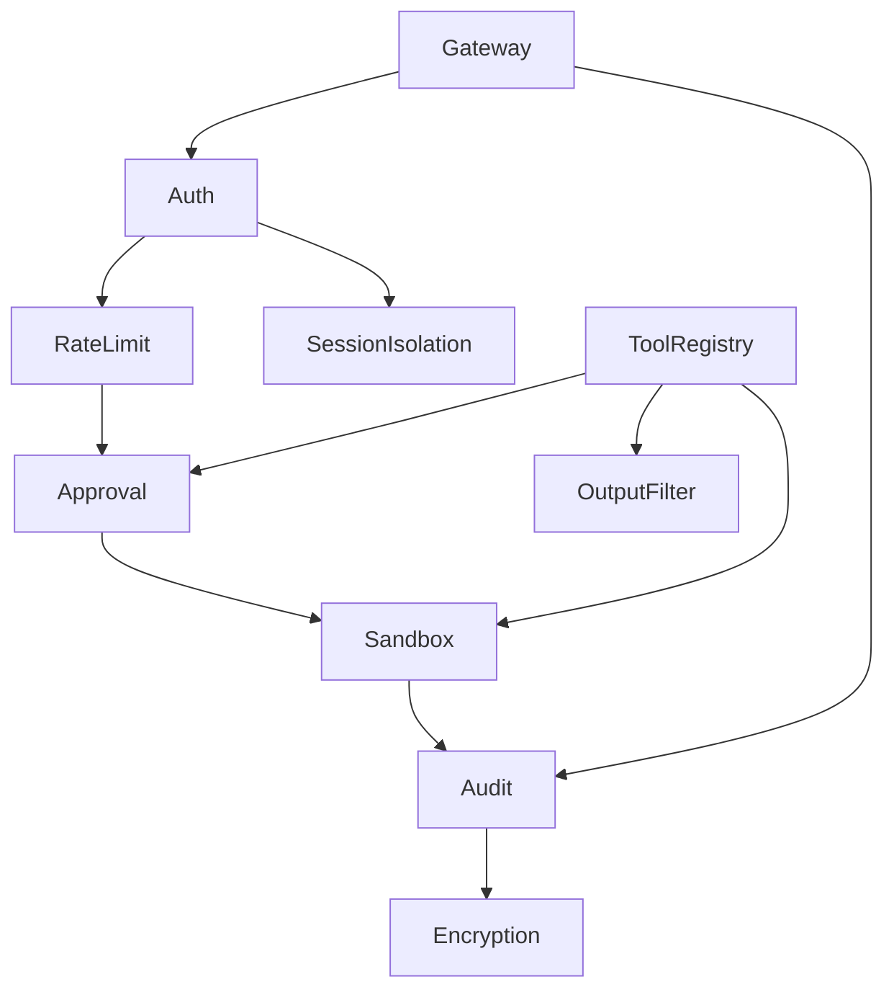

# ShuyuanCore 安全系统设计方案

## 1. 概述

安全系统是 ShuyuanCore 的多层纵深防御体系，覆盖身份认证、访问控制、审批流程、审计追溯、数据加密、沙箱隔离、隐私保护、速率限制等全链路安全能力。系统采用**可插拔策略模式**，每项安全能力可通过配置独立开关。

### 1.1 设计目标

- **纵深防御**：从网络层到数据层建立多层安全屏障
- **零信任原则**：默认不信任任何输入，逐层验证
- **可观测性**：所有安全事件可追踪、可审计、可回溯
- **最小权限**：用户/Agent 仅能访问已授权资源

---

## 2. 架构概览

```
┌──────────────────────────────────────────────────────────┐
│                      外部请求                             │
└──────────────┬───────────────────────────────────────────┘
               │
               ▼
┌──────────────────────────────────────┐
│  Layer 1: 身份认证 (auth)            │
│  API Key / Token 验证                │
└──────────────┬───────────────────────┘
               │
               ▼
┌──────────────────────────────────────┐
│  Layer 2: 速率限制 (rate_limit)      │
│  用户级 + IP 级限流                   │
└──────────────┬───────────────────────┘
               │
               ▼
┌──────────────────────────────────────┐
│  Layer 3: 授权审批 (approval)        │
│  敏感操作二次确认                     │
└──────────────┬───────────────────────┘
               │
               ▼
┌──────────────────────────────────────┐
│  Layer 4: 执行沙箱 (sandbox)          │
│  Docker / 本地隔离执行                 │
└──────────────┬───────────────────────┘
               │
               ▼
┌──────────────────────────────────────┐
│  Layer 5: 输出过滤 (output_filter)   │
│  响应内容安全校验                     │
└──────────────┬───────────────────────┘
               │
               ▼
┌──────────────────────────────────────┐
│  Layer 6: 审计日志 (audit)           │
│  全链路操作记录                       │
└──────────────────────────────────────┘
```

### 2.2 模块依赖关系



---

## 3. 子模块设计

### 3.1 身份认证（auth）

负责验证请求者身份，支持 API Key 认证与会话 Token 认证两种模式。

**设计要点：**
- API Key 从环境变量注入，不硬编码
- 支持多 Key 轮转（通过 `DASHSCOPE_API_KEY` / `DEEPSEEK_API_KEY` / `OPENAI_API_KEY`）
- 会话 Token 采用 HMAC-SHA256 签名，1 小时过期

**预留扩展：**
- OAuth 2.0 / OIDC 集成
- JWT Token 颁发与验证
- 多租户身份隔离

### 3.2 审批管理（approval）

对敏感操作（代码执行、文件删除、数据库写入等）进行二次确认，防止误操作或恶意利用。

**核心数据结构：**

```python
@dataclass
class ApprovalRequest:
    request_id: str          # 唯一标识
    user_id: str             # 请求者
    tool_name: str           # 工具名称
    params: dict             # 调用参数
    reason: str              # 审批原因
    status: str              # pending / approved / rejected / expired
    created_at: float        # 创建时间戳
    resolved_at: float | None  # 处理时间戳
    approved_by: str | None  # 审批人
    timeout: int             # 超时秒数
```

**核心流程：**

```
用户请求 → 安全策略判定 → 是否需要审批？
    ├── 否 → 直接执行
    └── 是 → 创建 ApprovalRequest
              ├── 超时 → 自动拒绝
              ├── 拒绝 → 返回错误
              └── 批准 → 继续执行
```

**实现机制：**
- 使用 `asyncio.Event` 实现异步等待
- 审批请求持久化到 `approvals` 表
- 支持超时自动拒绝（默认 300 秒）
- 提供 CLI 和 API 两种审批渠道

### 3.3 审计日志（audit）

对关键操作进行全量记录，支持缓存批量和实时写入两种模式。

**数据结构：**

```python
@dataclass
class AuditEntry:
    timestamp: float         # 事件时间
    user_id: str             # 操作者
    action: str              # 操作类型
    resource: str            # 操作资源
    params: dict             # 参数（敏感信息已脱敏）
    result: str              # 结果（success / failure）
    approved: bool | None    # 是否经过审批
    approval_id: str         # 关联审批 ID
    duration_ms: float       # 执行耗时
    ip_address: str          # 请求 IP
    error: str               # 错误信息
```

**敏感信息脱敏规则：**

| 字段匹配 | 处理方式 |
|---------|---------|
| `api_key`, `token`, `password`, `secret`, `cookie`, `authorization` | 替换为 `***REDACTED***` |
| 嵌套 dict | 递归脱敏 |
| 长度 > 500 的字符串 | 截断至前 200 字符 + `...[truncated]` |

**存储架构：**

```
┌──────────────┐    批量写入     ┌──────────────┐
│  内存缓存     │ ────────────→ │  audit_logs   │
│  (最多10000条) │               │   SQLite表     │
└──────────────┘               └──────────────┘
     │                               │
     │ 同步写入 (log)                │ 异步查询 (query_db)
     ▼                               ▼
  日志文件 (structlog)             API 查询接口
```

- 同步方法 `log()`：写入内存缓存 + 输出日志
- 异步方法 `log_async()`：写入内存缓存 + 立即刷入数据库
- 批量刷新 `flush_all()`：定期将缓存写入数据库

### 3.4 沙箱执行（sandbox）

对工具命令执行提供安全的隔离环境，支持 Docker 和本地两种模式。

**核心接口：**

```python
class SandboxExecutor:
    async def execute(
        command: list[str],
        timeout: int = 60,
        env: dict | None = None,
        cwd: str | None = None,
        memory_limit: str = "256m",
        image: str = "ubuntu:22.04",
    ) -> SandboxResult: ...
```

**Docker 沙箱策略：**

| 维度 | 策略 |
|------|------|
| 内存限制 | `--memory 256m`（可配置） |
| 网络隔离 | `--network none`，完全禁止对外通信 |
| 文件系统 | `--read-only`，只读根文件系统 |
| 镜像 | 默认 `ubuntu:22.04` |
| 超时 | 默认 60 秒，超时自动终止 |
| 自动清理 | `--rm`，容器退出后自动删除 |

**本地沙箱策略：**
- 使用 `asyncio.create_subprocess_exec` 创建子进程
- 设置环境变量隔离
- 超时自动终止
- 与测试/开发环境配合使用

**降级策略：**
```
sandbox_mode = docker → 检查 Docker 可用性
    ├── Docker 可用 → 使用 Docker 沙箱（60s 缓存检查结果）
    └── Docker 不可用 → 自动降级到本地沙箱
```

### 3.5 其他安全组件

| 组件 | 功能 | 当前状态 |
|------|------|---------|
| auth | 身份认证 | 预留 |
| confirm | 敏感操作确认 | 预留 |
| encryption | 数据加密（AES-256） | 预留 |
| network_isolation | 网络访问控制 | 预留 |
| output_filter | LLM 输出内容安全过滤 | 预留 |
| privacy | 数据脱敏与隐私保护 | 预留 |
| rate_limit | 用户级 + IP 级速率限制 | 预留 |
| rollback | 操作回滚与状态恢复 | 预留 |
| session_isolation | 会话级数据隔离 | 预留 |

---

## 4. 配置项

```yaml
security:
  require_approval: true        # 启用审批流程
  sandbox: docker               # 沙箱模式 (docker / local)
  audit_log: true               # 启用审计日志
  ip_whitelist: []              # IP 白名单
  env_expose: false             # 是否暴露环境变量
  data_encryption: true         # 数据加密
  network_isolation: true       # 网络隔离
  privacy_desensitize: true     # 隐私脱敏
  session_isolation: true       # 会话隔离
  operation_rollback: true      # 操作回滚
  rate_limit: true              # 速率限制
  sensitive_confirm: true       # 敏感确认
  output_filter: true           # 输出过滤
  permission_grading: true      # 权限分级
  cursor_secret: ""             # 游标加密密钥
```

---

## 5. 数据持久化

### audit_logs 表结构

```sql
CREATE TABLE IF NOT EXISTS audit_logs (
    id          INTEGER PRIMARY KEY AUTOINCREMENT,
    user_id     TEXT NOT NULL,
    action      TEXT NOT NULL,
    resource    TEXT NOT NULL DEFAULT '',
    params_json TEXT NOT NULL DEFAULT '{}',
    result      TEXT NOT NULL DEFAULT 'success',
    approved    INTEGER,
    approval_id TEXT NOT NULL DEFAULT '',
    duration_ms REAL NOT NULL DEFAULT 0.0,
    ip_address  TEXT NOT NULL DEFAULT '',
    error       TEXT NOT NULL DEFAULT '',
    timestamp   REAL NOT NULL
);
```

### approvals 表结构

由 `security/approval.py` 中定义，包含审批请求 ID、用户、工具名称、参数、状态、超时时间等字段。

---

## 6. 与系统的集成

### 与网关集成
```python
# 请求处理管线
Gateway Request → auth.verify() → rate_limit.check() → approval.request()
    → sandbox.execute() → audit.log() → Response
```

### 与工具系统集成
```python
# 敏感工具调用流程
ToolRegistry.register(tool)
    → ToolRegistry.execute(tool, params)
        → approval.is_required(tool) → 创建审批请求
        → sandbox.execute(command)   → 隔离执行
        → audit.log(entry)           → 记录日志
```

---

## 7. 待实现功能

| 功能 | 优先级 | 说明 |
|------|--------|------|
| OAuth 2.0 集成 | 中 | 支持第三方身份认证 |
| 速率限制策略引擎 | 高 | 支持用户级 + IP 级分布式限流 |
| 数据加密 | 高 | AES-256 对数据库敏感字段加密 |
| 输出内容安全过滤 | 中 | 基于规则 + LLM 的输出校验 |
| 操作回滚 | 低 | 支持 Agent 关键操作的事务回滚 |
| 权限分级管理 | 中 | 管理员/普通用户/只读用户分级 |