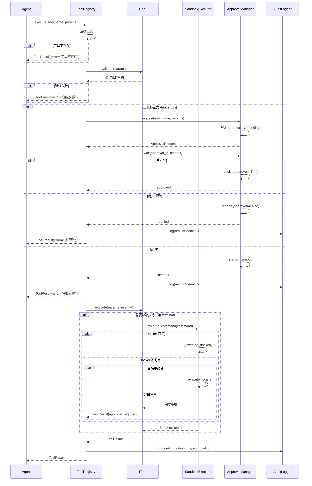
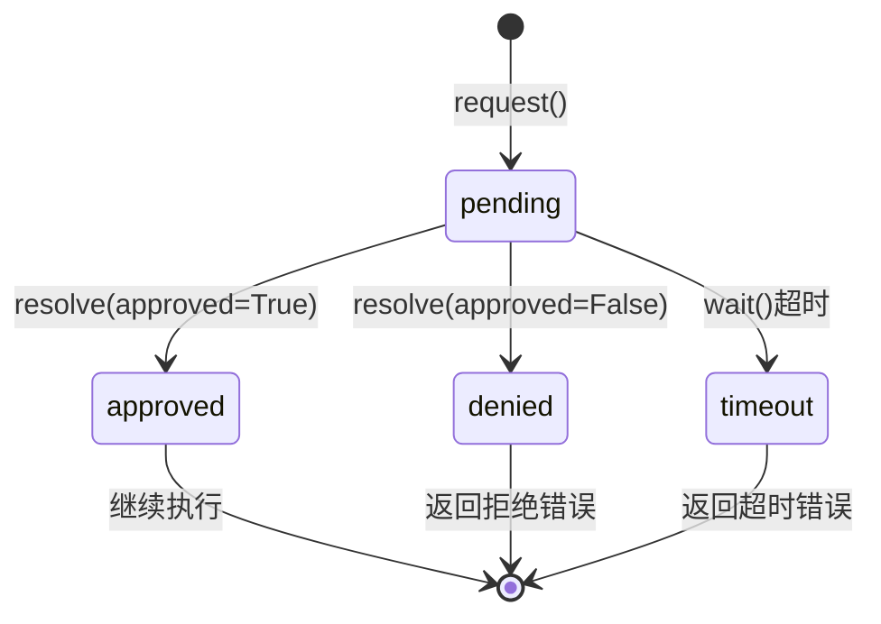
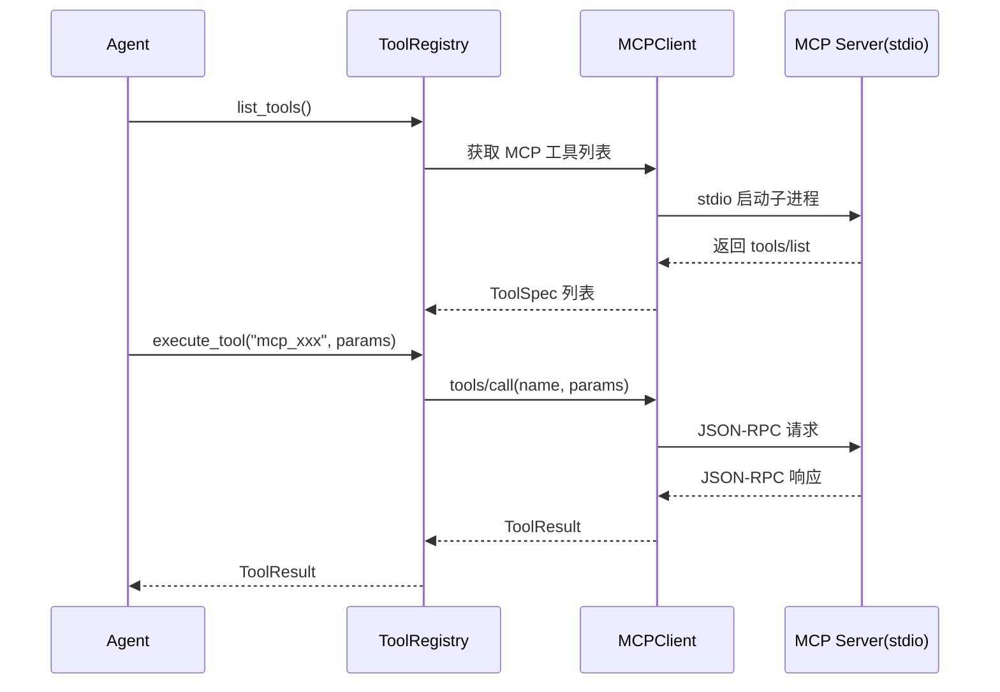

# ShuyuanCore 工具系统设计方案

**最后更新日期**：2026-05-27  
**对应阶段**：Phase 6（工具框架与安全沙箱）+ Phase 7（扩展工具与审批集成）

---

## 1. 设计目标

ShuyuanCore 工具系统的核心设计目标是构建一个**安全可控的工具执行体系**，使 AI Agent 能够在受控环境中安全地调用各类能力——从终端命令、代码执行到社交媒体数据采集和加密操作——同时在每一次工具调用中保证可审计、可审批、可追溯。

具体设计目标包括：

- **统一抽象**：通过 `ITool` 接口定义所有工具的行为契约，任何工具只需实现 `get_spec()`、`validate()`、`execute()` 三个方法即可接入系统。
- **安全沙箱**：默认使用 Docker 容器隔离执行，本地模式下通过白名单机制限制危险操作，确保命令执行不污染宿主机环境。
- **审批流程**：危险工具（`dangerous=True`）自动触发审批流程，引入用户确认环节，防止 AI 自主执行高危操作。
- **审计追踪**：每次工具调用的全量参数、结果、耗时、审批信息均写入 `audit_logs` 表，支持事后追溯和排查。
- **可扩展性**：支持通过 MCP（Model Context Protocol）连接外部工具服务器，允许在不修改核心代码的前提下扩展工具集。
- **信念场集成**：工具执行结果可写入 `beliefs` 表，tool_name 记录在 metadata 中，使 Agent 的"记忆"覆盖工具调用经验。

---

## 2. 核心概念

### 2.1 工具分类体系

系统共定义了 **29 个内置工具**，分为 6 大类别：

| 类别 | 类别标识 | 说明 |
|------|----------|------|
| 系统工具 | `system` | 终端执行、进程管理、文件操作、代码执行等 |
| 网络工具 | `web` | 网页抓取、浏览器自动化等 |
| 办公工具 | `office` | 文档生成、格式转换、电子表格、翻译、日历等 |
| 社交工具 | `social` | 小红书、抖音、微博、微信公众号等 |
| 扩展工具 | `extension` | 图表生成、加密解密、定时任务、子代理委托、媒体处理等 |
| 记忆工具 | `memory` | 信念搜索/读取/写入/删除等 |

### 2.2 安全沙箱隔离

系统采用**双层安全策略**：

1. **Docker 沙箱（首选）**：通过 `SandboxExecutor` 调用 Docker API 创建隔离容器，所有命令在 `--read-only`、`--network none`、受控内存限制的容器中执行，最大限度隔离宿主机。
2. **本地降级（回退）**：当 Docker 不可用时，自动降级到本地子进程执行。本地模式下，只有 `terminal_whitelist` 中的命令（`ls`、`pwd`、`echo`、`cat` 等）可直接执行；非白名单命令需要经过审批流程。

```python
# 安全沙箱核心逻辑（简化自 src/security/sandbox.py）
class SandboxExecutor:
    async def execute(self, command, timeout, env, cwd, memory_limit, image):
        if self._sandbox_mode == "docker" and await self.check_docker():
            return await self._execute_docker(...)
        return await self._execute_local(...)

    async def _execute_docker(self, command, timeout, memory_limit, image):
        cmd = [
            "docker", "run", "--rm", "-i",
            "--memory", memory_limit,
            "--network", "none",      # 网络隔离
            "--read-only",            # 只读文件系统
            image,
        ] + command
        # ... 执行并返回结果
```

### 2.3 审批流程（ApprovalManager）

`ApprovalManager` 是整个工具系统的**安全守门人**。危险工具的执行必须经过"请求→等待→审批→执行"的生命周期：

```python
# 审批流程核心（简化自 src/security/approval.py）
class ApprovalManager:
    async def request(self, tool_name, params, user_id, timeout) -> ApprovalRequest:
        approval_id = f"{user_id}_{uuid.hex[:12]}"
        event = asyncio.Event()
        self._events[approval_id] = event
        # 写入 SQLite approvals 表
        await conn.execute("INSERT INTO approvals (...) VALUES (...)", ...)
        return ApprovalRequest(approval_id=approval_id, ...)

    async def resolve(self, approval_id, approved, reason, resolved_by):
        new_status = "approved" if approved else "denied"
        # 更新 SQLite
        await conn.execute("UPDATE approvals SET status=? ...", ...)
        # 通知等待方
        event = self._events.pop(approval_id, None)
        if event: event.set()

    async def wait(self, approval_id, timeout) -> bool:
        try:
            await asyncio.wait_for(event.wait(), timeout=wait_timeout)
            # 超时自动拒绝
        except asyncio.TimeoutError:
            await conn.execute("UPDATE approvals SET status='timeout' ...", ...)
            return False
```

### 2.4 审计日志（audit_logs 表）

每次工具调用的全生命周期信息都会记录到 `audit_logs` 表，使用**内存缓存 + 异步 flush** 的双写机制以平衡性能与持久化需求。

```sql
-- audit_logs 表结构
CREATE TABLE IF NOT EXISTS audit_logs (
    id INTEGER PRIMARY KEY AUTOINCREMENT,
    user_id TEXT NOT NULL,
    action TEXT NOT NULL,
    resource TEXT NOT NULL DEFAULT '',
    params_json TEXT NOT NULL DEFAULT '{}',
    result TEXT NOT NULL DEFAULT 'success',
    approved INTEGER,
    approval_id TEXT NOT NULL DEFAULT '',
    duration_ms REAL NOT NULL DEFAULT 0.0,
    ip_address TEXT NOT NULL DEFAULT '',
    error TEXT NOT NULL DEFAULT '',
    timestamp REAL NOT NULL
);
```

### 2.5 危险命令识别

`TerminalTool` 内置了 `DANGEROUS_COMMANDS` 黑名单（`rm`、`dd`、`mkfs`、`shutdown`、`chmod`、`chown` 等），当命令中包含这些 token 时会被标记为危险。此外，通过 `terminal_whitelist` 白名单控制本地模式下允许直接执行的命令：

```python
# 来自 src/config.py ToolsConfig
class ToolsConfig(BaseModel):
    terminal_whitelist: list[str] = Field(
        default_factory=lambda: [
            "ls", "pwd", "echo", "cat", "head", "tail", "grep", "which", "whoami", "date"
        ]
    )
```

白名单机制在沙箱不可用时的**本地降级**场景中发挥关键作用——白名单命令可直接执行，非白名单命令则触发审批。

### 2.6 可选依赖分组

工具系统采用组件的可选依赖分组策略。在 `pyproject.toml` 中定义了 `[project.optional-dependencies]` 分组：

```toml
[project.optional-dependencies]
tools = ["docker>=7.0"]
```

这意味着核心安装不强制要求 Docker 依赖，用户可根据需要选择安装。部分工具（如 `chart` 需要 `matplotlib`、`crypto` 需要 `cryptography`、`media` 需要 `pytesseract`/`Pillow`/`edge-tts`）通过运行时 import 检查实现按需加载。

---

## 3. 数据流

### 3.1 工具调用流程



### 3.2 审批生命周期



### 3.3 MCP 客户端连接流程



---

## 4. 关键配置参数

工具系统的行为通过 `ToolsConfig` 和 `SecurityConfig` 两个 Pydantic 模型进行配置：

### 4.1 ToolsConfig

```python
# 来自 src/config.py
class ToolsConfig(BaseModel):
    sandbox: str = "docker"                    # 沙箱模式：docker / local
    default_timeout: int = 60                  # 默认执行超时（秒）
    approval_timeout: int = 300                # 审批等待超时（秒）
    terminal_whitelist: list[str] = [          # 本地模式白名单命令
        "ls", "pwd", "echo", "cat", "head",
        "tail", "grep", "which", "whoami", "date"
    ]
    code_exec_timeout: int = 30                # 代码执行超时（秒）
    code_exec_memory_limit: int = 256          # 代码执行内存限制（MB）
    web_timeout: int = 30                      # 网络请求超时（秒）
    web_user_agent: str = "ShuyuanCore/1.0"   # HTTP 请求 User-Agent
    respect_robots: bool = True                # 是否遵守 robots.txt
    database_readonly: bool = True             # 数据库工具只读模式
```

### 4.2 SecurityConfig

```python
class SecurityConfig(BaseModel):
    require_approval: bool = True              # 启用审批
    sandbox: str = "docker"                    # 沙箱模式
    audit_log: bool = True                     # 启用审计日志
    ip_whitelist: list[str] = []               # IP 白名单
    data_encryption: bool = True               # 数据加密
    network_isolation: bool = True             # 网络隔离
    privacy_desensitize: bool = True           # 隐私脱敏
    session_isolation: bool = True             # 会话隔离
    operation_rollback: bool = True            # 操作回滚
    rate_limit: bool = True                    # 限流
    rate_limit_per_minute: int = 60            # 每分钟最大请求数
```

---

## 5. 接口定义

### 5.1 核心数据类型

```python
# 来自 src/tools/interfaces.py
@dataclass
class ToolParameter:
    name: str          # 参数名
    type: str          # 参数类型（string / integer / array / object）
    description: str   # 参数说明
    required: bool = False
    default: Any = None

@dataclass
class ToolSpec:
    name: str                              # 工具名称
    description: str                       # 工具描述
    category: str                          # 工具类别
    parameters: list[ToolParameter] = []   # 参数列表
    dangerous: bool = False                # 是否危险
    require_sandbox: bool = False          # 是否需要沙箱
    require_approval: bool = False         # 是否需要审批

@dataclass
class ToolResult:
    success: bool                          # 是否成功
    data: Any = None                       # 返回数据
    error: str = ""                        # 错误信息
    duration_ms: float = 0.0               # 执行耗时
    approval_id: str = ""                  # 审批 ID
```

### 5.2 ITool 接口

```python
class ITool(ABC):
    @abstractmethod
    def get_spec(self) -> ToolSpec:
        """返回工具的元数据描述"""
        ...

    @abstractmethod
    async def validate(self, params: dict[str, Any]) -> list[str]:
        """验证参数合法性，返回错误列表（空列表表示验证通过）"""
        ...

    @abstractmethod
    async def execute(self, params: dict[str, Any], user_id: str = "default") -> ToolResult:
        """执行工具逻辑"""
        ...
```

### 5.3 IToolRegistry 接口

```python
class IToolRegistry(ABC):
    @abstractmethod
    def register(self, tool: ITool) -> None:
        """注册一个工具到注册表"""
        ...

    @abstractmethod
    def get_tool(self, name: str) -> ITool | None:
        """根据名称查找工具"""
        ...

    @abstractmethod
    def list_tools(self, category: str | None = None) -> list[ToolSpec]:
        """列出所有工具（可按类别筛选）"""
        ...

    @abstractmethod
    async def execute_tool(self, name: str, params: dict[str, Any], user_id: str = "default") -> ToolResult:
        """执行工具（含审批、审计、沙箱等完整流程）"""
        ...
```

### 5.4 ToolRegistry 实现

[ToolRegistry](file:///workspace/src/tools/registry.py) 是 `IToolRegistry` 的核心实现，协调了工具查找、参数验证、审批触发、审计日志写入等全流程：

```python
class ToolRegistry(IToolRegistry):
    def __init__(self):
        self._tools: dict[str, ITool] = {}

    def register(self, tool: ITool) -> None:
        spec = tool.get_spec()
        self._tools[spec.name] = tool

    async def execute_tool(self, name, params, user_id="default") -> ToolResult:
        tool = self._tools.get(name)
        if tool is None:
            return ToolResult(success=False, error=f"工具不存在: {name}")

        spec = tool.get_spec()
        # 1. 参数验证
        validation_errors = await tool.validate(params)
        if validation_errors:
            return ToolResult(success=False, error="; ".join(validation_errors))

        # 2. 危险工具 → 审批
        if spec.dangerous:
            approval_mgr = get_approval_manager()
            req = await approval_mgr.request(...)
            approved = await approval_mgr.wait(req.approval_id, timeout)
            if not approved:
                get_audit_logger().log(result="denied")
                return ToolResult(success=False, error="工具操作被拒绝")

        # 3. 执行
        result = await tool.execute(params=params, user_id=user_id)

        # 4. 审计
        get_audit_logger().log(user_id=user_id, action="tool_execute",
                                resource=f"tool:{name}", ...)
        return result
```

---

## 6. 29 个内置工具列表

以下表格列出所有内置工具的名称、类别、危险标记和简要描述：

| 序号 | 工具名称 | 类别 | 危险 | 描述 |
|------|----------|------|------|------|
| 1 | terminal | system | 是 | 执行终端命令，支持沙箱隔离和危险命令检测 |
| 2 | file_ops | system | 是 | 文件系统操作（读写、移动、删除、搜索） |
| 3 | process | system | 是 | 系统进程管理与监控 |
| 4 | code_exec | system | 是 | 执行代码片段（支持 Python / JavaScript） |
| 5 | web | web | 否 | 网页抓取与 HTTP 请求 |
| 6 | browser | web | 是 | 浏览器自动化操作 |
| 7 | database | office | 否 | 数据库查询（只读模式） |
| 8 | email | office | 否 | 邮件发送与读取 |
| 9 | spreadsheet | office | 否 | Excel/CSV 电子表格读写 |
| 10 | translate | office | 否 | 文本翻译服务 |
| 11 | doc_gen | office | 否 | 文档自动生成 |
| 12 | file_convert | office | 否 | 文件格式转换 |
| 13 | calendar | office | 否 | 日历与日程管理 |
| 14 | git | office | 否 | Git 仓库操作 |
| 15 | project_mgmt | office | 否 | 项目管理工具 |
| 16 | knowledge_base | office | 否 | 知识库管理与检索 |
| 17 | memory | memory | 否 | 信念记忆管理（搜索/读取/写入/删除） |
| 18 | skills | extension | 否 | 技能节点管理 |
| 19 | monitoring | system | 否 | 系统监控与性能指标收集 |
| 20 | chart | extension | 否 | 图表生成（柱状/折线/饼图/散点/Mermaid） |
| 21 | crypto | extension | 是 | 加密、解密、签名与验证 |
| 22 | cron | extension | 否 | 定时任务管理（创建/删除/触发） |
| 23 | delegation | extension | 是 | 子代理委托任务管理 |
| 24 | media | extension | 否 | 媒体处理（OCR/TTS/STT/图片处理） |
| 25 | xiaohongshu | social | 否 | 小红书公开数据搜索与检索 |
| 26 | douyin | social | 否 | 抖音公开数据搜索与检索 |
| 27 | weibo | social | 否 | 微博公开数据搜索与检索 |
| 28 | wechat_mp | social | 否 | 微信公众号文章搜索与检索 |
| 29 | api_debug | extension | 否 | API 调试工具（预留，暂无实现） |

**标记为 dangerous 的工具**共 5 个：`terminal`、`file_ops`、`process`、`code_exec`、`browser`、`crypto`、`delegation`。

这些工具要么直接操作系统资源（文件、进程、命令），要么涉及敏感操作（加密密钥管理、子代理生成），因此必须经过审批流程。

---

## 7. 审批机制详解

### 7.1 请求/解决/等待生命周期

审批机制由 [ApprovalManager](file:///workspace/src/security/approval.py) 实现，核心是 **asyncio.Event 同步 + SQLite 持久化** 的双层模型：

1. **request()**：创建审批请求，生成唯一 `approval_id`，创建 `asyncio.Event`，将请求写入 `approvals` 表（status=`pending`）。
2. **wait()**：调用方阻塞等待 `event.wait()`，可设置超时。超时后自动标记为 `timeout` 并返回 `False`。
3. **resolve()**：审批方调用，更新 `approvals` 表（status=`approved`/`denied`），然后 `event.set()` 唤醒等待方。

```python
# 审批同步核心：asyncio.Event 实现
async def wait(self, approval_id, timeout=None) -> bool:
    event = self._events.get(approval_id)
    if event is None:
        event = asyncio.Event()
        self._events[approval_id] = event
    
    try:
        await asyncio.wait_for(event.wait(), timeout=wait_timeout)
        row = await conn.execute("SELECT approved FROM approvals WHERE approval_id=?", ...)
        return bool(row["approved"])
    except asyncio.TimeoutError:
        # 自动标记为超时拒绝
        await conn.execute(
            "UPDATE approvals SET status='timeout', approved=0, reason='审批超时自动拒绝' ..."
        )
        return False
```

### 7.2 SQLite 持久化

审批请求持久化在 `approvals` 表中，确保系统重启后未完成的审批可恢复：

```sql
CREATE TABLE IF NOT EXISTS approvals (
    approval_id TEXT PRIMARY KEY,
    user_id TEXT NOT NULL,
    tool_name TEXT NOT NULL,
    params_json TEXT NOT NULL DEFAULT '{}',
    status TEXT NOT NULL DEFAULT 'pending',
    approved INTEGER,
    reason TEXT NOT NULL DEFAULT '',
    resolved_by TEXT NOT NULL DEFAULT '',
    timeout INTEGER NOT NULL DEFAULT 300,
    stream_id TEXT,
    created_at REAL NOT NULL,
    resolved_at REAL NOT NULL DEFAULT 0.0
);
```

在 `initialize()` 时，系统会从数据库恢复所有 `status='pending'` 的审批请求，重建 `asyncio.Event` 对象，确保中断恢复后的审批流程不被中断。

---

## 8. 审计日志机制

### 8.1 双写机制

[AuditLogger](file:///workspace/src/security/audit.py) 采用**内存缓存 + 异步 flush**的双写策略：

- **同步写缓存**：`log()` 方法仅将条目追加到内存 `_cache` 列表，并打印日志，不阻塞调用方。
- **异步持久化**：`log_async()` 方法在追加缓存后立即调用 `_flush_entry()` 写入 SQLite。系统也提供 `flush_all()` 方法用于批量将缓存条目刷入数据库。
- **缓存保护**：当缓存超过 `_max_entries`（10000 条）时，自动截断保留后半部分。

```python
class AuditLogger:
    def __init__(self, db_path="data/state.db"):
        self._cache: list[AuditEntry] = []
        self._conn: aiosqlite.Connection | None = None
        self._max_entries: int = 10000

    def log(self, user_id, action, resource, params, ...):
        entry = AuditEntry(timestamp=time.time(), ...)
        self._cache.append(entry)
        logger.info("audit: %s %s on %s -> %s (%.1fms)", ...)
        # 内存保护
        if len(self._cache) > self._max_entries:
            self._cache = self._cache[-self._max_entries // 2:]

    async def log_async(self, ...):
        # 同步写缓存 + 异步刷 DB
        self._cache.append(entry)
        await self._flush_entry(entry)

    async def flush_all(self):
        entries = self._cache[:]
        self._cache.clear()
        for entry in entries:
            await self._flush_entry(entry)

    async def _flush_entry(self, entry):
        await conn.execute("INSERT INTO audit_logs (...) VALUES (...)", ...)
        await conn.commit()
```

### 8.2 参数脱敏

审计日志在记录参数时自动执行敏感信息脱敏：

```python
_SENSITIVE_KEYS = {"api_key", "token", "password", "secret", "cookie", "authorization"}

def _sanitize_params(params):
    for key, value in params.items():
        if any(s in key.lower() for s in _SENSITIVE_KEYS):
            sanitized[key] = "***REDACTED***"  # 敏感字段脱敏
        elif isinstance(value, str) and len(value) > 500:
            sanitized[key] = value[:200] + "...[truncated]"  # 长文本截断
```

---

## 9. 危险命令识别

### 9.1 白名单机制

[TerminalTool](file:///workspace/src/tools/builtin/terminal.py) 实现了一套完整的危险命令识别流程：

1. **黑名单检测**：`DANGEROUS_COMMANDS` 包含 `rm`、`dd`、`mkfs`、`shutdown`、`chmod`、`chown` 等破坏性命令，通过 `_contains_dangerous_command()` 检查命令 token 是否命中黑名单。

2. **白名单检查**：在本地模式下，通过 `_is_whitelisted()` 检查命令的 base command 是否在 `terminal_whitelist` 中：

```python
def _is_whitelisted(self, command: str, settings) -> bool:
    base_cmd = shlex.split(command)[0] if shlex.split(command) else ""
    whitelist = settings.tools.terminal_whitelist
    return base_cmd in whitelist
```

3. **执行决策树**：

```
命令输入
  │
  ├─ Docker 可用 → Docker 沙箱执行
  │
  └─ Docker 不可用
       ├─ 白名单命令 → 本地执行（无需审批）
       └─ 非白名单命令 → 返回审批要求（需用户确认）
```

### 9.2 内置危险命令列表

```python
DANGEROUS_COMMANDS: frozenset[str] = frozenset({
    "rm", "dd", "mkfs", "format",
    "shutdown", "reboot", "halt", "poweroff",
    ">", ">>", "|",  # shell 重定向和管道
    "chmod", "chown",
})
```

---

## 10. 与信念场的关系

### 10.1 beliefs 表结构

工具执行结果与信念系统（Belief System）深度集成。[记忆工具](file:///workspace/src/tools/builtin/memory.py) 的 `write` 操作可以直接将数据写入 `beliefs` 表，`source` 字段标记为 `"tool"`：

```sql
-- beliefs 表核心字段
CREATE TABLE IF NOT EXISTS beliefs (
    id TEXT PRIMARY KEY,
    conversation_id TEXT NOT NULL,
    user_id TEXT NOT NULL DEFAULT 'anonymous',
    content TEXT NOT NULL,
    source TEXT NOT NULL DEFAULT 'user',    -- 标记来源
    confidence REAL NOT NULL DEFAULT 1.0,
    layer INTEGER NOT NULL DEFAULT 3,
    entities TEXT DEFAULT '[]',
    timestamp INTEGER NOT NULL DEFAULT 0,
    metadata_json TEXT DEFAULT '{}',         -- 可存入 tool_name 等信息
    ...
);
```

### 10.2 工具 metadata 记录

当工具执行产生信念数据时，`tool_name` 被记录到 `metadata_json` 字段中。例如 [MemoryTool](file:///workspace/src/tools/builtin/memory.py) 的 write 操作：

```python
# MemoryTool._execute_write()
async def _execute_write(self, params, conversation_id):
    belief = Belief(
        content=content,
        source="tool",                    # 标记为工具来源
        metadata={"tool": "memory"},       # 记录工具名称
    )
    belief_id = await self._store.add(conversation_id, belief)
    return ToolResult(success=True, data={"belief_id": belief_id})
```

同样，子代理工具（DelegationTool）的执行结果也会通过 `sub_agent` 的 `_execute()` 方法写入信念场：

```python
# sub_agent.py
belief = Belief(
    content=summary,
    source=f"sub_agent:{scope}",
    metadata={"task": task, "scope": scope},  # 记录任务上下文中
)
await self._belief_store.add(conversation_id, belief)
```

这种设计使得 Agent 能够通过信念搜索（`memory.search`）回顾过去的工具执行经验和结果，实现"经验积累"式的自我进化。

---

## 11. MCP 客户端流程

MCP（Model Context Protocol）支持允许系统连接外部工具服务器，扩展工具集。

### 11.1 连接生命周期

1. **启动**：MCP Client 通过 stdio 启动外部 MCP Server 子进程。
2. **发现**：调用 `tools/list` 获取服务器提供的工具列表，转换为 `ToolSpec` 对象。
3. **调用**：当 Agent 调用 MCP 工具时，通过 `tools/call` 发送 JSON-RPC 请求。
4. **关闭**：会话结束时关闭子进程。

### 11.2 接口设计

MCP 客户端通过 JSON-RPC 2.0 协议与服务器通信，支持标准的 `tools/list` 和 `tools/call` 方法。每个 MCP 工具会被包装为 `ITool` 实例，透明地集成到 `ToolRegistry` 中。

---

## 12. 已知限制与注意事项

### 12.1 MCP 服务器依赖外部进程

- MCP 工具依赖外部服务器子进程，通过 stdio 通信。需要确保 stdio 命令在部署环境中可用。
- MCP 服务器的稳定性直接影响工具的可用性，建议在生产环境中使用进程管理工具（如 systemd、supervisor）进行守护。

### 12.2 Docker 沙箱可用性

- 系统默认使用 Docker 沙箱，但 Docker 并非在全部环境中可用。本地降级模式的安全性完全依赖于 `terminal_whitelist` 白名单机制。
- 代码执行沙箱（`code_exec`）尚未实现完整的 Docker 隔离，当前在本地直接执行。

### 12.3 社交工具速率限制

- 小红书、抖音、微博等社交工具依赖公开网页接口，访问频率受限。工具内部实现了 `MIN_REQUEST_INTERVAL`（1 秒）的速率控制，但仍然可能触发平台反爬机制。
- 社交工具当前的 API 调用在失败时自动降级为模拟数据（mock），确保功能演示不受网络影响。

### 12.4 审批超时默认值

- 审批超时默认值为 300 秒（5 分钟），对于需要快速响应的场景可能需要调整。可通过 `ToolsConfig.approval_timeout` 配置。

### 12.5 可选依赖

- 部分工具依赖外部 Python 包（如 `chart` → `matplotlib`、`crypto` → `cryptography`、`media` → `pytesseract`/`Pillow`/`edge-tts`），这些依赖通过运行时 `try/except ImportError` 实现优雅降级，但功能受限。

---

## 附录 A：工具注册流程

所有内置工具在系统启动时通过 `__init__.py` 导入并注册到全局 `ToolRegistry`：

```python
# 注册流程示意
from src.tools.builtin import (
    TerminalTool, FileOpsTool, ProcessTool, CodeExecTool,
    MemoryTool, SkillsTool, WebTool, BrowserTool,
    DatabaseTool, EmailTool, SpreadsheetTool,
    TranslateTool, DocGenTool, FileConvertTool,
    CalendarTool, GitTool, ProjectMgmtTool, KnowledgeBaseTool,
    XiaoHongShuTool, DouYinTool, WeiBoTool, WeChatMpTool,
    MonitoringTool, ChartTool, CryptoTool, CronTool,
    DelegationTool, MediaTool,
)
from src.tools.registry import get_tool_registry

registry = get_tool_registry()
for tool_cls in [TerminalTool, FileOpsTool, ...]:
    registry.register(tool_cls())
```

## 附录 B：配置完整示例

```yaml
# config.yaml 工具系统相关配置
tools:
  sandbox: docker
  default_timeout: 60
  approval_timeout: 300
  terminal_whitelist:
    - ls
    - pwd
    - echo
    - cat
    - head
    - tail
    - grep
    - which
    - whoami
    - date
  code_exec_timeout: 30
  code_exec_memory_limit: 256
  web_timeout: 30
  web_user_agent: "ShuyuanCore/1.0"
  respect_robots: true
  database_readonly: true

security:
  require_approval: true
  sandbox: docker
  audit_log: true
  network_isolation: true
  privacy_desensitize: true
  rate_limit: true
  rate_limit_per_minute: 60
```