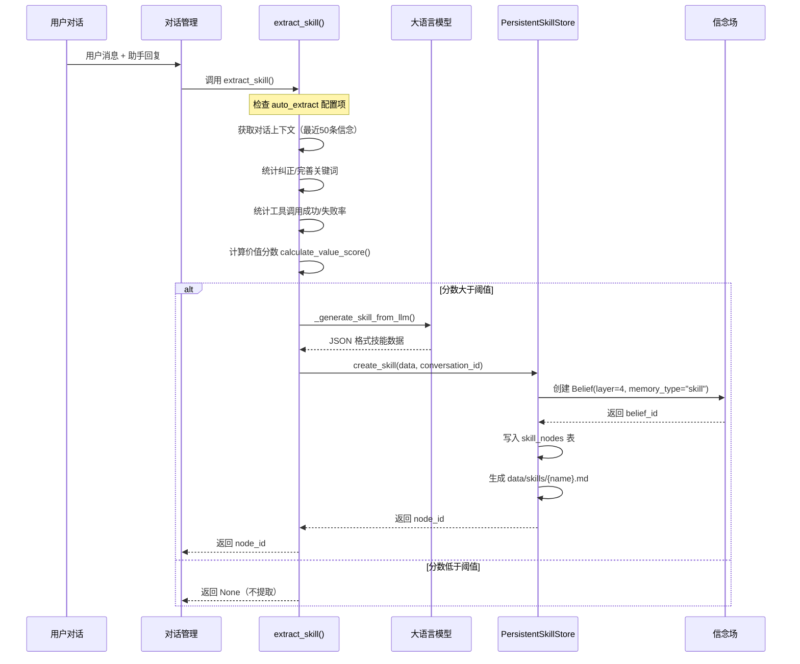
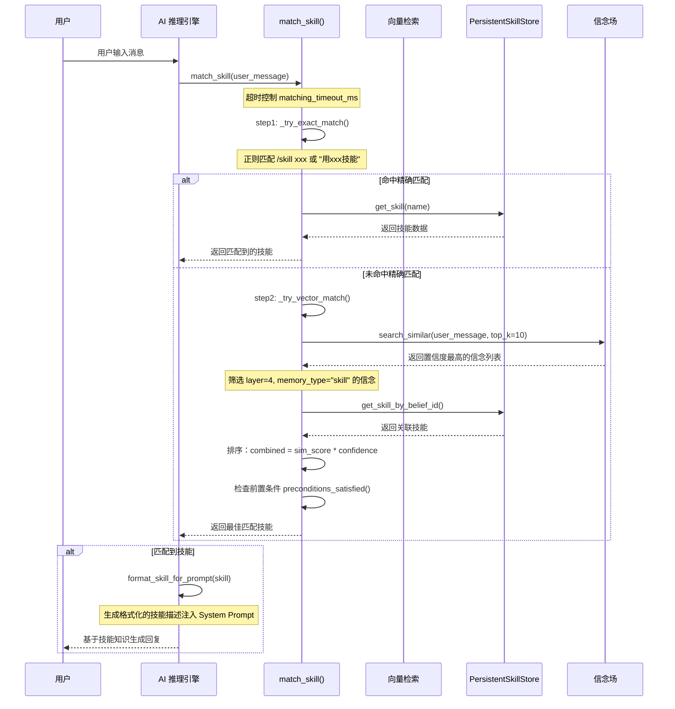
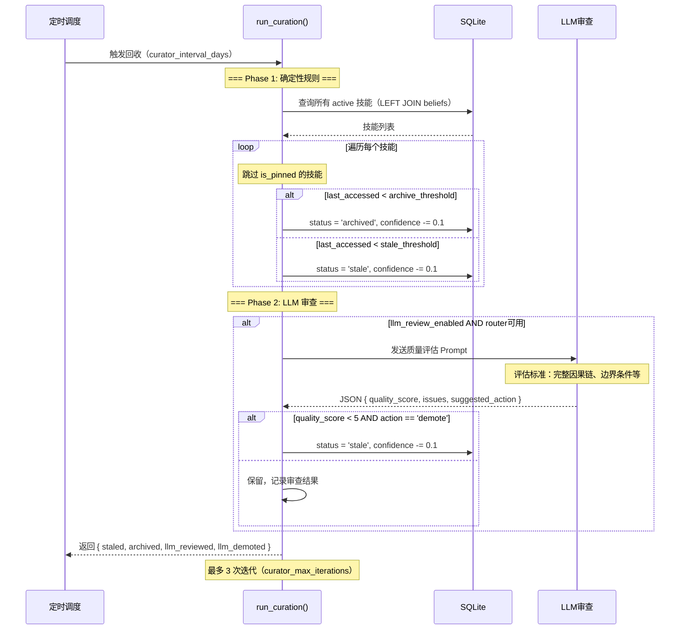

# ShuyuanCore 技能系统设计方案

> **最后更新**: 2026-05-27  
> **对应阶段**: Phase 5-6  
> **版本**: 1.0

---

## 1. 设计目标

技能系统是 ShuyuanCore 认知架构中**程序性记忆（Procedural Memory）** 的载体，其核心目标是将用户在对话中展现的可复用行为模式提炼为结构化的**因果技能图（Causal Skill Graph）**，使 AI 能够在后续交互中自动识别、匹配并复用已学技能。

具体目标包括：

- **从对话中自动提炼技能**：通过 LLM 分析对话上下文，自动提取可复用的因果关系和操作步骤，形成技能节点（SkillNode）。
- **构建因果技能图**：技能节点之间通过有向边连接，形成支持 BFS/DFS 遍历的图结构，表达"技能 A 使能技能 B"或"技能 A 抽象为技能 B"等关系。
- **置信度驱动的技能生命周期**：每个技能节点附带置信度，使用时衰减，Curator 定期回收低质量或长期未使用的技能。
- **信念统一存储**：技能节点以 `layer=4`、`memory_type="skill"` 存入信念表（beliefs），与陈述性记忆共享同一套置信度传播和衰减机制。
- **渐进式技能匹配**：支持精确关键词匹配和语义向量匹配两种模式，根据用户输入自动检索最相关的技能注入上下文。

---

## 2. 核心概念

### 2.1 技能节点（SkillNode）

技能节点是技能图的基本单元，定义在 [models.py](/workspace/src/skills/models.py#L8-L29) 中，包含以下 9 类字段：

#### 标识与元信息

| 字段 | 类型 | 说明 |
|------|------|------|
| `node_id` | `str` | 全局唯一标识，格式 `sk_xxxxxxxxxxxx` |
| `name` | `str` | 技能名称，英文短横线命名（如 `api-test-suite`） |
| `node_type` | `str` | 节点类型，默认为 `"skill"` |
| `belief_id` | `str` | 关联信念 ID，与 beliefs 表打通 |
| `source` | `str` | 来源，枚举：`"manual"`, `"auto_extracted"`, `"community"` |

#### 语义描述

| 字段 | 类型 | 说明 |
|------|------|------|
| `description` | `str` | 中文描述，一句话概括技能用途 |
| `tags` | `list[str]` | 标签列表，用于模糊匹配和分类 |
| `preconditions` | `list[dict]` | 前置条件，描述技能执行前需满足的条件 |

#### 因果链（三级抽象）

因果链是技能系统的核心语义，采用三级抽象层次设计，适应不同复杂度场景：

- **`causality_level0`**：一句话因果链，格式为"当【条件】时→做【动作】→得到【结果】"。适用于技能摘要和快速匹配预览。
- **`causality_level1`**：完整因果链，含中间步骤和分支条件。适用于需要完整理解的场景。
- **`causality_level2`**：详细推理，含完整的决策树或流程图。适用于复杂技能的解释和执行。

> 默认提取器只填充 `level0`，`level1` 和 `level2` 保留为空字符串，留待后续渐进式完善。

#### 约束与边界

| 字段 | 类型 | 说明 |
|------|------|------|
| `boundaries` | `list[str]` | 不适用场景列表，防止技能被误用到不合适的上下文 |
| `failure_modes` | `list[str]` | 可能的失败模式，帮助 AI 预判和处理异常 |
| `dependencies` | `list[str]` | 外部依赖项，标识技能依赖的其他技能名称 |

#### 版本与状态

| 字段 | 类型 | 说明 |
|------|------|------|
| `version_history` | `list[dict]` | 版本历史记录，每项含 `version`, `date`, `change` 字段 |
| `status` | `str` | 状态：`"active"`（活跃）、`"stale"`（需审查）、`"archived"`（归档）、`"incomplete"`（不完整） |
| `is_pinned` | `bool` | 是否固定，固定技能不会被 Curator 回收 |
| `confidence` | `float` | 置信度，初始值：提取 0.6，显式保存 0.9 |
| `last_accessed` | `int` | 最后访问时间戳（毫秒），从关联信念继承 |
| `created_at` / `updated_at` | `int` | 创建和更新时间戳 |

### 2.2 技能边（SkillEdge）

边定义在 [models.py](/workspace/src/skills/models.py#L32-L39)，构建技能节点之间的关系：

| 字段 | 类型 | 说明 |
|------|------|------|
| `edge_id` | `str` | 全局唯一标识，格式 `se_xxxxxxxxxxxx` |
| `from_node` | `str` | 源技能名称 |
| `to_node` | `str` | 目标技能名称 |
| `edge_type` | `str` | 边类型，见下方说明 |
| `created_at` | `int` | 创建时间戳 |

#### 边类型枚举

| 类型 | 语义 | 说明 |
|------|------|------|
| `enables` | 使能关系 | 技能 A 使能技能 B（最常见的关系） |
| `abstracts` | 抽象关系 | 技能 A 是技能 B 的更高层抽象 |
| `causally-linked` | 因果关系 | 技能 A 的结果作为技能 B 的输入 |
| `requires` | 依赖关系 | 技能 A 的执行要求技能 B 先执行 |

当添加 `enables` 或 `causally-linked` 类型的边时，系统会自动同步到信念表的 `depends_on` 字段，确保技能图与信念场的一致性（参考 [_sync_to_belief_depends_on](/workspace/src/skills/manager.py#L501-L550)）。

### 2.3 技能使用记录（SkillUsage）

[SkillUsage](/workspace/src/skills/models.py#L41-L49) 记录每次技能调用的元信息，用于反馈循环：

```
usage_id: str          # 格式 su_xxxxxxxxxxxx
skill_name: str        # 被调用的技能名称
conversation_id: str   # 所属对话 ID
invoked_at: int        # 调用时间戳
success: bool | None   # 是否成功
user_feedback: str | None  # 用户反馈文本
duration_ms: int | None    # 执行耗时（毫秒）
```

### 2.4 技能置信度与信念统一

技能系统最重要的设计决策之一是将技能节点存入信念场（beliefs 表），`layer=4`、`memory_type="skill"`。具体机制：

1. **创建技能时**，`PersistentSkillStore.create_skill` 会生成一个对应的 `Belief` 对象：
   ```python
   belief = Belief(
       content=skill_node.description or skill_node.name,
       source="skill",
       confidence=initial_confidence,    # 显式保存: 0.9, 自动提取: 0.6
       memory_type="skill",
       layer=4,
       status="active",
   )
   ```

2. **更新技能置信度时**，通过 `propagate_confidence` 触发信念传播：
   ```python
   await propagate_confidence(self._belief_store, belief_id, delta)
   ```
   这会使技能置信度的变化沿信念图传播，影响相关信念。

3. **查询技能时**，始终 `LEFT JOIN beliefs` 以获取 `confidence` 和 `last_accessed`：
   ```sql
   SELECT sn.*, b.confidence, b.last_accessed
   FROM skill_nodes sn
   LEFT JOIN beliefs b ON sn.belief_id = b.id
   ```

4. **删除技能时**，同步删除关联信念：
   ```python
   await self._belief_store.remove("", belief_id)
   ```

这种设计使得技能节点共享信念场的完备基础设施：置信度传播、衰减、以及基于嵌入向量的语义检索。

---

## 3. 数据流

### 3.1 技能提炼流程

从用户对话到技能节点的完整链路：



### 3.2 技能匹配流程

技能匹配是将用户输入与已存储技能进行匹配并注入 Prompt 的完整链路：



### 3.3 Curator 回收流程



---

## 4. 关键参数

技能系统所有可配置参数集中定义在 [SkillsConfig](/workspace/src/config.py#L128-L149) 中：

| 参数名 | 类型 | 默认值 | 说明 |
|--------|------|--------|------|
| `auto_extract` | `bool` | `True` | 是否启用自动技能提炼 |
| `progressive_disclosure` | `bool` | `True` | 是否启用渐进式信息披露 |
| `curator_interval_days` | `int` | `7` | Curator 回收周期（天） |
| `curator_max_iterations` | `int` | `3` | Curator 最大迭代次数 |
| `stale_days` | `int` | `30` | 技能标记为 stale 的天数阈值 |
| `archive_days` | `int` | `90` | 技能标记为 archived 的天数阈值 |
| `difficulty_driven` | `bool` | `True` | 是否启用难度驱动提炼 |
| `matching_timeout_ms` | `int` | `200` | 技能匹配超时（毫秒） |
| `value_score_threshold` | `float` | `0.7` | 技能提炼价值分数阈值 |
| `correction_keywords` | `list[str]` | `["不对","错了","不是","改一下","重新","错了错了","我意思是","你理解错了"]` | 纠正关键词列表 |
| `refinement_keywords` | `list[str]` | `["再加","补充","注意","别忘了","也要","同时","顺便"]` | 完善关键词列表 |
| `llm_review_enabled` | `bool` | `False` | 是否启用 LLM 质量审查 |

这些参数通过 `get_settings().skills` 全局访问，在 Extractor、Matcher、Curator 中均有使用。

---

## 5. 接口定义

### 5.1 ISkillStore

定义于 [interfaces.py](/workspace/src/skills/interfaces.py#L7-L33)，技能存储接口：

```python
class ISkillStore(ABC):
    async def list_skills(self, status: str = "active", source: str | None = None) -> list[dict[str, Any]]: ...
    async def get_skill(self, name: str) -> dict[str, Any] | None: ...
    async def create_skill(self, node: dict[str, Any], conversation_id: str) -> str: ...
    async def update_skill(self, node: dict[str, Any]) -> None: ...
    async def delete_skill(self, name: str) -> None: ...
```

**实现类 `PersistentSkillStore`**（[manager.py](/workspace/src/skills/manager.py#L28-L376)）的重要行为：

- `create_skill`：自动生成 `SkillNode`，写入 `skill_nodes` 表；如关联 `belief_store`，同时创建 `layer=4` 的信念；同步生成 `data/skills/{name}.md` Markdown 文件。
- `update_skill`：更新技能节点；如指定 `confidence`，同步更新 beliefs 表并触发置信度传播。
- `delete_skill`：级联删除关联信念（`belief_id`）和 Markdown 文件。
- `list_skills` / `get_skill`：`LEFT JOIN beliefs` 返回包含 `confidence` 和 `last_accessed` 的完整数据。
- `get_skill_by_belief_id`：通过信念 ID 反向查找技能。

### 5.2 ISkillGraph

定义于 [interfaces.py](/workspace/src/skills/interfaces.py#L36-L56)，技能图接口：

```python
class ISkillGraph(ABC):
    async def add_edge(self, edge: dict[str, Any]) -> str: ...
    async def get_edges(self, node_name: str | None = None) -> list[dict[str, Any]]: ...
    async def remove_edge(self, edge_id: str) -> None: ...
    async def traverse(self, start_name: str) -> list[dict[str, Any]]: ...
```

**实现类 `PersistentSkillGraph`**（[manager.py](/workspace/src/skills/manager.py#L379-L550））的重要行为：

- `add_edge`：写入 `skill_edges` 表；当 `edge_type` 为 `enables` 或 `causally-linked` 时，自动同步到信念的 `depends_on` 字段。
- `remove_edge`：删除边并反向同步信念的 `depends_on`。
- `traverse`：基于 BFS（广度优先）遍历技能图，返回从 `start_name` 出发可达的所有技能节点，支持跨层次发现。

---

## 6. 技能提炼价值分数

[calculate_value_score](/workspace/src/skills/extractor.py#L69-L102) 是自动技能提炼的核心决策函数，综合 8 个维度的信号计算价值分数：

```python
def calculate_value_score(
    turns_count: int,               # 对话轮次
    avg_interval_seconds: float,     # 平均消息间隔（秒）
    correction_count: int,           # 纠正关键词出现次数
    refinement_count: int,           # 完善关键词出现次数
    cross_session_count: int,        # 跨会话引用次数
    persona_weight: float,           # 人格模式权重
    recovered_from_error: bool,      # 是否从错误中恢复
    tool_call_failure_rate: float,   # 工具调用失败率
    explicit_save: bool,             # 是否显式保存
) -> float:
```

### 6.1 分数构成

| 维度 | 计算公式 | 权重/幅度 | 说明 |
|------|----------|-----------|------|
| **耗时分** | `min(turns_count * avg_interval / 5.0min, 1.0)` | `×0.2` | 耗时越长，技能越有价值 |
| **纠正惩罚** | `min(correction_count / 3, 1.0)` | `×0.15`（减分） | 纠正越多，对话质量越低 |
| **完善奖励** | `min(refinement_count / 2, 1.0)` | `×0.15` | 完善代表技能在逐步精化 |
| **跨会话** | `min(cross_session_count / 2, 1.0)` | `×0.3` | 跨会话复用是强信号 |
| **人格模式** | `persona_weight` | `×0.1` | 体现用户个性化偏好的技能 |
| **错误恢复** | `1.0 if recovered_from_error else 0.0` | `+0.1` | 从失败中恢复的经验更有价值 |
| **工具失败率** | `min(failure_rate, 1.0)` | `×0.1`（减分） | 失败率高说明技能不可靠 |
| **显式保存** | `1.0 if explicit_save else 0.0` | `+0.5` | 用户主动要求保存是最强信号 |

### 6.2 阈值逻辑

- 显式保存（命中 `EXPLICIT_SAVE_KEYWORDS`）：阈值降为 `0.0`，**无条件保存**。
- 自动提取：默认阈值为 `0.7`，可通过 `value_score_threshold` 配置。

### 6.3 关键词检测

- **纠正关键词**（`correction_keywords`）："不对"、"错了"、"不是"、"改一下"、"重新"、"我意思是"等
- **完善关键词**（`refinement_keywords`）："再加"、"补充"、"注意"、"别忘了"、"也要"等
- **显式保存关键词**（`EXPLICIT_SAVE_KEYWORDS`）："记住这个操作"、"存成技能"、"记下来"等

---

## 7. Curator 回收

Curator（[curator.py](/workspace/src/skills/curator.py)）是技能系统的"看门人"，定期检查并回收低质量或长期未使用的技能。采用**确定性规则 + LLM 审查**双阶段设计：

### 7.1 Phase 1：确定性规则（无条件执行）

基于时间维度的自动回收，不依赖外部 LLM 服务：

| 条件 | 动作 | 置信度影响 |
|------|------|------------|
| `last_accessed < archive_threshold_ms`（90天未使用） | `status → 'archived'` | `confidence -= 0.1`（最小值 0.1） |
| `last_accessed < stale_threshold_ms`（30天未使用） | `status → 'stale'` | `confidence -= 0.1`（最小值 0.1） |
| `is_pinned = True` | 跳过，不参与回收 | 无影响 |

阈值计算：
```python
stale_threshold_ms = int(now.timestamp() - stale_days * 86400) * 1000
archive_threshold_ms = int(now.timestamp() - archive_days * 86400) * 1000
```

### 7.2 Phase 2：LLM 审查（可选）

当 `llm_review_enabled = True` 且 Router 可用时执行：

1. **构建 Prompt**：包含技能名称、描述、因果链、边界条件、失败模式、标签。
2. **LLM 评估**：返回 `{ quality_score: 0-10, issues: [], suggested_action: "keep"|"demote" }`。
3. **评分标准**：
   - 8-10：定义清晰，有完整因果链和边界条件
   - 5-7：基本可用，但缺少部分关键信息
   - 0-4：定义模糊，缺乏实用价值
4. **执行决策**：`quality_score < 5 && suggested_action == 'demote'` 时将技能标记为 stale，置信度减 0.1。

### 7.3 迭代次数

Curator 最多执行 `curator_max_iterations = 3` 次迭代，每次迭代仅处理上一轮新产生的 stale/archived 技能，避免无限循环。

### 7.4 返回结果

```python
{
    "staled": int,         # 被标记为 stale 的技能数
    "archived": int,       # 被归档的技能数
    "llm_reviewed": int,   # LLM 审查的技能数
    "llm_demoted": int,    # LLM 降级的技能数
}
```

---

## 8. 导入/导出

导入导出功能由 [importer.py](/workspace/src/skills/importer.py) 实现，使用 ZIP 包格式封装技能数据。

### 8.1 导出格式

ZIP 包结构：
```
skills_export_20260527_120000.zip
├── manifest.json
├── skills/
│   ├── my-skill.md
│   ├── my-skill_node.json
│   ├── my-skill_edges.json
│   ├── another-skill.md
│   ├── another-skill_node.json
│   └── another-skill_edges.json
```

### 8.2 Manifest 校验

manifest.json 包含完整的元信息，校验逻辑严格：

```python
manifest = {
    "schema_version": "1.0",       # 必须匹配 _MANIFEST_SCHEMA_VERSION
    "exported_at": "2026-05-27T12:00:00Z",
    "skills": ["my-skill", "another-skill"],
    "dependencies": ["base-skill"],  # 导出时自动收集所有依赖
    "source": "community",           # 来源标记
}
```

#### 校验规则（import 时）

1. **schema_version 校验**：必须为 `"1.0"`，否则抛出 `SkillImportError`。
2. **manifest 完整性**：必须包含 `manifest.json` 文件。
3. **依赖检查**：检查所有 `dependencies` 在本系统是否存在；缺失依赖时，导入的技能状态标记为 `"incomplete"`。
4. **本地冲突处理**：如果同名技能已存在且其 `version_history` 中不包含 `source: "community"`，则跳过导入，保留本地技能。

### 8.3 导入冲突策略

| 场景 | 行为 |
|------|------|
| 本地没有同名技能 | 直接导入 |
| 本地技能来源为 community | 覆盖导入 |
| 本地技能来源为 manual/auto_extracted | 跳过（不覆盖） |
| 依赖缺失 | 标记为 `incomplete`，将 `missing_dependencies` 放入返回值 |

---

## 9. 与信念场的关系

技能系统与信念场（Belief System）的深度集成是最关键的设计决策之一。

### 9.1 存储架构

```
┌─────────────────────────────────────────────────────────────┐
│                      beliefs 表                             │
│  (layer=0~5, memory_type∈{chat,persona,skill,reflection})   │
│                                                             │
│  ┌─────────────────────────────────────────────────────────┐│
│  │  技能信念层 (layer=4, memory_type="skill")              ││
│  │                                                         ││
│  │  id          ← skill_nodes.belief_id                   ││
│  │  content     ← skill_nodes.description or name          ││
│  │  confidence  ← 技能初始置信度 (0.6/0.9)                ││
│  │  layer       ← 4 (信念分层体系中的技能层)               ││
│  │  memory_type ← "skill"                                  ││
│  │  depends_on  ← 从 skill_edges 同步的依赖关系             ││
│  └─────────────────────────────────────────────────────────┘│
└─────────────────────────────────────────────────────────────┘

┌─────────────────────────────────────────────────────────────┐
│                    skill_nodes 表                            │
│  (存储技能专属字段: causality, boundaries, failure_modes...) │
│                                                             │
│  node_id | name | belief_id | description | causality...    │
└─────────────────────────────────────────────────────────────┘
```

### 9.2 信念分层体系

信念系统采用分层设计（layer 0-5），技能位于第 4 层：

| Layer | 记忆类型 | 说明 |
|-------|----------|------|
| 0 | `chat` | 原始对话记录 |
| 1 | `fact` | 事实性断言 |
| 2 | `pattern` | 行为模式 |
| 3 | `reflection` | 反思性知识 |
| **4** | **`skill`** | **程序性知识 / 技能** |
| 5 | `principle` | 核心原则与价值观 |

### 9.3 关键交互

1. **创建**：`PersistentSkillStore.create_skill` → 创建 Belief(layer=4, memory_type="skill") → `belie f_store.add()`
2. **查询**：`list_skills()` / `get_skill()` → `LEFT JOIN beliefs`
3. **置信度同步**：`update_skill()` 更新置信度 → `propagate_confidence()` 传播至关联信念
4. **边同步**：`add_edge(edge_type="enables")` → `_sync_to_belief_depends_on()` 更新 `beliefs.depends_on`
5. **向量匹配**：`_try_vector_match()` → `belief_store.search_similar()` → 过滤 `memory_type="skill" AND layer=4`
6. **删除**：`delete_skill()` → `belief_store.remove()` 级联删除

---

## 10. 关键实现细节

### 10.1 数据库表结构

**skill_nodes 表**（隐含从 INSERT 推导）：

| 列名 | 类型 | 说明 |
|------|------|------|
| `node_id` | TEXT PK | 节点唯一标识 |
| `name` | TEXT UNIQUE | 技能名称 |
| `node_type` | TEXT | 节点类型 |
| `belief_id` | TEXT FK→beliefs.id | 关联信念 ID |
| `description` | TEXT | 技能描述 |
| `tags` | TEXT (JSON array) | 标签列表 |
| `preconditions` | TEXT (JSON array) | 前置条件 |
| `causality_level0` | TEXT | 一级因果链 |
| `causality_level1` | TEXT | 二级因果链 |
| `causality_level2` | TEXT | 三级因果链 |
| `boundaries` | TEXT (JSON array) | 边界条件 |
| `failure_modes` | TEXT (JSON array) | 失败模式 |
| `dependencies` | TEXT (JSON array) | 依赖项 |
| `version_history` | TEXT (JSON array) | 版本历史 |
| `status` | TEXT | 状态 |
| `is_pinned` | INTEGER (bool) | 是否固定 |
| `source` | TEXT | 来源 |
| `created_at` | INTEGER | 创建时间 |
| `updated_at` | INTEGER | 更新时间 |

**skill_edges 表**：

| 列名 | 类型 | 说明 |
|------|------|------|
| `edge_id` | TEXT PK | 边唯一标识 |
| `from_node` | TEXT | 源技能名称 |
| `to_node` | TEXT | 目标技能名称 |
| `edge_type` | TEXT | 边类型 |
| `created_at` | INTEGER | 创建时间 |

### 10.2 锁机制

Extractor 使用 `asyncio.Lock()` 确保同一时间只有一个提炼任务在执行，避免并发写入冲突：

```python
_extraction_lock = asyncio.Lock()

async def extract_skill(...):
    if _extraction_lock.locked():
        logger.info("extraction_skipped: another extraction task in progress")
        return None
    async with _extraction_lock:
        return await _do_extract(...)
```

### 10.3 超时控制

Matcher 使用 `asyncio.wait_for` 实现超时控制，防止向量检索阻塞推理流程：

```python
result = await asyncio.wait_for(
    _match_skill_impl(...),
    timeout=timeout_ms / 1000.0,  # matching_timeout_ms，默认 200ms
)
```

### 10.4 Markdown 持久化

每个技能节点在 `data/skills/{name}.md` 同步生成 Markdown 文件，包含 YAML front matter 和因果链正文。这提供了：
- **人类可读**的技能定义
- **版本兼容**的纯文本备份
- 无需数据库即可查看技能清单

Markdown 格式示例：

```markdown
---
name: api-test-suite
description: API 测试套件技能
node_type: skill
tags:
  - api
  - test
boundaries:
  - 不适用于 UI 测试
failure_modes:
  - 网络超时
  - 鉴权失败
status: active
is_pinned: false
---

## 因果链

当需要测试 API 接口时→使用 Python requests 库编写测试用例→验证响应状态码和数据结构
```

---

## 11. 已知限制

### 11.1 图数据库支持

当前仅支持 **SQLite 内联图存储**，不支持 Neo4j 等外部图数据库。`PersistentSkillGraph` 使用 `skill_edges` 表模拟图结构，通过递归查询（BFS）实现遍历。这在技能规模较小时（<10,000 节点）性能可接受，但大规模场景下无法利用原生图数据库的索引优化和复杂路径查询。

**影响范围**：
- `traverse()` 使用 BFS，每次查询都需要多次 SQL 调用
- 不支持 `shortestPath`、`allSimplePath` 等高级图算法
- 不支持属性图的多标签和方向优化

### 11.2 并发限制

- `asyncio.Lock()` 保证同一进程内串行化提炼操作，但多进程部署时仍可能冲突。
- 数据库使用 `PRAGMA busy_timeout = 5000` 处理写冲突，非分布式方案。

### 11.3 语义理解上限

- 因果链目前仅支持三级抽象（level0→level2），对于需要更深层推理的技能，表达能力受限。
- 前置条件（`preconditions`）仅支持 `type: "skill"` 和 `type: "belief"` 两种引用类型，不支持复合条件（AND/OR）。

### 11.4 LLM 审查依赖

Phase 2 的 LLM 审查依赖外部模型服务，当 `llm_review_enabled = True` 但 Router 不可用时，该阶段静默跳过，不会阻塞回收流程。这意味着在离线或弱网络环境下，仅确定性规则生效。

### 11.5 导入/导出

- 导出包包含 Markdown、JSON 和 graph 边数据，但不包含关联的信念传播历史。
- 导入时重新生成 `node_id` 和 `belief_id`，无法保留原有的置信度传播链路。

---

## 12. 代码索引

| 模块 | 文件 | 核心内容 |
|------|------|----------|
| 数据模型 | [models.py](/workspace/src/skills/models.py) | SkillNode, SkillEdge, SkillUsage |
| 接口抽象 | [interfaces.py](/workspace/src/skills/interfaces.py) | ISkillStore, ISkillGraph |
| 存储实现 | [manager.py](/workspace/src/skills/manager.py) | PersistentSkillStore, PersistentSkillGraph |
| 技能提炼 | [extractor.py](/workspace/src/skills/extractor.py) | extract_skill, calculate_value_score |
| 技能匹配 | [matcher.py](/workspace/src/skills/matcher.py) | match_skill, format_skill_for_prompt |
| 回收机制 | [curator.py](/workspace/src/skills/curator.py) | run_curation, LLM 审查 |
| 导入导出 | [importer.py](/workspace/src/skills/importer.py) | export_skills, import_skills |
| 工具函数 | [utils.py](/workspace/src/skills/utils.py) | ID 生成, Markdown 转换, 图遍历 |
| 配置 | [config.py](/workspace/src/config.py#L128-L149) | SkillsConfig |
| 信念存储 | [belief_store.py](/workspace/src/memory/belief_store.py) | beliefs 表定义与操作 |
| 公开 API | [\_\_init\_\_.py](/workspace/src/skills/__init__.py) | 模块导出 |