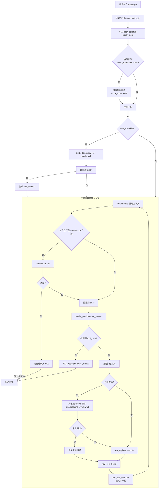
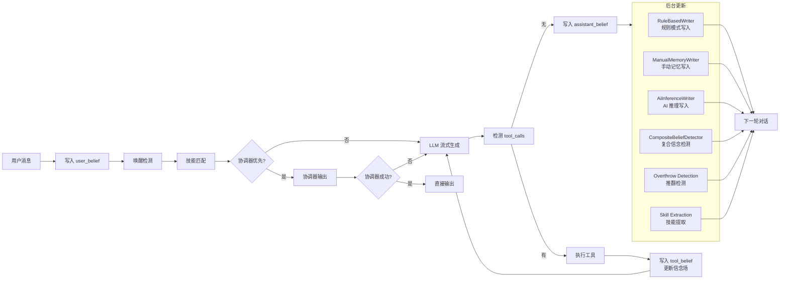
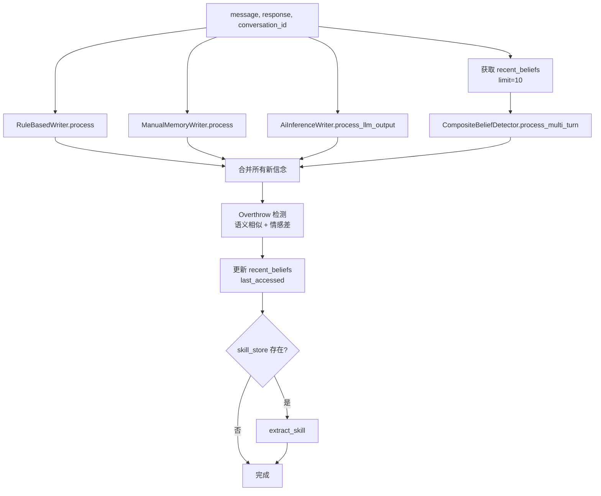

# ShuyuanCore 核心 Agent 设计方案

> 最后更新：2026-05-27  
> 对应阶段：Phase 3 (记忆系统与信念退化) — Phase 4 (Agent 主循环与工具集成)

---

## 1. 设计目标

ShuyuanCore 的 Agent 是一个**信念驱动（Belief-Driven）** 的对话智能体。其核心设计目标包括：

1. **持久化信念场**：所有交互（用户消息、助手回复、工具调用结果）均被建模为 `Belief` 对象存入 `IBeliefStore`，形成随时间退化的信念场（Belief Field）。
2. **流式主循环**：`Agent.chat_stream()` 是唯一对外暴露的接口，通过异步生成器（`AsyncIterator[str | dict]`）实现 SSE 风格的事件推送，支持文本内容、工具调用审批等实时事件。
3. **多轮工具调用**：支持最多 5 轮工具调用循环，每次迭代从信念场重建上下文，实现工具结果的即时反馈。
4. **后台信念更新**：每一轮对话结束后异步执行 `_background_update()`，涵盖规则写入、手动记忆写入、AI 推理写入、复合信念检测、信念推翻检测、技能提取等六项后台任务。
5. **模块解耦**：通过依赖注入将所有组件（模型提供者、信念存储、读取器、工具注册表、协调器等）注入 Agent 构造函数。

---

## 2. 核心概念

### 2.1 信念场退化实现

信念（`Belief`）是系统的原子数据单元，定义在 [interfaces.py](file:///workspace/src/core/interfaces.py) 中：

```python
@dataclass
class Belief:
    id: str
    content: str
    source: str                    # "user" | "assistant" | "tool"
    confidence: float = 1.0        # 当前置信度
    base_confidence: float = 1.0   # 初始置信度
    last_accessed: int = 0         # 毫秒时间戳
    memory_type: str = "chat"      # identity | preference | fact | task | agreement | emotion | chat
    layer: int = 3                 # 层级（1-5），1为最高优先级，5为最低
    entities: list[str] = field(default_factory=list)
    emotion: float = 0.5           # 情感极性 0-1
    depends_on: list[str] = field(default_factory=list)
    child_belief_ids: list[str] = field(default_factory=list)
    superseded_by: str | None = None
    status: str = "active"         # active | superseded
    is_composite: bool = False
    timestamp: int = 0
    metadata: dict[str, Any] = field(default_factory=dict)
```

**置信度退化**由 [decay.py](file:///workspace/src/memory/decay.py) 中的 `current_confidence()` 函数实现：

```python
def current_confidence(belief: Belief, now_ms: int | None = None) -> float:
    if belief.status == "superseded":
        return 0.0
    now = now_ms if now_ms is not None else current_time_ms()
    elapsed_days = max(0.0, (now - belief.last_accessed) / 86400000.0)
    rates = _get_decay_rates()
    rate = rates.get(belief.layer, 0.01)
    confidence = belief.base_confidence * math.exp(-rate * elapsed_days)
    config = get_settings().memory
    return max(confidence, config.confidence_floor)
```

退化策略采用**指数衰减模型**：`C = C_base * exp(-λ * t)`，其中 `λ` 由 `layer` 决定。不同层级（`layer`）有不同的衰减速率：

| Layer | 含义 | 衰减速率 |
|-------|------|----------|
| 1 | 身份/偏好 | 最慢（长期记忆） |
| 2 | 任务/约定 | 较慢 |
| 3 | 事实/聊天 | 中等 |
| 5 | 情绪 | 最快（短期记忆） |

**信念推翻（Overthrow）**：当新信念与旧信念的`emotion`分差 >0.5 且语义相似度 >0.8 时，旧信念的 `status` 会被标记为 `"superseded"`，其 `superseded_by` 指向新信念，新信念继承旧信念的 `depends_on` 依赖链。详见 [propagation.py](file:///workspace/src/memory/propagation.py)。

### 2.2 Agent.chat_stream() 主循环

`Agent.chat_stream()` 是 Agent 的核心入口，其签名如下：

```python
async def chat_stream(
    self,
    message: str,
    conversation_id: str | None = None,
    resume_event: asyncio.Event | None = None,
) -> AsyncIterator[str | dict[str, Any]]:
```

**输出格式**：该方法返回异步生成器，产出两种类型的事件：
- `str`：文本内容事件（SSE 的 data 字段）
- `dict`：结构化事件，包括 `{"type": "approval", ...}` 审批事件和 `{"type": "approval_result", ...}` 审批结果事件

#### 主循环完整步骤：

1. **创建对话 ID**：若未提供 `conversation_id`，自动生成 UUID。
2. **写入用户信念**：将用户消息包装为 `Belief(source="user")` 写入 `belief_store`。
3. **唤醒检测**：调用 `wake_readiness()` 判断是否需要唤醒相关记忆，若分数 >0.5 则搜索相似信念并计算 `wake_score()`，唤醒分数 >0.6 的信念输出到流。
4. **技能匹配**：若配置了 `skill_store`，通过 `EmbeddingService` 和 `match_skill()` 匹配相关技能，将技能提示注入 `skill_context`。
5. **工具调用循环**：最多 5 轮（`_MAX_TOOL_CALLS_PER_TURN = 5`），每轮：
   - 通过 `Reader.read()` 从信念场重建上下文
   - 若存在技能上下文则前置插入
   - **协调器路径**（首次迭代且存在 `coordinator`）：调用 `coordinator.run()`，成功后直接输出并 break
   - **LLM 路径**：调用 `model_provider.chat_stream()`，流式消费 `ChatStreamEvent`（`content` / `tool_call` / `done`）
   - 检测到 `pending_tool_calls` 则执行工具，结果写回信念场，进入下一轮
6. **最终回复写入**：若存在最终回复，写入 `Belief(source="assistant")`。

### 2.3 上下文管理

上下文管理由 `Reader.read()` 负责（实现于 [reader.py](file:///workspace/src/core/reader.py)）：

```python
class Reader(IReader):
    def __init__(self, belief_store: IBeliefStore) -> None:
        self._belief_store = belief_store

    async def read(
        self,
        conversation_id: str,
        user_query: str | None = None,
        max_tokens: int = 4000,
    ) -> list[dict[str, Any]]:
        beliefs = await self._belief_store.get(conversation_id)
        messages: list[dict[str, Any]] = []
        current_tokens = 0

        for belief in reversed(beliefs):
            role = belief.source
            content = belief.content
            estimated_tokens = estimate_tokens(content)

            if current_tokens + estimated_tokens > max_tokens:
                break

            messages.insert(0, {"role": role, "content": content})
            current_tokens += estimated_tokens

        return messages
```

**排序策略**：`beliefs` 按时间升序排列（从 `IBeliefStore.get()` 返回），`Reader` 使用 `reversed()` 从最新的信念开始遍历，并在超出 `max_tokens`（默认 4000）时截断。每次插入到 `messages` 头部以保持时间升序。

**Token 估算**：优先使用 `tiktoken` 按 GPT-4 编码精确计算 Token 数；若不可用则退化为 `len(text) // 4` 字符估算。

### 2.4 与记忆/技能/工具集成

Agent 通过依赖注入集成所有模块：

| 模块 | 接口/类型 | 用途 |
|------|----------|------|
| 模型提供者 | `IModelProvider` | 调用 LLM 进行对话生成 |
| 信念存储 | `IBeliefStore` | 持久化所有 Belief，支持语义搜索、置信度传播、推翻 |
| 读取器 | `IReader` | 从信念场重建 LLM 上下文 |
| 工具注册表 | `IToolRegistry` | 注册/执行工具函数 |
| 记忆存储 | `IMemoryStore` | 预留接口（当前为 NoOp） |
| 人设守卫 | `IPersonaGuard` | 预留接口（当前为 NoOp） |
| 技能引擎 | `ISkillEngine` | 预留接口（当前为 NoOp） |
| 技能存储 | `PersistentSkillStore` | 持久化技能匹配与提取 |
| 协调器 | `Coordinator` | 可选，替代 LLM 直接输出 |

### 2.5 工具调用循环

工具调用循环是实现 Agent 自主调用外部能力的关键机制：

```
while tool_call_count < 5:
    1. Reader.read() → 重建上下文
    2. 注入 skill_context（如有）
    3. 协调器路径（首次迭代）或 LLM 路径
    4. 流式消费 ChatStreamEvent 收集 tool_calls
    5. 若无 tool_calls → 写入 assistant_belief, break
    6. 遍历 pending_tool_calls：
       a. 危险工具检查 → resume_event 审批
       b. tool_registry.execute()
       c. 将结果写入 tool_belief
    7. tool_call_count++
```

**流式实时检测 tool_calls**：`IModelProvider.chat_stream()` 产出 `ChatStreamEvent`，其中 `type == "tool_call"` 时记录待执行工具；`type == "done"` 时检查 `event.tool_name` 是否非空以捕获流末未闭合的工具调用。

**危险工具审批**：当工具名称在 `_dangerous_tools` 集合中且传入了 `resume_event` 时，Agent 会：
1. 产出 `{"type": "approval", "approval_id": "...", "tool_name": "...", ...}` 事件
2. `await resume_event.wait()` 阻塞等待外部批准
3. 外部通过设置 `resume_event` 和 `_approval_approved` 标记来恢复
4. 若审批被拒绝（`_approval_approved == False`），记录错误结果 `"error: tool ... rejected by user"` 并继续

### 2.6 后台更新

`_background_update()` 在 `chat_stream()` 外部独立调用，是每一轮对话结束后异步执行的后台任务，包含六个子系统：

#### 2.6.1 规则写入（RuleBasedWriter）

通过正则表达式匹配用户消息中的结构化信息，自动提取并写入 Belief：

| 正则模式 | 记忆类型 | 默认置信度 |
|----------|---------|-----------|
| 我叫/我姓... | identity | 0.95 |
| 我喜欢/热爱... | preference | 0.85 |
| 记住：... | fact | 0.9 |
| 我的项目是... | task | 0.85 |
| 我的目标是... | agreement | 0.85 |
| 我的生日是... | fact | 0.9 |
| 我来自... | identity | 0.9 |
| 请记得... | fact | 0.85 |

#### 2.6.2 手动记忆写入（ManualMemoryWriter）

检测用户消息是否以 `"记住："` 或 `"记住："` 开头，若是则提取后续内容以 `、` `,` `；` 分隔，每条写入为 `type="fact"`、`layer=3`、`confidence=0.9` 的 Belief。

#### 2.6.3 AI 推理写入（AiInferenceWriter）

将 LLM 的回复内容根据重要度阈值写入信念场：

```python
async def process_llm_output(
    self, llm_content: str, importance: float, timestamp_ms: int, ...
) -> Belief | None:
    if importance < self._threshold:   # threshold 从配置读取
        return None
    # 提取实体、情感分析，构建 Belief
    await self._store.add(self._conversation_id, belief)
    return belief
```

#### 2.6.4 复合信念检测（CompositeBeliefDetector）

当对话轮数超过 `composite_min_rounds`（默认值从配置读取）且实体数量 >= 3 时，将多轮对话内容合并为一条复合 Belief：

- `is_composite = True`
- 内容截取前 500 字符
- `metadata` 记录 `turn_count`、`emotion_range`、`combined_length`
- `entities` 为所有轮次实体的并集

#### 2.6.5 推翻检测

遍历所有新生成的 Belief，对每个包含实体的信念执行语义相似搜索。若存在相似度 >0.8 且情感分差 >0.5 的已有信念，则调用 `belief_store.overthrow()` 将旧信念标记为 `superseded`：

```python
if sim_score > 0.8 and existing.id != new_belief.id and existing.status == "active":
    emotion_diff = abs(existing.emotion - new_belief.emotion)
    if emotion_diff > 0.5:
        await self._belief_store.overthrow(
            old_id=existing.id,
            new_id=new_belief.id,
            reason=f"Contradicting emotion: {existing.emotion:.2f} vs {new_belief.emotion:.2f}",
        )
```

#### 2.6.6 技能提取

若配置了 `skill_store`，调用 `extract_skill()` 从对话中自动提取可复用的技能：

```python
if self._skill_store:
    from src.skills.extractor import extract_skill
    await extract_skill(
        conversation_id=conversation_id,
        message=message,
        response=response,
        belief_store=self._belief_store,
        skill_store=self._skill_store,
        model_provider=self._model_provider,
    )
```

技能提取的流程：
1. 检查 `settings.skills.auto_extract` 配置
2. 获取最近的 50 条信念
3. 统计对话轮数、修正次数、精炼次数、工具调用失败率
4. 计算 `value_score`（价值评分）
5. 若评分超过阈值，调用 LLM 生成技能数据（名称、描述、前置条件、因果链等）
6. 写入 `skill_store`

---

## 3. 数据流（Mermaid 流程图）

### 3.1 chat_stream() 主循环完整流程



### 3.2 完整对话数据流



---

## 4. Agent 类构造函数

Agent 构造函数采用**显式依赖注入**模式，所有可选参数都有合理的 NoOp 默认实现：

```python
class Agent:
    def __init__(
        self,
        model_provider: IModelProvider,       # 必须：LLM 模型提供者
        belief_store: IBeliefStore,            # 必须：信念存储
        reader: IReader,                       # 必须：信念读取器
        tool_registry: IToolRegistry | None = None,   # 工具注册表（默认 MockToolRegistry）
        memory_store: IMemoryStore | None = None,     # 记忆存储（默认 NoOpMemoryStore）
        persona_guard: IPersonaGuard | None = None,   # 人设守卫（默认 NoOpPersonaGuard）
        skill_engine: ISkillEngine | None = None,     # 技能引擎（默认 NoOpSkillEngine）
        skill_store: Any | None = None,               # 技能存储
        entity_extractor: IEntityExtractor | None = None,  # 实体提取器（默认 JiebaEntityExtractor）
        emotion_analyzer: IEmotionAnalyzer | None = None, # 情感分析器（默认 SnowNlpEmotionAnalyzer）
        coordinator: Any | None = None,                  # 协调器
    ) -> None:
```

NoOp 默认实现位于 [noop_implementations.py](file:///workspace/src/core/noop_implementations.py)，包括：
- `NoOpBeliefStore`：所有方法空实现
- `NoOpMemoryStore` / `NoOpPersonaGuard` / `NoOpSkillEngine`：空类
- `MockToolRegistry`：内置 `echo` 和 `get_current_time` 两个测试工具

---

## 5. 信念读取

`Reader.read()` 实现了从信念场到 LLM 上下文的转换，其核心策略如下：

### 排序策略

```
输入：beliefs = [B0(t=0), B1(t=5), B2(t=10), ...]  # 时间升序
处理：for belief in reversed(beliefs)                # 从最新开始
      messages.insert(0, ...)                        # 插入头部保持升序
输出：messages = [B0, B1, B2, ...]                   # 时间升序
```

优先保留最新的信念，因为最新的信念通常最相关。当累加 Token 数超过 `max_tokens`（默认 4000）时，较早的信念被截断丢弃。

### Token 限制

Token 估算采用两层策略：

1. **精确模式**（优先）：使用 `tiktoken.encoding_for_model("gpt-4")` 按 GPT-4 编码计算
2. **估算模式**（回退）：`max(1, len(text) // 4)` 简单字符估算

其中 `tiktoken` 编码结果会被缓存到模块级 `_ENCODING_CACHE` 字典，避免重复加载。

---

## 6. 审批集成

危险工具的执行需要经过**异步审批机制**，这是 Agent 安全控制的核心设计。

### 触发条件

工具名称在 `_dangerous_tools` 集合中 **且** `resume_event` 参数不为 `None`。

### 审批流程

```python
# Agent 侧
require_approval = tool_name in self._dangerous_tools and resume_event is not None
if require_approval:
    approval_id = f"stream_{uuid.uuid4().hex[:8]}"
    self._pending_resume_event = resume_event
    yield {
        "type": "approval",
        "approval_id": approval_id,
        "tool_name": tool_name,
        "arguments": arguments,
        "message": f"工具 {tool_name} 需要审批",
    }
    await resume_event.wait()    # 阻塞等待
    resume_event.clear()
    self._pending_resume_event = None
    if not getattr(self, "_approval_approved", True):
        # 被拒绝
        result = f"error: tool {tool_name} rejected by user"
        yield {"type": "approval_result", "approved": False, ...}
```

### 外部调用方流程

```python
# 外部调用方（如 FastAPI 路由）
resume_event = asyncio.Event()
async for event in agent.chat_stream(message, conv_id, resume_event):
    if isinstance(event, dict) and event.get("type") == "approval":
        # 向用户展示审批界面
        # 用户点击"批准"或"拒绝"
        agent._approval_approved = True  # 或 False
        resume_event.set()  # 恢复 Agent
```

### 审批状态标记

`_approval_approved` 属性并非构造函数中的成员，而是通过 `setattr` 动态设置。默认行为（未设置时）为 `getattr(self, "_approval_approved", True)`，即**默认通过**，仅在需要拒绝时才显式设为 `False`。

---

## 7. 后台更新

`_background_update()` 内部的数据流如下：



### RuleBasedWriter

定义于 [writer.py](file:///workspace/src/memory/writer.py) 第 38-84 行，接收文本和 `timestamp_ms`，遍历 13 条预定义正则规则，匹配成功后：
1. 提取匹配内容
2. 情感分析（`emotion_analyzer.analyze`）
3. 实体提取（`entity_extractor.extract`）
4. 根据 `memory_type` 映射 `layer`（identity→1, preference→1, task→2, agreement→2, fact→3）
5. 构建 `Belief` 并写入 `store`

### ManualMemoryWriter

定义于 [writer.py](file:///workspace/src/memory/writer.py) 第 91-138 行，仅处理以 `"记住："` 开头的消息。支持中英文逗号、中文分号、英文分号作为分隔符，每条子项独立写入。

### AiInferenceWriter

定义于 [writer.py](file:///workspace/src/memory/writer.py) 第 141-187 行，将 LLM 回复内容根据 `importance` 参数与配置阈值 `ai_importance_threshold` 比较，高于阈值才写入。

### CompositeBeliefDetector

定义于 [writer.py](file:///workspace/src/memory/writer.py) 第 190-260 行，检测条件：
- 对话轮数 >= `composite_min_rounds`（从配置读取）
- 合并文本 >= 100 字符
- 提取实体数 >= 3

满足条件后构建 `is_composite=True` 的信念，`metadata` 记录多轮情感范围。

### Overthrow 检测

嵌入在 `_background_update()` 的循环内，对每个新信念执行语义搜索，通过 `emotion_diff > 0.5` 触发推翻，调用 `belief_store.overthrow()` 将旧信念标记为 `superseded`。

### 技能提取

通过 `extract_skill()` 异步函数实现，其核心流程包括：
1. 检查 `settings.skills.auto_extract` 开关
2. 获取最近信念，统计轮数、修正次数、精炼次数、工具失败率
3. 计算 `value_score`：综合轮数、修正惩罚、精炼奖励、工具失败惩罚、显式保存加成
4. 若分数超过 `value_score_threshold`，调用 LLM 生成结构化技能数据
5. 写入 `PersistentSkillStore.create_skill()`

---

## 8. 与各模块集成

### 8.1 model_provider

实现 `IModelProvider` 接口，提供 `chat()`（非流式）和 `chat_stream()`（流式）两个核心方法。`chat_stream()` 产出 `ChatStreamEvent` 事件，Agent 在工具调用循环中根据事件类型分发：

| 事件类型 | 处理方式 |
|---------|---------|
| `"content"` | 追加到 `full_response`，直接 yield 给调用方 |
| `"tool_call"` | 记录到 `pending_tool_calls` 列表 |
| `"done"` | 检查 `tool_name` 是否非空，若含工具调用则追加到列表 |

### 8.2 belief_store

实现 `IBeliefStore` 接口，Agent 的信念场核心：
- `add()`：写入信念
- `get()`：获取按时间升序排列的信念列表
- `search_similar()`：语义相似搜索（用于唤醒检测和推翻检测）
- `update()`：更新信念的 `last_accessed` 字段
- `overthrow()`：推翻旧信念

### 8.3 reader

实现 `IReader` 接口，负责从 `belief_store` 重建 LLM 上下文。采用反向遍历 + Token 截断策略，优先保留最新信念。

### 8.4 tool_registry

实现 `IToolRegistry` 接口，提供：
- `execute(tool_name, arguments)`：执行工具并返回字符串结果
- `list_tools()`：返回工具规格列表
- `get_tool(tool_name)`：获取特定工具规格

### 8.5 coordinator

协调器是可选组件，当存在时会在工具循环的首次迭代中优先尝试。若 `coordinator.run()` 成功，直接输出结果并跳过 LLM 调用；若失败则回退到 LLM 路径。这就是文档第 10 节提到的已知限制。

---

## 9. 对话流程

一次完整对话的生命周期：

```
用户输入 "帮我查一下天气，然后发送邮件给张三说今天下雨"
  │
  ├─ 1. Agent.chat_stream(message, ...)
  │    ├─ 2. 写入 user_belief: "帮我查一下天气..."
  │    ├─ 3. wake_readiness("帮我查一下天气...") → 0.7 > 0.5
  │    │    └─ search_similar → wake_score > 0.6 → yield "[唤醒相关记忆: ...]"
  │    ├─ 4. match_skill("帮我查一下天气...") → 匹配到 "天气查询助手" 技能
  │    │    └─ skill_context = [{"role": "system", "content": "..."}]
  │    ├─ 5. 工具调用循环 (Round 1)
  │    │    ├─ Reader.read() → 重建上下文（含 user_belief + 唤醒的记忆）
  │    │    ├─ LLM chat_stream → tool_call: get_weather(city="北京")
  │    │    ├─ 审批检查 → get_weather 不在 dangerous_tools → 直接执行
  │    │    ├─ tool_registry.execute("get_weather", {"city": "北京"})
  │    │    ├─ 写入 tool_belief: "北京今天小雨，15-20°C"
  │    │    └─ tool_call_count = 1
  │    ├─ 6. 工具调用循环 (Round 2)
  │    │    ├─ Reader.read() → 包含上轮工具结果
  │    │    ├─ LLM chat_stream → tool_call: send_email(to="张三", body="今天下雨")
  │    │    ├─ send_email 在 dangerous_tools 中 → yield approval 事件
  │    │    ├─ await resume_event.wait() → 用户批准
  │    │    ├─ tool_registry.execute("send_email", {to: "张三", body: "今天下雨"})
  │    │    ├─ 写入 tool_belief: "邮件已发送"
  │    │    └─ tool_call_count = 2
  │    ├─ 7. 工具调用循环 (Round 3)
  │    │    ├─ Reader.read() → 含所有上下文
  │    │    ├─ LLM chat_stream → 无 tool_call
  │    │    ├─ 写入 assistant_belief: "已帮您查好天气并发送邮件"
  │    │    └─ break
  │    └─ 8. yield 最终回复
  │
  └─ 9. _background_update(message, response, conversation_id)
       ├─ RuleBasedWriter: 无匹配规则 → []
       ├─ ManualMemoryWriter: 不以"记住："开头 → []
       ├─ AiInferenceWriter: importance=0.6 > threshold → 写入推理信念
       ├─ CompositeBeliefDetector: turns<min_rounds → []
       ├─ Overthrow 检测: 无冲突 → 跳过
       └─ Skill Extraction: value_score=0.72 > 0.5 → LLM生成技能
            └─ skill_store.create_skill({name: "天气+邮件助手", ...})
```

---

## 10. 已知限制

### 10.1 协调器成功后跳过 LLM 直接输出

当前实现中，一旦 `coordinator.run()` 成功返回结果，Agent 会立即：
1. 将 `coordinator_result` 设为 `full_response`
2. 直接 `yield coordinator_result` 给调用方
3. 写入 `assistant_belief` 并 `break` 跳出工具循环

```python
if self._coordinator is not None and tool_call_count == 0:
    coordinator_result = await self._coordinator.run(ctx)
    full_response = coordinator_result
    yield coordinator_result
    # ...写入信念...
    break  # 跳过后续 LLM 调用和工具循环
```

这意味着：
- 协调器的输出**不会经过 LLM 二次处理或润色**
- 协调器输出后**无法继续执行工具调用**（即使协调器输出中包含需要工具执行的信息）
- 协调器的输出格式必须直接可消费，不存在"协调器规划 → LLM 执行"的管线模式

这是一个有意为之的简化设计，未来可能演进为"协调器规划 → LLM 执行"或"协调器与 LLM 协同生成"的模式。

### 10.2 其他潜在限制

- **无跨对话记忆共享**：`_background_update` 写入的信念关联到 `conversation_id`，但 Agent 主循环本身不主动跨对话共享记忆（需依赖 `IBeliefStore.search_similar` 的全局搜索能力）
- **无重入保护**：`chat_stream()` 不支持并发调用同一 Agent 实例，`_pending_resume_event` 状态会被覆盖
- **技能提取的同步锁定**：`extract_skill()` 使用 `asyncio.Lock` 保证同一时间只有一个提取任务在执行，高并发场景下可能有延迟
- **Reader 无优先级排序**：当前按时间逆序 + Token 截断，未考虑 `layer` 优先级或 `confidence` 权重，高优先级低层级的信念可能被低优先级高层级的信念挤出上下文窗口

---

## 附录：关键文件索引

| 文件 | 作用 |
|------|------|
| [agent.py](file:///workspace/src/core/agent.py) | Agent 主类，包含 chat_stream() 和 _background_update() |
| [interfaces.py](file:///workspace/src/core/interfaces.py) | Belief 数据类、IBeliefStore、IReader、IToolRegistry 等接口定义 |
| [reader.py](file:///workspace/src/core/reader.py) | Reader 实现，信念→LLM 上下文转换 |
| [noop_implementations.py](file:///workspace/src/core/noop_implementations.py) | 各接口的 NoOp 和 Mock 默认实现 |
| [decay.py](file:///workspace/src/memory/decay.py) | 信念置信度指数衰减模型 |
| [writer.py](file:///workspace/src/memory/writer.py) | RuleBasedWriter、ManualMemoryWriter、AiInferenceWriter、CompositeBeliefDetector |
| [wake.py](file:///workspace/src/memory/wake.py) | 唤醒检测：wake_readiness、wake_score、WakeFrequencyTracker |
| [extractor.py](file:///workspace/src/memory/extractor.py) | JiebaEntityExtractor、SnowNlpEmotionAnalyzer |
| [propagation.py](file:///workspace/src/memory/propagation.py) | 置信度传播、信念推翻 |
| [models/interfaces.py](file:///workspace/src/models/interfaces.py) | IModelProvider、ChatStreamEvent |
| [memory/interfaces.py](file:///workspace/src/memory/interfaces.py) | IEntityExtractor、IEmotionAnalyzer（Protocol） |
| [skills/matcher.py](file:///workspace/src/skills/matcher.py) | match_skill、format_skill_for_prompt |
| [skills/extractor.py](file:///workspace/src/skills/extractor.py) | extract_skill、value_score 计算 |