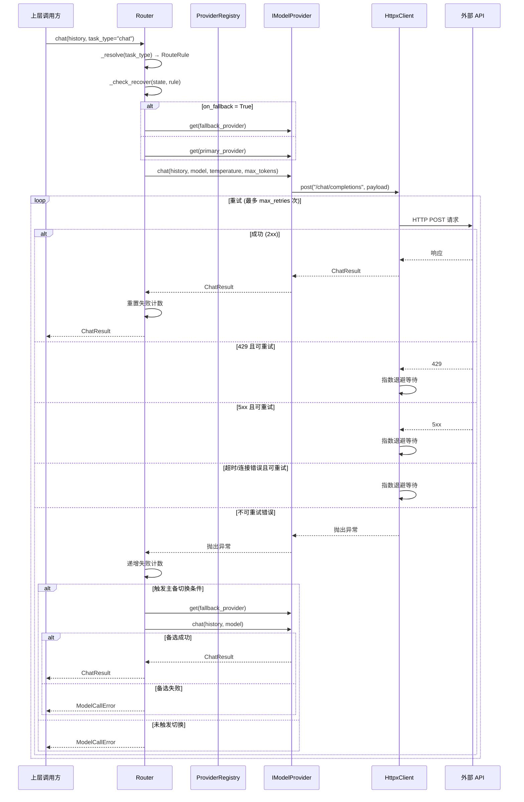
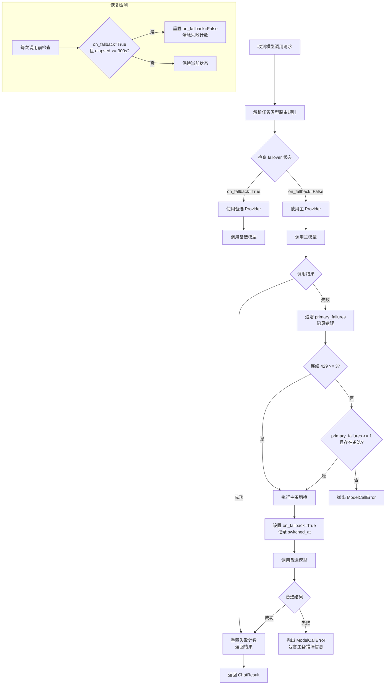
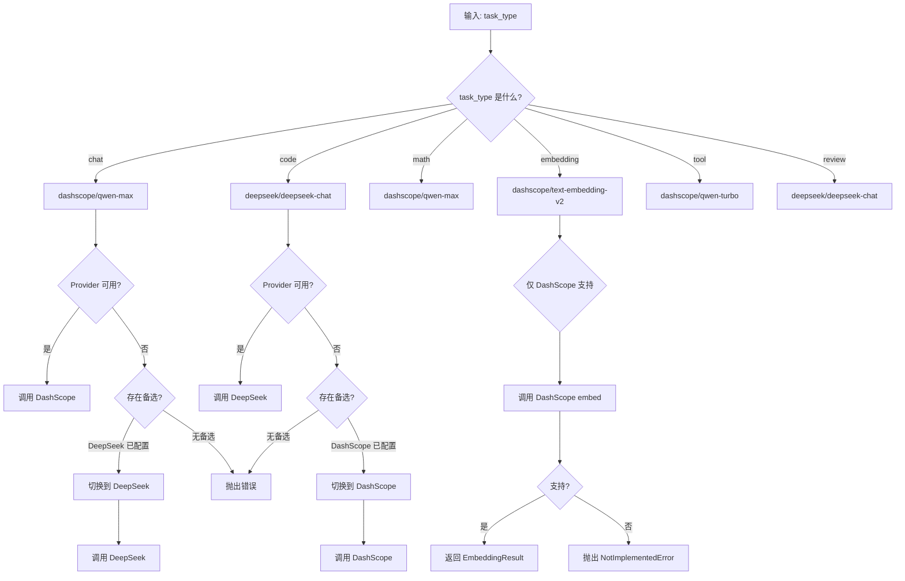
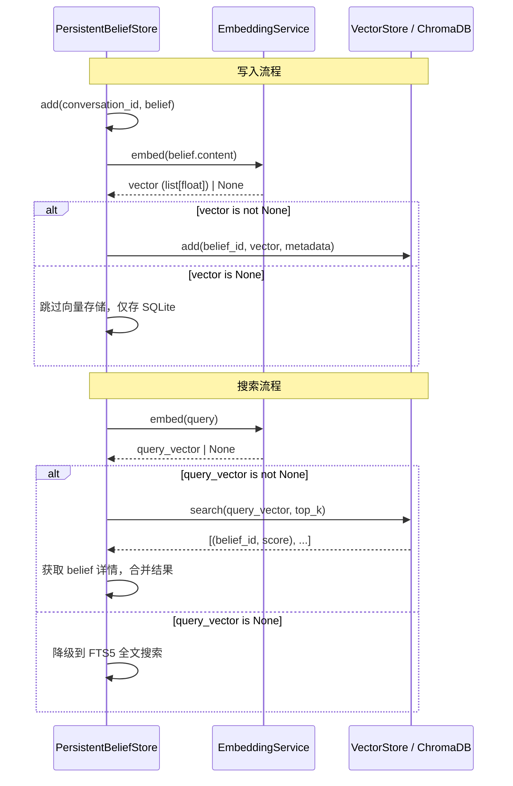

# ShuyuanCore 模型层设计方案

> **最后更新**: 2026-05-27  
> **对应阶段**: Phase 2 — 模型抽象与多 Provider 支持  
> **版本**: v2.0

---

## 1. 设计目标

### 1.1 统一模型接口

ShuyuanCore 需要与多个 LLM 服务商（阿里云 DashScope、DeepSeek、OpenAI 兼容接口、Ollama 本地模型等）交互。不同服务商的 API 格式、鉴权方式、支持的参数各不相同。模型层的核心目标是将这些差异抽象在统一的接口背后，使上层业务代码无需感知底层使用的是哪家模型。

### 1.2 主备切换（Failover）

在生产环境中，单一模型服务商可能出现以下问题：

- API 超时（网络抖动、服务端负载过高）
- HTTP 5xx 服务端错误
- 速率限制（429 Too Many Requests）
- 服务商维护或故障

模型层需要内置主备切换机制：当主模型连续失败时，自动将流量切换到备选模型，并在主模型恢复后自动切回。默认主模型为 DashScope（通义千问），备选模型为 DeepSeek。

### 1.3 任务类型路由

不同类型的任务对模型有不同的需求：

| 任务类型 | 推荐模型 | 说明 |
|---------|---------|------|
| chat | qwen-max | 通用对话，需要较强的语义理解能力 |
| code | deepseek-chat | 代码生成/理解，DeepSeek 在代码任务上表现优异 |
| math | qwen-max | 数学推理 |
| embedding | text-embedding-v2 | 文本向量化，仅 DashScope 支持 |
| tool | qwen-turbo | 工具调用，对性价比要求高 |
| review | deepseek-chat | 复盘/审查，需要较强的分析能力 |

### 1.4 重试与容错

网络请求天然不可靠，模型层需要在 HTTP 层面实现自动重试，并采用指数退避策略避免对服务端造成额外压力。

### 1.5 三 LLM 分工

系统内部使用三种不同的 LLM 角色：

- **主 LLM（Main LLM）**：负责对话生成，使用 `chat` 或 `code` 路由配置
- **复盘 LLM（Review LLM）**：负责对话复盘、信念审查，使用 `review` 路由配置
- **工具 LLM（Tool LLM）**：负责工具调用解析，使用 `tool` 路由配置

这种分工允许为不同角色配置不同的模型和参数，在性能与成本之间取得平衡。

---

## 2. 核心概念

### 2.1 模型提供者接口（IModelProvider）

所有模型提供者必须实现 `IModelProvider` 抽象基类，该接口定义了五个核心方法/属性：

```python
class IModelProvider(ABC):

    @abstractmethod
    async def chat(
        self,
        history: list[dict[str, Any]],
        model: str | None = None,
        temperature: float | None = None,
        max_tokens: int | None = None,
    ) -> ChatResult: ...

    @abstractmethod
    async def chat_stream(
        self,
        history: list[dict[str, Any]],
        model: str | None = None,
        temperature: float | None = None,
        max_tokens: int | None = None,
    ) -> AsyncIterator[ChatStreamEvent]: ...

    @abstractmethod
    async def embed(
        self,
        texts: list[str],
        model: str | None = None,
    ) -> EmbeddingResult: ...

    @abstractmethod
    async def check_health(self) -> HealthStatus: ...

    @property
    @abstractmethod
    def name(self) -> str: ...
```

#### 数据类定义

```python
@dataclass
class ChatResult:
    content: str          # 模型返回的文本内容
    tokens_used: int = 0  # 消耗的 token 数
    model_used: str = ""  # 实际使用的模型名
    finish_reason: str = "stop"  # 停止原因（stop/length/tool_calls）

@dataclass
class ChatStreamEvent:
    type: str = "content"           # 事件类型：content/done
    content: str = ""               # 流式内容片段
    tool_name: str | None = None    # 工具名（预留）
    tool_params: str | None = None  # 工具参数（预留）
    tool_result: str | None = None  # 工具结果（预留）
    tokens_used: int = 0            # 最终 token 数

@dataclass
class EmbeddingResult:
    vectors: list[list[float]]  # 向量列表
    model_used: str = ""        # 实际使用的模型名
    dimensions: int = 0         # 向量维度

@dataclass
class HealthStatus:
    ok: bool = False           # 健康状态
    latency_ms: int = 0        # 延迟（毫秒）
    error: str | None = None   # 错误信息
```

### 2.2 主备切换（Failover）

主备切换是模型层的核心可靠性机制。触发条件如下：

- **超时**：请求超过 30 秒未响应（HttpxClient 的超时设置）
- **5xx 错误**：服务端返回 500/502/503/504 状态码
- **连续 429**：连续 3 次触发速率限制

切换规则：

- 主模型为 DashScope 时，备选模型自动配置为 DeepSeek
- 主模型为 DeepSeek 时，备选模型自动配置为 DashScope
- 其他 Provider 没有内置备选模型
- 切换后每 5 分钟（300 秒）尝试恢复主模型

```python
@dataclass
class FailoverState:
    primary_failures: int = 0          # 主模型连续失败次数
    consecutive_429_count: int = 0     # 连续 429 计数
    on_fallback: bool = False          # 是否正在使用备选
    switched_at: float = 0.0           # 切换时间戳
    last_error: str = ""               # 最后一次错误信息
```

### 2.3 任务类型路由

任务路由通过配置文件定义，每个任务类型对应一个 `provider/model` 格式的标识：

```yaml
models:
  default: dashscope/qwen-max
  embedding: dashscope/text-embedding-v2
  embedding_dimensions: 1536
  routing:
    code: deepseek/deepseek-chat
    chat: dashscope/qwen-max
    math: dashscope/qwen-max
    embedding: dashscope/text-embedding-v2
    tool: dashscope/qwen-turbo
    review: deepseek/deepseek-chat
  providers:
    dashscope:
      api_key: ${DASHSCOPE_API_KEY}
      model: qwen-max
      embedding_model: text-embedding-v2
    deepseek:
      api_key: ${DEEPSEEK_API_KEY}
      model: deepseek-chat
```

路由规则 `RouteRule` 包含了主模型和备选模型的完整信息：

```python
@dataclass
class RouteRule:
    task_type: str         # 任务类型
    primary_provider: str  # 主提供者名
    primary_model: str     # 主模型名
    fallback_provider: str # 备选提供者名
    fallback_model: str    # 备选模型名
```

### 2.4 重试与超时策略

HTTP 客户端层实现了完整的重试机制，采用**指数退避**策略：

```
base_delay = 1.0 秒
max_delay = 30.0 秒
multiplier = 2（指数增长）

第 1 次重试等待: 1.0 秒
第 2 次重试等待: 2.0 秒
第 3 次重试等待: 4.0 秒
...
```

可重试的状态码：429、500、502、503、504

- 429（Rate Limit）：特殊处理，记录日志后递增退避
- 5xx（服务端错误）：标准指数退避
- 超时/连接错误：标准指数退避

### 2.5 嵌入服务（EmbeddingService）

嵌入服务封装了文本向量化操作，使用 DashScope 的 `text-embedding-v2` 模型，输出 1536 维向量：

```python
class EmbeddingService:
    def __init__(self, model_provider: Any | None = None) -> None:
        self._provider = model_provider

    async def embed(self, text: str) -> list[float] | None:
        if self._provider is None:
            return None
        for attempt in range(2):
            try:
                result = await self._provider.embed([text])
                if result.vectors and len(result.vectors) > 0:
                    return result.vectors[0]
            except Exception:
                if attempt == 0:
                    continue
        return None
```

支持在调用层进行简单的重试（最多 2 次），适用于信念存储中的向量搜索。

### 2.6 三 LLM 分工

系统内部通过 `Router.switch_model()` 方法实现角色切换：

```python
def switch_model(self, role: str, model_spec: str) -> dict[str, Any]:
    valid_roles = ["chat", "code", "math", "embedding", "tool", "review",
                   "main", "tool", "review"]
    role_map = {"main": "chat", "tool": "tool", "review": "review"}
    target_role = role_map.get(role, role)
    # ... 验证并更新路由规则
```

- **主 LLM**：对应 `chat`/`code` 路由，用于与用户的直接对话
- **复盘 LLM**：对应 `review` 路由，在 Agent 系统中用于审查信念一致性和输出质量
- **工具 LLM**：对应 `tool` 路由，用于工具调用场景，通常使用性价比更高的模型

---

## 3. 数据流

### 3.1 模型调用完整流程



### 3.2 主备切换判断逻辑



### 3.3 任务类型路由决策树



---

## 4. 关键参数

模型层的所有关键参数均通过配置文件定义，核心配置类结构如下：

### ModelsConfig

```python
class ModelsConfig(BaseModel):
    default: str = "dashscope/qwen-max"
    embedding: str = "dashscope/text-embedding-v2"
    embedding_dimensions: int = 1536
    routing: ModelRoutingConfig = Field(default_factory=ModelRoutingConfig)
    providers: dict[str, ModelProviderConfig] = Field(default_factory=dict)
```

### ModelRoutingConfig

```python
class ModelRoutingConfig(BaseModel):
    code: str = "deepseek/deepseek-chat"
    chat: str = "dashscope/qwen-max"
    math: str = "dashscope/qwen-max"
    embedding: str = "dashscope/text-embedding-v2"
    tool: str = "dashscope/qwen-turbo"
    review: str = "deepseek/deepseek-chat"
```

### ModelProviderConfig

```python
class ModelProviderConfig(BaseModel):
    api_key: str = ""
    base_url: str = ""
    model: str = ""
    embedding_model: str = ""
```

### 关键参数汇总

| 参数路径 | 默认值 | 说明 |
|---------|--------|------|
| `models.default` | `dashscope/qwen-max` | 默认模型规格 |
| `models.embedding` | `dashscope/text-embedding-v2` | 默认嵌入模型 |
| `models.embedding_dimensions` | `1536` | 嵌入向量维度 |
| `models.routing.code` | `deepseek/deepseek-chat` | 代码任务路由 |
| `models.routing.chat` | `dashscope/qwen-max` | 对话任务路由 |
| `models.routing.math` | `dashscope/qwen-max` | 数学任务路由 |
| `models.routing.embedding` | `dashscope/text-embedding-v2` | 嵌入任务路由 |
| `models.routing.tool` | `dashscope/qwen-turbo` | 工具任务路由 |
| `models.routing.review` | `deepseek/deepseek-chat` | 复盘任务路由 |
| `models.providers` | `{}` | Provider 配置字典 |
| `_FAILOVER_RECOVER_SECONDS` | `300` | 主备恢复间隔（秒） |
| `_FAILOVER_CONSECUTIVE_429_LIMIT` | `3` | 连续 429 触发切换阈值 |
| `_DEFAULT_TIMEOUT` | `30.0` | HTTP 请求超时（秒） |
| `_DEFAULT_MAX_RETRIES` | `3` | HTTP 最大重试次数 |
| `_DEFAULT_BACKOFF` | `1.0` | 指数退避基准延迟（秒） |

---

## 5. 接口定义

### 5.1 IModelProvider（完整接口）

参见第 2.1 节的接口定义。所有 Provider 实现都必须严格遵守该抽象接口。

### 5.2 ProviderRegistry

Provider 注册中心负责管理所有已注册的模型提供者实例：

```python
class ProviderRegistry:
    def __init__(self) -> None:
        self._providers: dict[str, IModelProvider] = {}

    def register(self, name: str, provider: IModelProvider) -> None:
        """注册一个 Provider 实例"""
        self._providers[name] = provider

    def get(self, name: str) -> IModelProvider | None:
        """按名称获取 Provider"""
        return self._providers.get(name)

    def list_providers(self) -> list[str]:
        """列出所有已注册的 Provider 名称"""
        return list(self._providers.keys())

    async def check_all(self) -> dict[str, HealthStatus]:
        """检查所有已注册 Provider 的健康状态"""
        results: dict[str, HealthStatus] = {}
        for name, provider in self._providers.items():
            try:
                results[name] = await provider.check_health()
            except Exception as exc:
                results[name] = HealthStatus(ok=False, error=str(exc))
        return results
```

### 5.3 Router（完整接口）

```python
class Router:
    def __init__(self, registry: ProviderRegistry | None = None) -> None: ...

    def set_registry(self, registry: ProviderRegistry) -> None: ...

    async def chat(
        self,
        history: list[dict[str, Any]],
        task_type: str = "chat",
        temperature: float | None = None,
        max_tokens: int | None = None,
    ) -> ChatResult: ...

    async def embed(
        self,
        texts: list[str],
        task_type: str = "embedding",
    ) -> EmbeddingResult: ...

    def resolve(self, task_type: str) -> tuple[IModelProvider, str]: ...

    def switch_model(self, role: str, model_spec: str) -> dict[str, Any]: ...

    async def check_health(self) -> dict[str, HealthStatus]: ...

    def get_current_models(self) -> dict[str, str]: ...

    def get_routing_rules(self) -> list[dict[str, str]]: ...
```

---

## 6. 模型提供者实现

### 6.1 DashScopeProvider

阿里云 DashScope（通义千问）的实现，是系统默认的主模型提供者。

- **API 格式**：兼容 OpenAI 格式（`/compatible-mode/v1`）
- **默认模型**：`qwen-max`
- **默认嵌入模型**：`text-embedding-v2`（1536 维）
- **Base URL**：`https://dashscope.aliyuncs.com/compatible-mode/v1`
- **超时**：30 秒
- **最大重试**：3 次

DashScopeProvider 是唯一完整支持 `chat`、`chat_stream`、`embed` 三个核心方法的 Provider。

### 6.2 DeepSeekProvider

DeepSeek API 的实现，作为 DashScope 的默认备选。

- **API 格式**：标准 OpenAI 兼容格式
- **默认模型**：`deepseek-chat`
- **Base URL**：`https://api.deepseek.com/v1`
- **不支持 embedding**：`embed()` 方法直接抛出 `NotImplementedError`

### 6.3 OpenAICompatProvider

通用的 OpenAI 兼容接口实现，可用于任何兼容 OpenAI API 格式的服务商（如 OneAPI、LiteLLM 等）。

- **默认模型**：`gpt-4o`
- **Base URL**：`https://api.openai.com/v1`
- **可选 API Key**：允许空值（用于无需认证的兼容服务）
- **条件嵌入**：仅当配置了 `embedding_model` 时才支持嵌入

### 6.4 OllamaProvider

本地 Ollama 服务的实现，继承自 `OpenAICompatProvider`。

- **默认模型**：`llama3`
- **Base URL**：`http://localhost:11434`
- **超时**：60 秒（本地模型推理时间可能较长）
- **最大重试**：2 次
- **温度调整**：内部将 temperature 除以 2（Ollama 的温度范围与 OpenAI 不一致）
- **API 差异**：使用 Ollama 原生 `/api/chat` 端点而非 OpenAI 兼容端点
- **不支持 embedding**：通过此接口不支持嵌入

```python
class OllamaProvider(OpenAICompatProvider):
    @property
    def name(self) -> str:
        return "ollama"

    async def chat(self, history, model=None, temperature=None, max_tokens=None) -> ChatResult:
        # 使用 Ollama 原生 API /api/chat
        # temperature 内部转换: temperature / 2.0
        ...

    async def check_health(self) -> HealthStatus:
        # 使用 /api/tags 端点检测服务可用性
        ...
```

---

## 7. 主备切换规则（详细）

### 7.1 触发条件

| 条件 | 判断依据 | 说明 |
|------|---------|------|
| 超时 | HttpxClient 抛出 TimeoutException | 默认 30 秒无响应 |
| 5xx 错误 | HTTP 500/502/503/504 | 服务端不可用 |
| 连续 429 | 连续 3 次 rate limit | 需降速或切换 |
| 其他异常 | 任意 Exception | 统一递增失败计数 |

### 7.2 切换流程

1. 调用 `_call_with_failover()` 方法
2. 先调用 `_check_recover()` 检查是否可切回主模型
3. 根据 `FailoverState.on_fallback` 选择主 Provider 或备选 Provider
4. 调用 Provider 的 `chat()` 方法
5. 若成功：重置所有失败计数，返回结果
6. 若失败：递增 `primary_failures`，检查是否触发切换
7. 切换条件满足时：设置 `on_fallback = True`，记录 `switched_at`，调用备选 Provider
8. 备选也失败时：抛出 `ModelCallError`，包含主备的错误信息

### 7.3 自动恢复

```
_FAILOVER_RECOVER_SECONDS = 300  # 5 分钟

每次调用前执行 _check_recover():
    if on_fallback and (当前时间 - switched_at) >= 300:
        on_fallback = False
        primary_failures = 0
        consecutive_429_count = 0
        记录恢复日志
```

### 7.4 手动切换

通过 `Router.switch_model()` 方法可以手动切换指定角色的模型：

```python
router.switch_model(role="main", model_spec="deepseek/deepseek-chat")
router.switch_model(role="review", model_spec="dashscope/qwen-max")
```

手动切换时会自动清除该角色的 Failover 状态。

---

## 8. 错误处理

### 8.1 错误层次结构

```
ShuyuanCoreError
 └── ModelError (code: 2000, http_status: 502)
      ├── ModelCallError (code: 2001, http_status: 502)
      │    LLM API 调用失败（超时或服务端错误）
      └── ModelSwitchError (code: 2002, http_status: 400)
           模型切换失败（目标模型不存在或未配置）
```

### 8.2 异常处理策略

#### HTTP 客户端层（HttpxClient）

```python
for attempt in range(1, max_retries + 1):
    try:
        response = await client.request(method, url, ...)

        if response.status_code == 429 and attempt < max_retries:
            wait = 1.0 * (2 ** (attempt - 1))  # 指数退避
            await asyncio.sleep(wait)
            continue

        if response.status_code in {500, 502, 503, 504} and attempt < max_retries:
            wait = 1.0 * (2 ** (attempt - 1))
            await asyncio.sleep(wait)
            continue

        response.raise_for_status()
        return response

    except (httpx.TimeoutException, httpx.ConnectError) as exc:
        if attempt < max_retries:
            wait = 1.0 * (2 ** (attempt - 1))
            await asyncio.sleep(wait)
        else:
            raise
```

#### 路由层（Router）

- 捕获 Provider 抛出的所有异常
- 判断是否触发主备切换
- 主备均失败时抛出 `ModelCallError`，detail 中包含主备错误信息
- Provider 未注册时抛出 `ModelSwitchError`

### 8.3 降级策略

当模型调用全面失败时，各模块的降级行为：

| 模块 | 降级行为 |
|------|---------|
| 对话（Agent） | 返回缓存的上次响应或通用错误信息 |
| 嵌入（EmbeddingService） | 返回 `None`，上层使用纯文本搜索作为 fallback |
| 信念搜索（BeliefStore） | 降至 FTS5 全文搜索 |
| 技能匹配（SkillMatcher） | 降至精确匹配，跳过向量搜索 |
| Persona 编译 | 跳过嵌入步骤 |

---

## 9. 嵌入服务

### 9.1 EmbeddingService

嵌入服务是向量搜索的基础设施，封装了模型调用和重试逻辑：

```python
class EmbeddingService:
    def __init__(self, model_provider: Any | None = None) -> None:
        self._provider = model_provider

    async def embed(self, text: str) -> list[float] | None:
        if self._provider is None:
            return None
        for attempt in range(2):
            try:
                result = await self._provider.embed([text])
                if result.vectors and len(result.vectors) > 0:
                    return result.vectors[0]
            except Exception:
                if attempt == 0:
                    continue
        return None
```

**设计要点**：

- 单文本输入，单向量输出（内部调用 batch API）
- 内置 2 次重试（一次失败后立即重试）
- 所有异常被吞掉，返回 `None` — 上层必须处理空值
- 支持向 VectorStore 写入和搜索

### 9.2 与 VectorStore 的配合



### 9.3 Batch Embedding 支持

虽然 `EmbeddingService.embed()` 只接受单个文本，但其底层调用 `IModelProvider.embed(texts: list[str])` 接受文本列表。当需要对多条文本进行向量化时，可以：

1. 直接调用 Provider 的 `embed()` 方法传入文本列表
2. 或者批量调用 `EmbeddingService.embed()`（每条独立请求）

建议使用第一种方式以利用服务端的 batch 优化。

---

## 10. 与信念场的关系

### 10.1 嵌入在信念系统中的角色

嵌入（Embedding）是信念场（Belief System）实现语义搜索的基础。`PersistentBeliefStore` 使用嵌入向量实现 `search_similar()` 方法，用于查找语义相似的信念。

### 10.2 信念写入流程

当新的信念被写入 `PersistentBeliefStore` 时：

1. 信念的 `content` 文本通过 `EmbeddingService` 转换为 1536 维向量
2. 向量和信念 ID 一同存入 `VectorStore`（基于 ChromaDB 或内存索引）
3. 信念文本同时写入 SQLite 数据库和 FTS5 全文索引

### 10.3 信念搜索流程

`search_similar(query, top_k, min_confidence)` 的搜索策略：

1. 首先尝试向量搜索：将 query 转换为向量，从 VectorStore 召回 top_k 条
2. 向量搜索失败时，降级到 FTS5 全文搜索
3. 合并去重后，按相关性得分排序返回

### 10.4 在 Agent 系统中的应用

```python
# agents/reviewer.py — 信念一致性检查
similar = await ctx.belief_store.search_similar(draft, top_k=5, min_confidence=0.6)
for belief, sim in similar:
    if belief.confidence > 0.9 and sim > 0.8:
        # 检测到与高置信信念不一致
        issues.append({"dimension": "accuracy", "description": "..."})

# skills/matcher.py — 技能匹配
similar_beliefs = await belief_store.search_similar(user_message, top_k=10, min_confidence=0.1)
for belief, sim_score in similar_beliefs:
    if belief.memory_type == "skill" and belief.layer == 4:
        # 匹配到相关技能
        skill = await skill_store.get_skill_by_belief_id(belief.id)
```

### 10.5 向量维度一致性

嵌入维度的配置通过 `embedding_dimensions` 参数统一管理：

```
models.embedding_dimensions = 1536
persona.compiler.embedding_dimensions = 1536  # Persona 系统使用相同维度
```

所有使用向量的模块必须使用相同的维度，以保证向量空间的一致性。

---

## 11. Provider 注册与初始化

### 11.1 初始化流程

```mermaid
flowchart LR
    A[应用启动] --> B[加载配置 config.yaml]
    B --> C[遍历 providers 配置]
    C --> D{Provider 类型}
    D -->|dashscope| E[创建 DashScopeProvider]
    D -->|deepseek| F[创建 DeepSeekProvider]
    D -->|openai_compat| G[创建 OpenAICompatProvider]
    D -->|ollama| H[创建 OllamaProvider]
    E --> I[注册到 ProviderRegistry]
    F --> I
    G --> I
    H --> I
    I --> J[创建 Router]
    J --> K[Router._reload_config()]
    K --> L[Router.set_registry(registry)]
    L --> M[就绪]
```

### 11.2 配置示例

```yaml
models:
  default: dashscope/qwen-max
  routing:
    code: deepseek/deepseek-chat
    chat: dashscope/qwen-max
    math: dashscope/qwen-max
    embedding: dashscope/text-embedding-v2
    tool: dashscope/qwen-turbo
    review: deepseek/deepseek-chat
  providers:
    dashscope:
      api_key: ${DASHSCOPE_API_KEY}
      model: qwen-max
      embedding_model: text-embedding-v2
    deepseek:
      api_key: ${DEEPSEEK_API_KEY}
      model: deepseek-chat
    openai_compat:
      api_key: ${OPENAI_API_KEY}
      base_url: https://api.openai.com/v1
      model: gpt-4o
```

配置中的 `${VAR_NAME}` 语法会被自动解析为环境变量值。

---

## 12. 已知限制

### 12.1 Embedding 仅支持 DashScope

当前系统中，只有 `DashScopeProvider` 完整支持 `embed()` 方法。`DeepSeekProvider` 和 `OllamaProvider` 均抛出 `NotImplementedError`。`OpenAICompatProvider` 仅当显式配置了 `embedding_model` 时才支持嵌入。这意味着嵌入功能存在单点依赖风险。

### 12.2 主备切换的局限性

- 切换条件较为简单（基于失败计数），未考虑错误类型权重
- 备选模型不支持嵌入（embedding 任务无 failover）
- 切换后调用方可能获得不同模型的能力差异（如 DeepSeek 与 Qwen 的风格差异）
- 恢复检测仅在每次调用时触发，不是后台定时任务

### 12.3 流式响应与主备切换

当前 `Router` 的 `_call_with_failover()` 仅包装了 `chat()` 方法。流式 `chat_stream()` 直接调用 Provider，不经过 failover 逻辑。这意味着流式调用无法享受主备切换保护。

### 12.4 并发安全

`FailoverState` 是可变对象，当前实现中未加锁。在高并发场景下，多个协程同时修改 `FailoverState` 可能存在竞态条件。对于单线程 asyncio 场景问题不大，但需要关注。

### 12.5 Provider 的动态注册

`ProviderRegistry` 目前仅支持启动时静态注册，缺少运行时动态添加/移除 Provider 的机制。在某些场景下（如动态切换 API Key、热更新配置）可能不够灵活。

---

## 13. 附录

### 13.1 文件结构

```
src/models/
├── __init__.py          # 模块入口，导出关键类型
├── interfaces.py        # IModelProvider 接口、数据类、ProviderRegistry
├── router.py            # Router、RouteRule、FailoverState
├── _client.py           # HttpxClient（HTTP 层封装、重试策略）
├── dashscope.py         # DashScopeProvider
├── deepseek.py          # DeepSeekProvider
├── openai_compat.py     # OpenAICompatProvider、OllamaProvider

src/memory/
├── embedding.py         # EmbeddingService
├── vector_store.py      # VectorStore（MemoryIndex / ChromaIndex）

src/exceptions.py        # 异常层次结构（ModelError、ModelCallError、ModelSwitchError）

src/config.py            # ModelsConfig、ModelRoutingConfig、ModelProviderConfig
```

### 13.2 关键常量定义

```python
# _client.py
_RETRYABLE_STATUSES: set[int] = {429, 500, 502, 503, 504}
_DEFAULT_TIMEOUT: float = 30.0
_DEFAULT_CONNECT_TIMEOUT: float = 10.0
_DEFAULT_MAX_RETRIES: int = 3
_DEFAULT_BACKOFF: float = 1.0

# router.py
_FAILOVER_RECOVER_SECONDS = 300
_FAILOVER_CONSECUTIVE_429_LIMIT = 3
_FAILOVER_RETRYABLE_STATUSES: set[int] = {429, 500, 502, 503, 504}
_TASK_TYPES: list[str] = ["chat", "code", "math", "embedding", "tool", "review"]

# dashscope.py
_DEFAULT_BASE_URL = "https://dashscope.aliyuncs.com/compatible-mode/v1"
_DEFAULT_MODEL = "qwen-max"
_DEFAULT_EMBEDDING_MODEL = "text-embedding-v2"
_EMBEDDING_DIMENSIONS = 1536

# deepseek.py
_DEFAULT_BASE_URL = "https://api.deepseek.com/v1"
_DEFAULT_MODEL = "deepseek-chat"

# openai_compat.py
_DEFAULT_BASE_URL = "https://api.openai.com/v1"
_DEFAULT_MODEL = "gpt-4o"
```

### 13.3 典型调用示例

```python
# 初始化
registry = ProviderRegistry()
registry.register("dashscope", DashScopeProvider(api_key="..."))
registry.register("deepseek", DeepSeekProvider(api_key="..."))

router = Router(registry=registry)

# 对话调用（自动路由 + 主备切换）
result = await router.chat(
    history=[{"role": "user", "content": "你好"}],
    task_type="chat",
    temperature=0.7,
)

# 嵌入调用（无 failover）
emb_result = await router.embed(
    texts=["需要向量化的文本"],
    task_type="embedding",
)

# 健康检查
health = await router.check_health()

# 手动切换模型
router.switch_model(role="main", model_spec="deepseek/deepseek-chat")

# 获取当前路由规则
rules = router.get_routing_rules()
```