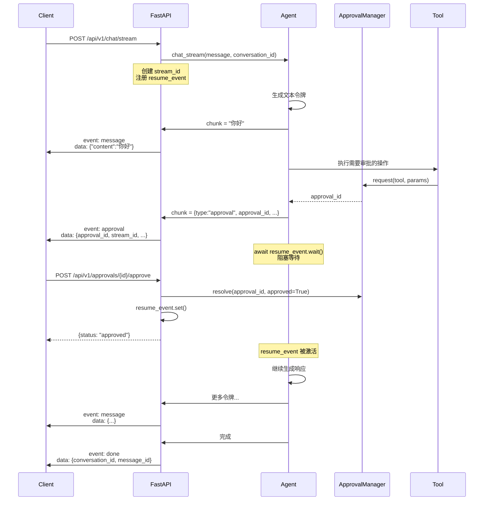

# ShuyuanCore 网关与 API 设计方案

> **最后更新日期**: 2026-05-27  
> **对应阶段**: Phase 9 — 网关与 API 服务层  
> **核心目标**: 统一消息接入和 API 服务

---

## 1. 设计目标

ShuyuanCore 网关层承担着**统一消息接入**和**API 服务**两大核心职责。设计上遵循以下原则：

- **统一入口**：所有外部交互（HTTP API、CLI 命令行、IM 平台消息）统一经过网关层，由网关负责路由、认证、限流、鉴权等横切关注点。
- **协议适配**：通过平台适配器模式（Platform Adapter），将不同 IM 平台（Telegram、微信、飞书、钉钉、企业微信、QQ）的协议差异封装在适配器内部，对核心 Agent 保持透明。
- **流式优先**：聊天接口原生支持 Server-Sent Events (SSE) 流式输出，支持审批阻塞/恢复的异步事件驱动模型。
- **安全可控**：内置令牌桶限流、API Key 认证、匿名用户隔离、Cursor 签名校验等安全机制。

---

## 2. 核心概念

### 2.1 FastAPI 路由

网关基于 **FastAPI** 框架构建，共定义 8 个端点（实际映射为 9 个路由注册点）：

| 序号 | 路径 | 方法 | 说明 |
|------|------|------|------|
| 1 | `/health` | GET | 健康检查 |
| 2 | `/api/v1/chat` | POST | 非流式聊天（完整响应） |
| 3 | `/api/v1/chat/stream` | POST | 流式聊天（SSE） |
| 4 | `/api/v1/conversations` | GET | 会话列表（游标分页） |
| 5 | `/api/v1/conversations/{id}/messages` | GET | 会话消息列表（游标分页） |
| 6 | `/api/v1/approvals` | POST | 创建审批请求 |
| 7 | `/api/v1/approvals/{id}/approve` | POST | 批准审批 |
| 8 | `/api/v1/approvals/{id}/deny` | POST | 拒绝审批 |
| 9 | `/api/v1/approvals/{id}/resume` | POST | 恢复阻塞的 SSE 流 |

### 2.2 SSE 流式事件

流式聊天端点使用 SSE 协议推送四种事件类型：

| 事件名 | 触发时机 | 数据字段 |
|--------|----------|----------|
| `approval` | Agent 执行需要审批的工具时 | `approval_id`, `stream_id`, `tool_name`, `message` |
| `message` | Agent 产生文本令牌时 | `content`（字符串或结构化数据） |
| `done` | Agent 完成响应生成时 | `conversation_id`, `message_id` |
| `error` | 流处理过程中发生异常时 | `detail`（错误描述） |

### 2.3 游标分页

历史消息和会话列表均使用 **基于游标的分页**（Cursor-based Pagination），而非传统的 offset/limit 分页，以避免大偏移量下的性能问题。

核心数据结构为 `(timestamp, id)` 元组，经 HMAC-SHA256 签名后编码为 URL-safe base64 字符串。

### 2.4 审批端点

审批系统支持完整的 CRUD 生命周期：

1. **创建审批** (`POST /api/v1/approvals`)：Agent 调用危险工具时，生成审批请求并持久化
2. **批准/拒绝** (`POST /api/v1/approvals/{id}/approve|deny`)：人工介入做出审批决策
3. **恢复流** (`POST /api/v1/approvals/{id}/resume`)：审批决策作出后，恢复被阻塞的 SSE 流继续执行

### 2.5 CLI REPL

基于 `prompt_toolkit` 的交互式命令行界面，提供与 Agent 直接对话的能力：

- 支持 Slash 命令：`/mode`, `/approve`, `/deny`, `/clear`, `/exit`, `/quit`
- 三种模式切换：`quick`, `balanced`, `deep`
- 命令自动补全（`_CommandCompleter`）
- 多行输入支持（Alt+Enter 换行）
- 审批交互：Agent 遇到需要审批的操作时，REPL 打印审批横幅并自动等待用户决策
- 历史记录持久化（`~/.shuyuancore_history`）

### 2.6 限流与 API Key 认证中间件

网关通过两层 HTTP 中间件实现安全控制：

1. **`_guard` 中间件**：白名单路径免检，非白名单路径执行限流检查
2. **`_inject_context` 中间件**：注入 `request_id` 和 `user_id` 到请求状态

### 2.7 平台适配器模式

定义了 `BaseAdapter` 抽象基类（位于 [base_adapter.py](file:///workspace/src/gateway/base_adapter.py)），为 8 个平台提供统一接入接口：

| 平台 | 适配器文件 | 状态 |
|------|-----------|------|
| CLI | [cli.py](file:///workspace/src/gateway/cli.py), [cli_repl.py](file:///workspace/src/gateway/cli_repl.py) | 已实现 |
| API | [api_server.py](file:///workspace/src/gateway/api_server.py) | 已实现 |
| OpenAI Proxy | [openai_proxy.py](file:///workspace/src/gateway/openai_proxy.py) | 占位 |
| Telegram | [telegram.py](file:///workspace/src/gateway/telegram.py) | 占位 |
| 微信 | [wechat.py](file:///workspace/src/gateway/wechat.py) | 占位 |
| 企业微信 | [wechat_work.py](file:///workspace/src/gateway/wechat_work.py) | 占位 |
| 飞书 | [feishu.py](file:///workspace/src/gateway/feishu.py) | 占位 |
| 钉钉 | [dingtalk.py](file:///workspace/src/gateway/dingtalk.py) | 占位 |
| QQ | [qq.py](file:///workspace/src/gateway/qq.py) | 占位 |

---

## 3. 数据流

### 3.1 HTTP 请求处理管道

```mermaid
graph TD
    Client[客户端] -->|HTTP 请求| CORS[CORS 中间件]
    CORS --> Guard[Guard 中间件]
    Guard -->|白名单检查| WhiteList{路径在白名单?}
    WhiteList -->|是| InjectCtx
    WhiteList -->|否| Auth{提取 X-User-ID<br/>或 Bearer Token}
    Auth --> RateLimit{令牌桶限流<br/>rpm > 0?}
    RateLimit -->|超限| 429[返回 429<br/>Rate limit exceeded]
    RateLimit -->|通过| InjectCtx[Inject Context 中间件]
    InjectCtx -->|注入 request_id + user_id| Router[FastAPI 路由]
    Router -->|/health| HealthHandler
    Router -->|/api/v1/chat| ChatHandler
    Router -->|/api/v1/chat/stream| StreamHandler
    Router -->|/api/v1/conversations| ConvHandler
    Router -->|/api/v1/conversations/{id}/messages| MsgHandler
    Router -->|/api/v1/approvals/*| ApprovalHandler
    ChatHandler --> Agent[Agent.chat_stream]
    StreamHandler --> Agent
    Agent --> BeliefStore[PersistentBeliefStore<br/>beliefs 表]
    ApprovalHandler --> ApprovalDB[(approvals 表)]
    ChatHandler -->|JSON 响应| Client
    StreamHandler -->|SSE 事件流| Client
    ConvHandler --> BeliefStore
    MsgHandler --> BeliefStore
    Router -->|未处理异常| ExceptionHandler[全局异常处理器<br/>500 + error_response]
    ExceptionHandler --> Client
```

### 3.2 SSE 流式事件生成流程



### 3.3 游标分页编解码流程

```mermaid
graph LR
    subgraph 编码 encode_cursor
        A1[timestamp: int<br/>entity_id: str] --> A2[base64 编码 entity_id]
        A2 --> A3[拼接 data<br/>timestamp_safeId_expiresAt]
        A3 --> A4[HMAC-SHA256 签名<br/>取前 16 位 hex]
        A4 --> A5[拼接 data_sig]
        A5 --> A6[base64 编码<br/>→ 游标字符串]
    end

    subgraph 解码 decode_cursor
        B1[游标字符串] --> B2[base64 解码]
        B2 --> B3[按最后一个 _ 分割<br/>→ data + sig]
        B3 --> B4[用相同密钥<br/>重新计算 HMAC]
        B4 --> B5{compare_digest<br/>签名匹配?}
        B5 -->|否| B6[返回 None<br/>非法游标]
        B5 -->|是| B7[解析 data 三字段<br/>→ ts, id_b64, expires_at]
        B7 --> B8{检查过期<br/>time() > expires_at?}
        B8 -->|是| B6
        B8 -->|否| B9[base64 解码 id]
        B9 --> B10[返回 (timestamp, entity_id)]
    end
```

---

## 4. 关键参数

以下参数来自 [config.py](file:///workspace/src/config.py) 中的配置模型，通过 `get_settings()` 全局获取：

```python
# Settings 中的关键配置结构

class SecurityConfig(BaseModel):
    cursor_secret: str = ""                          # 游标签名密钥，空则随机生成
    api_keys: list[dict[str, str]] = []              # API Key 列表，格式: [{"key": "...", "user_id": "..."}]
    rate_limit_per_minute: int = 60                  # 每分钟每用户最大请求数

class GatewayPlatformConfig(BaseModel):
    enabled: bool = False
    port: int = 0
    token: str = ""

class HistoryConfig(BaseModel):
    per_page: int = 50                               # 历史消息每页默认条数
    max_per_page: int = 200                          # 每页最大条数
    cache_recent: int = 20                           # 最近缓存条数

class DeployConfig(BaseModel):
    host: str = "0.0.0.0"                            # 服务绑定地址
    port: int = 8005                                 # 服务端口
    workers: int = 1                                 # 工作进程数
    log_level: str = "info"                          # 日志级别
```

**关键参数汇总表**：

| 参数路径 | 默认值 | 说明 |
|----------|--------|------|
| `deploy.port` | `8005` | API 服务监听端口 |
| `deploy.host` | `0.0.0.0` | 绑定地址 |
| `security.rate_limit_per_minute` | `60` | 每用户每分钟请求上限（0 表示不限） |
| `security.cursor_secret` | `""` | 游标签名密钥，空时使用随机值 |
| `security.api_keys` | `[]` | API Key 白名单，`[{"key": "...", "user_id": "..."}]` |
| `gateway.history.per_page` | `50` | 消息分页默认每页条数 |
| `gateway.history.max_per_page` | `200` | 消息分页上限 |
| `gateway.platforms.api.port` | `8000` | API 平台端口 |
| `tools.approval_timeout` | `300` | 审批超时时间（秒） |

---

## 5. API 端点完整定义

### 5.1 端点表格

| 方法 | 路径 | 认证要求 | 请求体/参数 | 响应模型 | 说明 |
|------|------|----------|-------------|----------|------|
| GET | `/health` | 无（白名单） | — | `HealthResponse` | 健康检查，返回 `{"status":"healthy","version":"1.0.0"}` |
| POST | `/api/v1/chat` | Bearer Token 或 X-User-ID | `ChatRequest` | `ChatResponse` | 非流式聊天，等待完整响应后返回 |
| POST | `/api/v1/chat/stream` | Bearer Token 或 X-User-ID | `StreamChatRequest` | `StreamingResponse` (SSE) | 流式聊天，支持审批阻塞/恢复 |
| GET | `/api/v1/conversations` | Bearer Token 或 X-User-ID | `cursor` (query), `limit` (query, 1-100) | `PaginatedResponse` | 获取用户会话列表，按最后活跃时间降序 |
| GET | `/api/v1/conversations/{id}/messages` | Bearer Token 或 X-User-ID | `cursor` (query), `limit` (query, 1-200) | `PaginatedResponse` | 获取指定会话的消息列表，按时间升序 |
| POST | `/api/v1/approvals` | Bearer Token 或 X-User-ID | `ApprovalCreateRequest` | `ApprovalCreateResponse` | 创建审批请求 |
| POST | `/api/v1/approvals/{id}/approve` | Bearer Token 或 X-User-ID | `ApprovalAction` | `ApprovalResolveResponse` | 批准审批 |
| POST | `/api/v1/approvals/{id}/deny` | Bearer Token 或 X-User-ID | `ApprovalAction` | `ApprovalResolveResponse` | 拒绝审批 |
| POST | `/api/v1/approvals/{id}/resume` | Bearer Token 或 X-User-ID | `stream_id` (query), `approved` (query) | JSON | 恢复被阻塞的 SSE 流 |

### 5.2 请求/响应模型

所有模型定义在 [api_models.py](file:///workspace/src/gateway/api_models.py)：

```python
class ChatRequest(BaseModel):
    message: str = Field(..., min_length=1)       # 用户消息
    conversation_id: str | None = None            # 会话 ID，不传则自动创建
    mode: str = "balanced"                        # 模式: quick/balanced/deep

class ChatResponse(BaseModel):
    content: str                                  # 完整响应内容
    conversation_id: str                          # 会话 ID
    message_id: str                               # 消息 ID
    approval_required: bool = False               # 是否需要审批
    approval_id: str | None = None                # 审批 ID

class PaginatedResponse(BaseModel):
    items: list[Any]                              # 数据项列表
    next_cursor: str | None = None                # 下一页游标
    has_more: bool = False                        # 是否还有更多数据

class ApprovalAction(BaseModel):
    approved: bool                                # true=批准, false=拒绝
    reason: str = ""                              # 审批理由
```

### 5.3 响应示例

**健康检查**：
```
GET /health
→ 200 {"status": "healthy", "version": "1.0.0"}
```

**流式聊天 SSE**：
```
POST /api/v1/chat/stream
→ 200 text/event-stream

event: message
data: {"content": "你好！"}

event: approval
data: {"type": "approval", "approval_id": "user_abc123", "stream_id": "user_def456", "tool_name": "terminal", "message": "需要审批"}

event: message
data: {"content": "结果是..."}

event: done
data: {"conversation_id": "xxx", "message_id": "yyy"}
```

**会话列表**：
```
GET /api/v1/conversations?limit=20
→ 200
{
  "items": [
    {"id": "conv_1", "message_count": 5, "last_message_at": 1700000000, "created_at": 1690000000}
  ],
  "next_cursor": "MTcwMDAwMDAwMF9jb252XzFfMTcwMDAwMzYwMF81YTZiN2M4Zj...",
  "has_more": true
}
```

---

## 6. SSE 事件格式

SSE 格式定义在 [utils.py](file:///workspace/src/gateway/utils.py) 的 `format_sse_event` 函数中：

```python
def format_sse_event(event: str, data: dict[str, Any]) -> str:
    payload = json.dumps(data, ensure_ascii=False)
    return f"event: {event}\ndata: {payload}\n\n"
```

各事件类型的具体输出格式：

### 6.1 approval 事件

```
event: approval
data: {"type":"approval","approval_id":"user_a1b2c3d4e5f6","stream_id":"user_abc12345","tool_name":"terminal","message":"需要审批执行命令: ls -la"}
```

### 6.2 message 事件

```
event: message
data: {"content":"这是一段流式输出的文本"}
```

当 Agent 返回结构化数据块时，`chunk` 字典的键值对会直接作为 data 字段的内容。

### 6.3 done 事件

```
event: done
data: {"conversation_id":"550e8400-e29b-41d4-a716-446655440000","message_id":"550e8400-e29b-41d4-a716-446655440001"}
```

### 6.4 error 事件

```
event: error
data: {"detail":"stream error"}
```

### 6.5 SSE 响应头

```python
StreamingResponse(
    _event_generator(),
    media_type="text/event-stream",
    headers={
        "Cache-Control": "no-cache",
        "Connection": "keep-alive",
        "X-Accel-Buffering": "no",          # 禁用 Nginx 缓冲
    },
)
```

---

## 7. 游标分页

### 7.1 设计原理

传统 offset/limit 分页在数据频繁变更时会出现**重复/遗漏**问题，且大偏移量下性能下降。游标分页通过**最后一条记录的排序位置**来定位下一页，保证分页的稳定性。

ShuyuanCore 使用 `(timestamp, id)` 复合游标：

- **会话列表**：按 `last_message_at DESC, conversation_id DESC` 排序，游标编码为 `(max_timestamp, conversation_id)`
- **消息列表**：按 `timestamp ASC, id ASC` 排序，游标编码为 `(last_timestamp, last_id)`

### 7.2 HMAC-SHA256 签名

游标必须经过签名才能暴露给客户端，防止客户端篡改。签名流程如下：

```python
def encode_cursor(timestamp: int, entity_id: str, expires_in: int = 3600) -> str:
    secret = get_cursor_secret()                                    # 获取密钥
    expires_at = int(time.time()) + expires_in                      # 过期时间戳
    safe_id = base64.urlsafe_b64encode(entity_id.encode()).decode() # base64 编码 ID
    data = f"{timestamp}_{safe_id}_{expires_at}"                    # 拼接明文
    sig = hmac.new(
        secret.encode(), data.encode(), hashlib.sha256
    ).hexdigest()[:16]                                              # HMAC-SHA256 取前16位
    combined = f"{data}_{sig}"                                      # 拼接签名
    return base64.urlsafe_b64encode(combined.encode()).decode()     # base64 编码输出

def decode_cursor(cursor: str) -> tuple[int, str] | None:
    raw = base64.urlsafe_b64decode(cursor.encode()).decode()
    parts = raw.rsplit("_", 1)                                      # 分割 data 和 sig
    data, sig = parts
    # 重新计算签名做对比
    expected = hmac.new(secret.encode(), data.encode(), hashlib.sha256).hexdigest()[:16]
    if not hmac.compare_digest(expected, sig):                      # 防时序攻击
        return None
    # 解析 timestamp, entity_id, expires_at
    timestamp_str, entity_id_b64, expires_at_str = data.split("_")
    if int(time.time()) > expires_at:                               # 检查过期
        return None
    entity_id = base64.urlsafe_b64decode(entity_id_b64.encode()).decode()
    return timestamp, entity_id
```

### 7.3 安全特性

| 特性 | 实现方式 |
|------|----------|
| 防篡改 | HMAC-SHA256 签名，密钥不暴露给客户端 |
| 防时序攻击 | `hmac.compare_digest` 进行常量时间比较 |
| 过期控制 | 签名中内嵌 `expires_at` 字段，默认 1 小时过期 |
| 密钥回退 | 未配置 `cursor_secret` 时使用 `secrets.token_urlsafe(32)` 随机生成，每次重启变化 |
| URL 安全 | 使用 URL-safe base64 编码 |

---

## 8. 限流中间件

### 8.1 令牌桶算法

限流实现基于**令牌桶算法**（Token Bucket），定义在 [api_server.py](file:///workspace/src/gateway/api_server.py) 的 `_check_rate_limit` 函数中：

```python
_rate_limit_buckets: dict[str, tuple[float, float]] = {}   # user_id → (剩余令牌, 最后填充时间)
_rate_limit_lock = asyncio.Lock()                           # 线程安全锁

def _check_rate_limit(user_id: str, rpm: int) -> bool:
    now = time.monotonic()
    key = user_id
    if key not in _rate_limit_buckets:
        # 首次请求：初始化桶，预扣一个令牌
        _rate_limit_buckets[key] = (float(rpm) - 1.0, now)
        return True

    tokens, last_refill = _rate_limit_buckets[key]
    elapsed = now - last_refill
    # 按时间增量补充令牌：每分钟补充 rpm 个
    tokens = min(float(rpm), tokens + elapsed * (rpm / 60.0))

    if tokens >= 1.0:
        # 有可用令牌，消耗一个
        _rate_limit_buckets[key] = (tokens - 1.0, now)
        return True

    # 令牌不足，拒绝请求
    _rate_limit_buckets[key] = (tokens, now)
    return False
```

### 8.2 限流策略

- **补充速率**：每秒 `rate_limit_per_minute / 60` 个令牌
- **桶容量**：等于 `rate_limit_per_minute`，允许短时突发
- **隔离粒度**：按 `user_id` 独立计数
- **限流响应**：HTTP 429，附带 `Retry-After: 60` 和 `X-User-ID` 头
- **白名单豁免**：`/health`, `/docs`, `/openapi.json`, `/redoc` 等路径不受限流

### 8.3 配置

```yaml
# config/default.yaml
security:
  rate_limit_per_minute: 60   # 设为 0 可关闭限流
```

---

## 9. 认证中间件

### 9.1 用户身份提取流程

[api_server.py](file:///workspace/src/gateway/api_server.py) 中的 `_extract_user_id` 函数实现了三级身份提取：

```python
def _extract_user_id(request: Request) -> str:
    # 第一优先级：X-User-ID 头（显式指定）
    x_user_id = request.headers.get("X-User-ID")
    if x_user_id:
        return x_user_id

    # 第二优先级：Bearer Token → API Keys 匹配
    auth = request.headers.get("Authorization", "")
    if auth.startswith("Bearer "):
        token = auth[7:]
        settings = get_settings()
        api_keys = getattr(settings.security, "api_keys", [])
        for entry in api_keys:
            if entry.get("key") == token:
                return entry.get("user_id", "default")
        # 未匹配到已知 API Key，使用 token 前缀作为标识
        return f"token:{token[:8]}"

    # 第三优先级：匿名用户
    return "anonymous"
```

### 9.2 API Key 配置

```yaml
# config/default.yaml
security:
  api_keys:
    - key: "sk-xxxxx"
      user_id: "user_admin"
    - key: "sk-yyyyy"
      user_id: "user_bot"
```

### 9.3 中间件链执行顺序

```
Request → CORS → _guard (认证+限流) → _inject_context (注入) → Router → Handler → Response
```

- `_guard` 中间件执行白名单检查和限流
- `_inject_context` 中间件注入 `request_id`（UUID）和 `user_id`，并在响应头中回传

---

## 10. 平台适配器

### 10.1 BaseAdapter 接口

[base_adapter.py](file:///workspace/src/gateway/base_adapter.py) 定义了平台适配器的抽象基类接口（当前为占位文件）：

```python
from abc import ABC, abstractmethod

class BaseAdapter(ABC):
    """所有 IM 平台适配器必须实现的抽象基类"""

    @abstractmethod
    async def connect(self) -> bool:
        """建立与平台的连接"""
        ...

    @abstractmethod
    async def send_message(self, user_id: str, content: str) -> str:
        """向指定用户发送消息，返回消息 ID"""
        ...

    @abstractmethod
    async def receive_message(self) -> tuple[str, str] | None:
        """接收用户消息，返回 (user_id, content) 元组"""
        ...

    @abstractmethod
    async def get_user_info(self, user_id: str) -> dict:
        """获取用户信息"""
        ...

    @abstractmethod
    def platform_features(self) -> dict:
        """返回平台支持的特性列表
        {
            "supports_rich_text": bool,
            "supports_markdown": bool,
            "supports_buttons": bool,
            "max_message_length": int,
        }
        """
        ...
```

### 10.2 平台适配器概览

| 适配器 | 文件 | 状态 | 特性说明 |
|--------|------|------|----------|
| API (FastAPI) | [api_server.py](file:///workspace/src/gateway/api_server.py) | 已实现 | RESTful API + SSE 流式 |
| CLI REPL | [cli_repl.py](file:///workspace/src/gateway/cli_repl.py) | 已实现 | prompt_toolkit 交互、审批交互 |
| OpenAI Proxy | [openai_proxy.py](file:///workspace/src/gateway/openai_proxy.py) | 占位 | OpenAI 兼容接口 |
| Telegram | [telegram.py](file:///workspace/src/gateway/telegram.py) | 占位 | Bot API |
| 微信 | [wechat.py](file:///workspace/src/gateway/wechat.py) | 占位 | 微信公众平台 |
| 企业微信 | [wechat_work.py](file:///workspace/src/gateway/wechat_work.py) | 占位 | 企微 Bot API |
| 飞书 | [feishu.py](file:///workspace/src/gateway/feishu.py) | 占位 | 飞书开放平台 |
| 钉钉 | [dingtalk.py](file:///workspace/src/gateway/dingtalk.py) | 占位 | 钉钉机器人 |
| QQ | [qq.py](file:///workspace/src/gateway/qq.py) | 占位 | QQ 机器人 API |

### 10.3 平台配置

每个平台通过 `GatewayPlatformConfig` 控制启用状态和连接参数：

```yaml
# config/default.yaml
gateway:
  platforms:
    cli:
      enabled: true
    api:
      enabled: true
      port: 8000
    telegram:
      enabled: false
      token: "${TELEGRAM_BOT_TOKEN}"
    wechat:
      enabled: false
      token: "${WECHAT_TOKEN}"
    # ... 其他平台
```

---

## 11. CLI REPL

### 11.1 交互架构

CLI REPL 基于 `prompt_toolkit` 构建，实现了一个完整的交互式对话环境（[cli_repl.py](file:///workspace/src/gateway/cli_repl.py)）：

```python
@bindings.add("escape", "enter")
def _multiline_newline(event):
    event.current_buffer.insert_text("\n")

session = PromptSession(
    history=FileHistory("~/.shuyuancore_history"),  # 历史记录持久化
    completer=_CommandCompleter(),                    # 命令自动补全
    key_bindings=bindings,                            # 快捷键绑定
    style=REPL_STYLE,                                 # 自定义样式
    multiline=True,                                   # 多行输入
    prompt_continuation=HTML("... "),                 # 续行提示符
)
```

### 11.2 Slash 命令

| 命令 | 语法 | 说明 |
|------|------|------|
| `/mode` | `/mode quick\|balanced\|deep` | 切换 Agent 处理模式 |
| `/approve` | `/approve <approval_id> [reason]` | 批准审批请求 |
| `/deny` | `/deny <approval_id> [reason]` | 拒绝审批请求 |
| `/clear` | `/clear` | 清屏 |
| `/exit` | `/exit` | 退出 REPL |
| `/quit` | `/quit` | 同 `/exit` |

### 11.3 审批交互流程

```
用户: "帮我删除 /tmp/test.txt"
Agent → 检测到危险操作
Agent → 生成审批请求
REPL 打印：
============================================================
 需要审批 / Approval Required
 Approval ID: user_abc123
 工具 / Tool : terminal
 命令 / Command: rm /tmp/test.txt
 请输入 /approve user_abc123 批准, 或 /deny user_abc123 拒绝
 Enter /approve user_abc123 to approve, or /deny user_abc123 to deny
============================================================

用户: /approve user_abc123
→ 审批通过，Agent 继续执行
```

### 11.4 超时处理

REPL 使用 `asyncio.wait_for` 设置 5 分钟审批超时：

```python
async def _wait_for_approval(approval_id: str) -> bool:
    mgr = await get_approval_manager()
    try:
        approved = await asyncio.wait_for(
            mgr.wait(approval_id, timeout=300),
            timeout=300,
        )
        return approved
    except asyncio.TimeoutError:
        # 超时自动拒绝
        await mgr.resolve(approval_id, approved=False, reason="审批超时自动拒绝")
        return False
```

### 11.5 自定义样式

```python
REPL_STYLE = Style.from_dict({
    "prompt": "#00aa00 bold",      # 提示符：绿色加粗
    "assistant": "#00aaff",        # AI 回复：蓝色
    "system": "#888888 italic",    # 系统信息：灰色斜体
    "error": "#ff0000",            # 错误：红色
    "approval": "#ffaa00 bold",    # 审批：橙色加粗
    "tool": "#aa8800",             # 工具信息：棕色
})
```

---

## 12. 与信念场的关系

### 12.1 数据存储模型

网关层与信念场（Belief Field）的关系通过 **`PersistentBeliefStore`** 建立。所有对话消息通过 `beliefs` 表存储：

```sql
CREATE TABLE IF NOT EXISTS beliefs (
    id              TEXT PRIMARY KEY,
    conversation_id TEXT NOT NULL,          -- 会话 ID
    user_id         TEXT NOT NULL DEFAULT 'anonymous',  -- 用户 ID
    content         TEXT NOT NULL,          -- 消息内容
    source          TEXT NOT NULL DEFAULT 'user',  -- 来源 user/assistant/system
    confidence      REAL NOT NULL DEFAULT 1.0,
    base_confidence REAL NOT NULL DEFAULT 1.0,
    last_accessed   INTEGER NOT NULL DEFAULT 0,
    memory_type     TEXT NOT NULL DEFAULT 'chat',  -- 记忆类型
    layer           INTEGER NOT NULL DEFAULT 3,    -- 层级
    entities        TEXT DEFAULT '[]',       -- 实体列表（JSON）
    emotion         REAL NOT NULL DEFAULT 0.5,     -- 情感值
    depends_on      TEXT DEFAULT '[]',
    child_belief_ids TEXT DEFAULT '[]',
    superseded_by   TEXT,
    status          TEXT NOT NULL DEFAULT 'active', -- active/superseded
    is_composite    INTEGER NOT NULL DEFAULT 0,
    timestamp       INTEGER NOT NULL DEFAULT 0,    -- 消息时间戳
    metadata_json   TEXT DEFAULT '{}',
    created_at      INTEGER NOT NULL DEFAULT 0,
    updated_at      INTEGER NOT NULL DEFAULT 0
);

CREATE INDEX IF NOT EXISTS idx_beliefs_conversation
ON beliefs(conversation_id, layer, timestamp DESC);

CREATE INDEX IF NOT EXISTS idx_beliefs_status
ON beliefs(status, confidence DESC);
```

### 12.2 API 与信念场的对应关系

| API 端点 | 对应的信念场操作 | 查询条件 |
|----------|------------------|----------|
| `GET /api/v1/conversations` | `store.get_conversation_list()` | `layer=3 AND status='active'`，按 `conversation_id` 分组聚合 |
| `GET /api/v1/conversations/{id}/messages` | `store.get_conversation_messages()` | `conversation_id=? AND layer=3 AND status='active'` |
| `POST /api/v1/chat` | `agent.chat_stream()` → `belief_store.add()` | Agent 自动写入 `beliefs` 表 |
| `POST /api/v1/chat/stream` | 同上（流式） | 同上 |

### 12.3 游标分页与信念场

游标分页的数据源直接来自 `beliefs` 表：

- **会话列表**：对 `beliefs` 表按 `conversation_id` 分组，聚合 `message_count`, `created_at`, `last_message_at`
- **消息列表**：对 `beliefs` 表按 `conversation_id + timestamp` 排序，使用 `(timestamp, id)` 复合游标

```python
# 编码示例：最后一条记录的 timestamp 和 id
next_cursor = encode_cursor(last["timestamp"], last["id"])

# 解码示例
cursor_ts, cursor_id = decode_cursor(cursor)
# 用于 SQL 条件：WHERE (timestamp > ? OR (timestamp = ? AND id > ?))
```

---

## 13. 已知限制

1. **平台适配器未实现**：除 API 和 CLI 外，Telegram、微信、飞书等 6 个IM平台的适配器仅定义了占位文件，实际连接逻辑尚未实现。
2. **审批流恢复依赖 Agent 内部状态**：`resume` 端点通过 `_agent_instance._approval_approved` 属性传递审批结果，该方式耦合了 Agent 内部实现，后续应考虑通过事件总线解耦。
3. **无持久化游标密钥**：`cursor_secret` 在生产环境应配置为固定值，否则服务重启后所有现有游标会因签名密钥变化而失效。
4. **限流为进程内实现**：当前令牌桶存储在内存字典中，多 worker 模式下（`workers > 1`）各进程限流状态不共享，可能导致实际限流效果打折。生产部署建议使用 Redis 等外部存储。
5. **无完善的错误码体系**：当前错误响应仅返回 HTTP 状态码和简单消息，未定义结构化的业务错误码体系，不利于客户端错误处理。
6. **API Key 明文存储**：`security.api_keys` 中的密钥以明文形式存储在配置文件中，未做哈希处理。生产环境应使用环境变量注入或密钥管理服务。
7. **审批超时无回调**：审批超时自动拒绝后，Agent 端无法感知超时事件，可能处于永久阻塞状态。当前仅在 CLIREPL 中有超时处理，HTTP SSE 流中依赖 Agent 内部的 `resume_event` 超时机制。
8. **无 OpenTelemetry 集成**：网关层缺乏分布式追踪能力，API 调用链路的性能分析和错误排查依赖传统日志。
9. **SSE 流无心跳**：长时间无令牌输出时，SSE 连接可能被中间代理（Nginx、Cloudflare 等）超时断开，缺乏心跳（heartbeat）机制保持连接。
10. **OpenAI Proxy 未实现**：[openai_proxy.py](file:///workspace/src/gateway/openai_proxy.py) 仅为占位文件，尚未实现 OpenAI 兼容接口。

---

## 附录 A：项目结构

```
src/gateway/
├── __init__.py           # 包初始化
├── api.py                # API 路由（空占位）
├── api_models.py         # Pydantic 请求/响应模型
├── api_server.py         # FastAPI 应用创建和路由定义
├── approval_helper.py    # 审批操作辅助函数
├── base_adapter.py       # 平台适配器抽象基类
├── cli.py                # CLI 入口（空占位）
├── cli_repl.py           # prompt_toolkit REPL 实现
├── dingtalk.py           # 钉钉适配器（占位）
├── feishu.py             # 飞书适配器（占位）
├── gateway.py            # 网关入口（空占位）
├── openai_proxy.py       # OpenAI 兼容代理（占位）
├── qq.py                 # QQ 适配器（占位）
├── telegram.py           # Telegram 适配器（占位）
├── utils.py              # 工具函数（cursor 编解码、SSE 格式化）
├── wechat.py             # 微信适配器（占位）
└── wechat_work.py        # 企业微信适配器（占位）
```

## 附录 B：配置参考

```yaml
# config/default.yaml — 网关相关配置
security:
  rate_limit_per_minute: 60
  cursor_secret: "${CURSOR_SECRET}"     # 建议通过环境变量设置
  api_keys:
    - key: "${API_KEY_1}"
      user_id: "admin"
    - key: "${API_KEY_2}"
      user_id: "bot"

gateway:
  platforms:
    cli:
      enabled: true
    api:
      enabled: true
      port: 8000
    telegram:
      enabled: false
      port: 0
      token: ""
    wechat:
      enabled: false
      port: 0
      token: ""
    wechat_work:
      enabled: false
      port: 0
      token: ""
    feishu:
      enabled: false
      port: 0
      token: ""
    dingtalk:
      enabled: false
      port: 0
      token: ""
    qq:
      enabled: false
      port: 0
      token: ""
  history:
    per_page: 50
    max_per_page: 200
    cache_recent: 20

deploy:
  host: "0.0.0.0"
  port: 8005
  workers: 1
  log_level: "info"
```